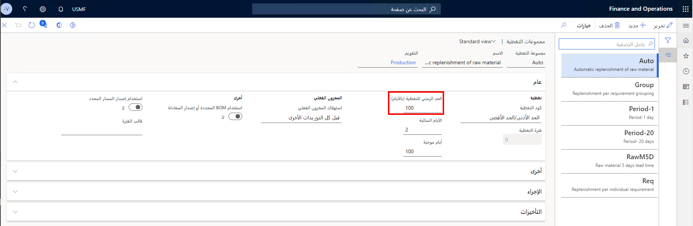
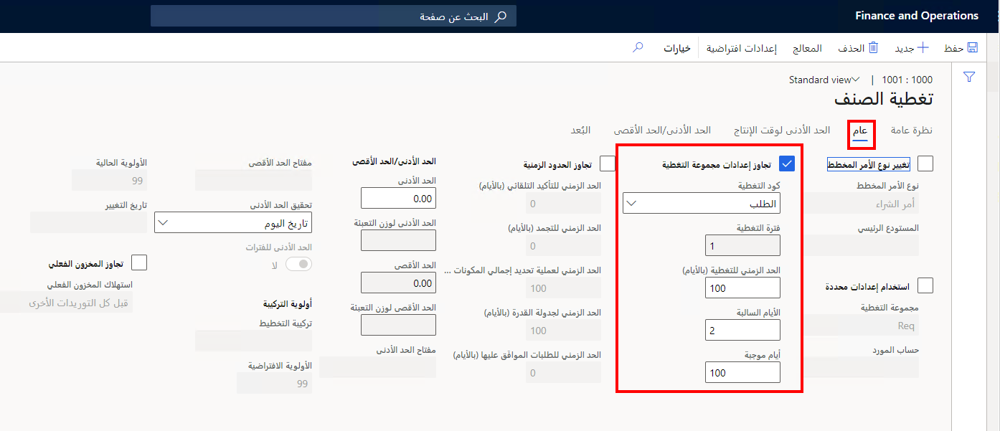

يمكن للمخططين استخدام الأطر الزمنية للتغطية ضمن "تحسين التخطيط" لتحديد أفق التخطيط لاستبعاد توصيات العرض والطلب التي تتجاوز الأطر الزمنية المحددة للتغطية. يمنع الإطار الزمني للتغطية التخطيط الرئيسي من جدولة الطلبات بعيداً جداً، مما يؤدي في النهاية إلى تشتيت انتباه المخطط.

يحدد الإطار الزمني للتغطية عدد الأيام التي تلي تاريخ تشغيل التخطيط التي يتم خلالها استبعاد العرض والطلب. على الرغم من أن القيمة الافتراضية للنظام هي 100 يوم، إلا أنها يجب أن تكون أكبر من إجمالي وقت التسليم للمنتجات في نظامك.

يمكنك تحديد إطار زمني للتغطية على كل من المستويات التالية:

- **مجموعة التغطية** - يمكنك تعيين إطار زمني افتراضي للتغطية لكل مجموعة تغطية.
- **تغطية الصنف** - يمكنك تجاوز الإطار الزمني للتغطية الموروث من مجموعة التغطية المعينة لصنف ما.
- **الخطة الرئيسية** - يمكنك تجاوز الأطر الزمنية للتغطية الموروثة من مجموعة التغطية وإعدادات تغطية الصنف.

## مجموعات التغطية
عند إعداد مجموعات التغطية، تنطبق الإعدادات على جميع المنتجات التي تنتمي إلى تلك المجموعة. يمكنك تجاوز الإعدادات على المنتج، أو عند إنشاء الخطط الرئيسية.

لإنشاء مجموعة تغطية، اتبع الخطوات التالية:

1.  انتقل إلى **التخطيط الرئيسي > الإعداد > مجموعات التغطية**. 
2.  حدد **جديد**.
3.  أدخل **اسم مجموعة التغطية** و **الوصف**.
4.  حدد **التقويم** الخاص بالمجموعة.

    > [!NOTE]
    > يتم تحديد مدة الإطار الزمني للتغطية بالأيام التقويمية. لن تؤثر التقويمات التي تستخدم أيام العمل على حساب الإطار الزمني. على سبيل المثال، الأسبوع هو سبعة أيام، حتى إذا حدد تقويم وقت العمل عطلات نهاية الأسبوع كأيام مغلقة.

5.  في حقل **إطار زمني التغطية (بالأيام)**، أدخل أيام التغطية كما هو موضح أعلاه.

للحصول على معلومات حول الحقول الأخرى في هذه الصفحة، راجع [إعدادات التغطية](/training/modules/configure-use-master-planning-dyn365-supply-chain-mgmt/06-coverage-settings/?azure-portal=true).
 
> [!div class="mx-imgBorder"]
> 

## إعداد إطار زمني تغطية لأحد الأصناف
يجب أن ينتمي كل منتج إلى مجموعة تغطية. إذا لم يتم تعيين مجموعة تغطية لمنتج ما، فسيتم استخدام مجموعة تغطية افتراضية. يرث كل عنصر إطاراً زمنياً للتغطية من مجموعة تغطيته. ومع ذلك، إذا لزم الأمر، يمكنك تجاوز الإعداد.

لتحديد إطار زمني للتغطية لصنف معين، اتبع هذه الخطوات.

1.  انتقل إلى **إدارة معلومات المنتجات > المنتجات > المنتجات الصادرة**.
2.  حدد منتجاً في الشبكة.
3.  في جزء الإجراءات، في علامة التبويب **الخطة**، في **مجموعة التغطية**، حدد **تغطية الصنف**.
4.  في صفحة **تغطية الصنف**، في علامة التبويب **نظرة عامة**، حدد أو أنشئ صفاً للموقع الذي تريد تعيين إطار زمني تغطية فيه.
5.  حدد علامة التبويب **عام** لفتح إعدادات الموقع المحدد.
6.  حدد خانة الاختيار **تجاوز إعدادات مجموعة التغطية**.
7.  في حقل **رمز التغطية**، حدد الطريقة التي تستخدمها الجدولة الرئيسية لحساب متطلبات الصنف. تتوفر الخيارات التالية: 
    - **الفترة** - عندما يخفض الطلب المخزون المتوقع للفترة إلى أقل من الحد الأدنى المحدد للكمية، يتم إنشاء أمر مخطط لتلبية كل الطلبات التي تحدث خلال الفترة المحددة في حقل فترة التغطية. تبدأ الفترة في تاريخ أول متطلب، ويتم إنشاء الأمر المخطط في هذا التاريخ. 
    - **المتطلب** - يتم إنشاء أمر مخطط لتلبية كل متطلبات تجعل المخزون أقل من الحد الأدنى للكمية
    - **الحد الأدنى/الحد الأقصى** - عندما يؤدي الطلب إلى انخفاض المخزون المتوقع إلى أقل من الحد الأدنى المحدد للكمية، يتم إنشاء أمر مخطط لجلب المخزون إلى الحد الأقصى المحدد للكمية. عند استخدام هذا الأسلوب، يتم استبعاد الأصناف المحجوزة فعلياً من حساب المتطلبات.
    - **يدوي** - لا تقوم الجدولة الرئيسية بحساب المتطلبات أو إنشاء أوامر مخططة للصنف؛ من المفترض أن يتم تخطيط العنصر يدوياً؛ هذه الطريقة هي الأفضل للعناصر التي يسهل شراؤها، والأشياء المُدارة عن طريق الفحص البصري
    - **الأولوية** - موازنة العرض للطلب مع نهج يحركه الطلب، بما في ذلك أولوية التخطيط واستخدام القيم في الحد الأدنى ونقطة إعادة الطلب والحد الأقصى؛ الأولوية متاحة فقط مع تمكين "تحسين التخطيط"
8.  أدخل **فترة التغطية**. هذا هو عدد الأيام التي تقوم خلالها الجدولة الرئيسية بدمج كل متطلبات الصنف وإنشاء أمر مخطط واحد لتغطية مجموع هذه الطلبات. على سبيل المثال، إذا قمت بإدخال **5**، يتم دمج الأوامر المخططة لفترات خمسة أيام. تبدأ فترة التغطية في تاريخ أول متطلب، ويتم إنشاء الأمر المخطط في ذلك التاريخ. يحدد تاريخ المتطلبات، مثل تاريخ التسليم، وقت تقديم الأمر المخطط. يتوفر هذا الحقل عند تحديد **الفترة** في قائمة **رمز التغطية**. 
9.  قم بتعيين حقل **إطار زمني التغطية (بالأيام)** إلى عدد الأيام التي تريد استخدامها كإطار زمني تغطية للصنف.
10. أدخل عدد **الأيام السالبة**، وهو عدد الأيام المضافة إلى تاريخ استحقاق أحد المتطلبات لتحديد فترة زمنية يمكن خلالها استخدام الإيصال المخطط لتلبية المتطلبات. لا يمكن استخدام إيصال مخطط غير مستحق خلال الفترة الزمنية المحددة لتلبية المتطلبات، كما تنشئ الجدولة الرئيسية أمراً مخططاً جديداً. تتوافق الأيام السالبة مع عدد الأيام التي يمكن أن يتأخر فيها التسليم قبل أن تحتاج إلى إنشاء أمر تنفيذ جديد. خلال هذا الوقت، يكون مستوى مخزون الصنف سالباً. يمكنك تحديد الأيام السالبة في صفحة تغطية الصنف أو صفحة مجموعات التغطية. يعتمد سلوك الأيام السالبة على ما إذا قمت بتحديد الخيار **استخدام الأيام السالبة الديناميكية** في صفحة **معلمات التخطيط الرئيسي**.
11. أدخل عدد **الأيام الموجبة**. اطرح عدد الأيام من تاريخ استحقاق أحد المتطلبات لتحديد الوقت الذي يمكن خلاله استخدام إيصال مخطط مستحق لتلبية المتطلبات. الاستلام المخطط المستحق خارج الفاصل الزمني المحدد غير صالح، والجدولة الرئيسية تنشئ أمراً مخططاً جديداً. يمكن معادلة الأيام الموجبة بعدد الأيام التي تستخدم فيها المخزون الحالي قبل إنشاء أمر تنفيذ جديد. خلال هذا الوقت، يكون مستوى مخزون الصنف موجباً.

> [!div class="mx-imgBorder"]
> 
 
## إطار زمني التغطية لخطة رئيسية
على مستوى المخطط الرئيسي، يمكنك تحديد إطار زمني تغطية. وبهذه الطريقة، يمكنك تحديد مدة حساب التخطيط الرئيسي لخطة رئيسية.

لتحديد إطار زمني للتغطية لخطة رئيسية، اتبع هذه الخطوات.

1.  انتقل إلى **التخطيط الرئيسي > الإعداد > الخطط > الخطط الرئيسية**.
2.  حدد خطة رئيسية موجودة في القائمة أو أنشئ خطة رئيسية جديدة.
3.  في علامة التبويب السريعة **الأطر الزمنية بالأيام**، قم بتعيين خيار **التغطية** إلى **نعم**. 
4.  بعد ذلك، في الحقل ضمن الخيار، أدخل عدد الأيام التي تريد استخدامها كإطار زمني التغطية للخطة الرئيسية. يتجاوز هذا الإعداد أي إعدادات وقت تغطية تم تحديدها لكل منتج ومجموعة تغطية.

 
