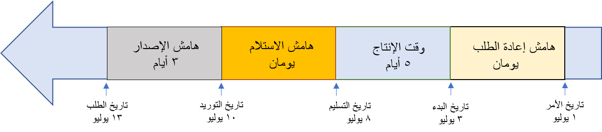
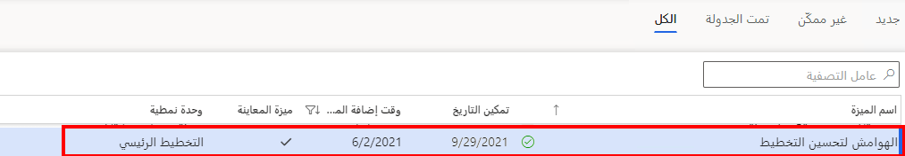

توفر هوامش الأمان وقتاً في المخزن المؤقت بعد الحد الأدنى لوقت الإنتاج العادي. 

على سبيل المثال، إذا تطلب المنتج المستلم فحصاً أو معالجة أو تم تأخيره ولم يكن جاهزاً للاستهلاك الفوري، فباستخدام هامش أمان، لن تحتاج إلى إضافة زمن وصول البضاعة مع المورد لأن ذلك سيعطي للمورد ذلك الوقت المتوقع الإضافي. 

يتم استخدام هوامش الأمان في العمليات الحسابية لثلاث خدمات:

- **هامش الاستلام** – وقت المخزن المؤقت لمعالجة أمر وارد.
- **هامش إعادة الطلب** – وقت المخزن المؤقت لوضع أمر.
- **هامش الإصدار** – وقت المخزن المؤقت لمعالجة الشحنات الصادرة.

> [!NOTE]
> لم يتم دعم إعادة ترتيب الهامش وهامش الإصدار، المُشار إليهما في الجدول بخط مائل، من أجل تحسين التخطيط. وحتى الآن، يتم التعامل مع جميع القيم التي تم إدخالها على أنها صفر.

يعرض الجدول التالي مثال على الهوامش المستخدمة في العمليات الحسابية.

| **الحدث** | **عدد الأيام** | **التواريخ** |
 | ------------- | ------------- |------------- |
 | **تاريخ الأمر** |   | 1 يوليو|
 | ***هامش إعادة الطلب** _ | 2 | _July 3 – تاريخ بدء التوريد* |
| **الحد الأدنى لوقت الإنتاج** | 5 | _July 8 – تاريخ تسليم التوريد |
| **هامش الاستلام** | 2 | _July 10 – تاريخ متطلبات التوريد |
| ***هامش الإصدار** _ | 3 | _July 13 – تاريخ متطلبات الطلب* |

عندما يتم تمكين هامش الإصدار وإعادة الترتيب لتحسين التخطيط، ستكون التواريخ الممثلة كما هي مدرجة في الرسم التخطيطي التالي. 

> [!NOTE]
> يمثل هذا الرسم سيناريو يتم فيه تعيين أيام الهوامش في الإعداد على **لا**. إذا تم تعيين أيام العمل على **نعم**، فسيعرض حساب الأيام تقويم أيام العمل ويستبعد تلك الأيام بخلاف أيام العمل. في السيناريو الذي لا يتم فيه تعيين يومي السبت والأحد كأيام عمل ويتم تعيين الهوامش لتضمين أيام العمل، سيكون تاريخ الطلب الفعلي في هذا التقويم لعام 2020 هو 17 يوليو لأن عطلات نهاية الأسبوع ستكون إجمالاً 12 يوماً. 

قبل أن تتمكن من استخدام هذه الوظيفة، يجب عليك تمكين ميزة **الهوامش لتحسين التخطيط** في مساحة عمل **إدارة الميزات**.

عند التمكين، ستصبح الهوامش جزءاً من حساب الحد الأدنى لوقت الإنتاج. 

يمكن إعداد هوامش الأمان في مجموعة التغطية والخطة الرئيسية. إذا تم إدخال هوامش الأمان في كليهما، فستتم إضافتهما فوق بعضهما البعض. وبالتالي، إذا أدخلت يومين في مجموعة التغطية ويومين في الخطة الرئيسية، فسيكون هذا هامشاً لمدة أربعة أيام.

شاهد الفيديو التالي للتعرف على هوامش الأمان.

 > [!VIDEO https://www.microsoft.com/videoplayer/embed/RE4IsWa]

