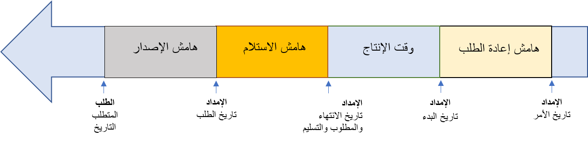

توفر هوامش الأمان وقتاً في المخزن المؤقت بعد الحد الأدنى لوقت الإنتاج العادي. 

على سبيل المثال، إذا تطلب المنتج المستلم فحصاً أو معالجة أو تم تأخيره ولم يكن جاهزاً للاستهلاك الفوري، فباستخدام هامش أمان، لن تحتاج إلى إضافة زمن وصول البضاعة مع المورد لأن ذلك سيعطي للمورد ذلك الوقت المتوقع الإضافي. 

يتم استخدام هوامش الأمان في العمليات الحسابية لثلاث خدمات:

- **هامش الاستلام** – وقت المخزن المؤقت لمعالجة أمر وارد.
- **هامش إعادة الطلب** – الوقت الاحتياطي لتقديم أمر التوريد.
- **هامش الإصدار** – وقت المخزن المؤقت لمعالجة الشحنات الصادرة.

يعرض الجدول التالي مثال على الهوامش المستخدمة في العمليات الحسابية.

| **الحدث** | **عدد الأيام** | **التواريخ** |
 | ------------- | ------------- |------------- |
 | **تاريخ الأمر** |   | 1 يوليو|
 | ***هامش إعادة الطلب** _ | 2 | _July 3 – تاريخ بدء التوريد* |
| **الحد الأدنى لوقت الإنتاج** | 5 | _July 8 – تاريخ تسليم التوريد |
| **هامش الاستلام** | 2 | _July 10 – تاريخ متطلبات التوريد |
| ***هامش الإصدار** _ | 3 | _July 13 – تاريخ متطلبات الطلب* |

عندما يتم تمكين هامش الإصدار وإعادة الترتيب لتحسين التخطيط، ستكون التواريخ الممثلة كما هي مدرجة في الرسم التخطيطي التالي. 

قبل أن تتمكن من استخدام هذه الوظيفة، يجب عليك تمكين ميزة **هوامش لتحسين التخطيط** في مساحة عمل **إدارة الميزات** وتثبيت الوظيفة الإضافية لتحسين التخطيط لبيئة من المستوى 2 أو أعلى من خلال Lifecycle Services.

عند التمكين، ستصبح الهوامش جزءاً من حساب الحد الأدنى لوقت الإنتاج. 

يمكن إعداد هوامش الأمان في مجموعة التغطية والخطة الرئيسية. إذا تم إدخال هوامش الأمان في كليهما، فستتم إضافتهما فوق بعضهما البعض. وبالتالي، إذا أدخلت يومين في مجموعة التغطية ويومين في الخطة الرئيسية، فسيكون هذا هامشاً لمدة أربعة أيام.

شاهد الفيديو التالي للتعرف على هوامش الأمان.

 > [!VIDEO https://www.microsoft.com/videoplayer/embed/RE4IsWa]

