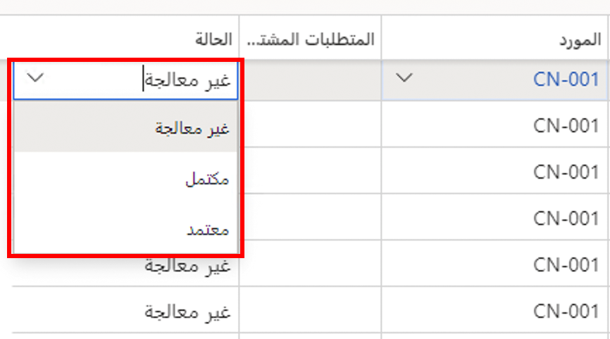

تعتبر الموافقة على الأوامر المخططة أمراً اختيارياً وهي خطوة لإنشاء أمر مؤكد. باستخدام حالة الموافقة، إذا تم تشغيل خطة رئيسية أخرى، فلن يتم حذف أمر تمت الموافقة عليه. ستقوم بالكتابة فوق أي أوامر متبقية في الحالة **غير معالج** استناداً إلى البيانات الحالية. 

يشتمل الأمر المخطط على إحدى الحالات الثلاثة التالية:

- **غير معالج** - الحالة الافتراضية عند قيام التخطيط الرئيسي بإنشاء أمر. في هذه الحالة، سيتم حذف الأمر في المرة التالية. 
- **مكتمل** -تعني هذه الحالة أنك قمت بتقييم الأمر وقررت عدم تأكيد الأمر. يعتبر النظام أن **غير معالج** و **مكتمل** متماثلين. 
- **تمت الموافقة عليه** - يتم اعتبار الأوامر المخططة بالحالة **تمت الموافقة عليه** ثابتة ويتم التخطيط لها من خلال التخطيط الرئيسي، لذلك لا يتم تغييرها أو حذفها عند تشغيل خطة أخرى. سيتم نسخ الأمر من إصدار الخطة القديمة إلى الخطة الجديدة.

    

