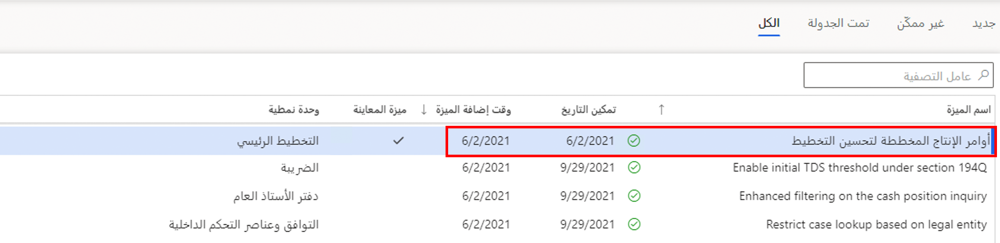
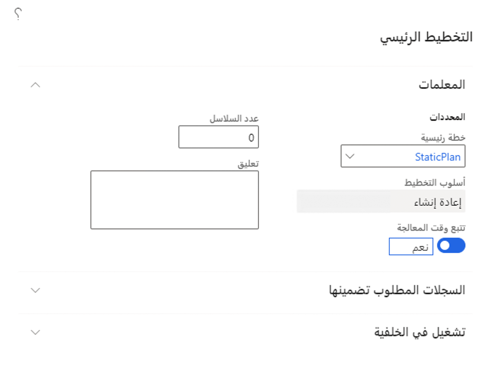

باستخدام تحسين التخطيط الذي تم تثبيته، يمكن تعديل أوامر الإنتاج المخططة والمعتمدة، وعند تشغيل "تحسين التخطيط" مرة أخرى، ستنعكس التغييرات التي تم إجراؤها على أمر الإنتاج المخطط. باستخدام التخطيط الرئيسي المضمن، تنتظر الخطط عادةً حتى التشغيل التالي، في المساء على سبيل المثال، لتلقي أمر إنتاج مخطط دقيق. 

يتعين تمكين ميزة **أوامر الإنتاج المخططة لتحسين التخطيط**، كما هو موضح في لقطة الشاشة التالية.

## دعم طلبات الشراء 
يمكن أن يؤدي تحسين التخطيط إلى إنشاء أوامر مخططة بناءً على طلبات الشراء. يُعد طلب الشراء مستنداً يخول قسم المشتريات لشراء سلع أو خدمات. يمكن استخدام طلب الشراء الذي تم اعتماده لإنشاء أمر شراء. تتيح هذه الميزة تحسين التخطيط لتحليل طلبات الشراء الحالية وإنشاء أوامر الشراء المخططة الضرورية تلقائياً.

## تشغيل تحسين التخطيط لعرض أمر إنتاج مخطط 

اتبع الخطوات التالية لتشغيل خطة:

1.  انتقل إلى **التخطيط الرئيسي > ‏‫مساحات العمل‬ > التخطيط الرئيسي**.
2.  في مجموعة **ملخص الخطة الحالية**، حدد **تشغيل** من الإطار المتجانب **التخطيط الرئيسي**.
3.  في مربع الحوار الذي يتم فتحه، حدد **DynPlan** في حقل **الخطة الرئيسية**.
4.  حدد **موافق**.
 
    

