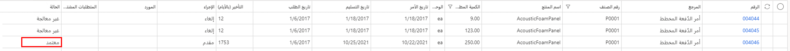

بعد تشغيل "تحسين التخطيط" لأمر مخطط محدد، يمكنك تحليل الأمر والموافقة عليه.

1.  افتح **التخطيط الرئيسي > التخطيط الرئيسي > الأوامر المخططة**.
2.  حدد **الإنتاج المخطط**. 
3.  في جزء الإجراءات، في علامة التبويب **طريقة عرض** في مجموعة **المتطلبات**، حدد **تحديد إجمالي المكونات المطلوبة**.
4.  راجع إجمالي المكونات المطلوبة في هذا الأمر، مما يدل على أنه سيحتاج إلى ثلاثة أوامر شراء للحصول على مواد كافية لتجميع العنصر **P0001**.

    

5.  أغلق صفحة **تحديد إجمالي المكونات المطلوبة**.
6.  في صفحة **الطلبات المخططة**، حدد **مخطط Gantt** في مجموعة **عرض** في علامة التبويب **عرض**. 

    

7.  قم بتحديث الكمية من 123 إلى 250 ثم قم بالموافقة على الأمر.
    - أغلق صفحة **مخطط Gantt**. 
    - ارجع إلى صفحة **الأوامر المخططة**. 
    - قم بتغيير **الكمية المطلوبة** إلى **‎‎250.00**.
    - في جزء الإجراء، حدد **موافقة**. 
    - في مربع الحوار، حدد **موافق**.

    

8.  لا تؤدي الموافقة على الأمر إلى تغيير أوامر الشراء المخططة أو مخطط Gantt. لإكمال هذا الإجراء، تحتاج إلى تشغيل "تحسين التخطيط" مرة أخرى. تقوم الموافقة بحفظ كمية الأمر التي تم تغييرها وعند تشغيلها مرة أخرى، فإنها تحافظ على الأمر كما كان ولكنه يقوم بمراجعة المتطلبات. 

    

    

    

شاهد الفيديو التالي لمشاهدة العملية بأكملها من البداية إلى النهاية. 

 > [!VIDEO https://www.microsoft.com/videoplayer/embed/RE4IquI]