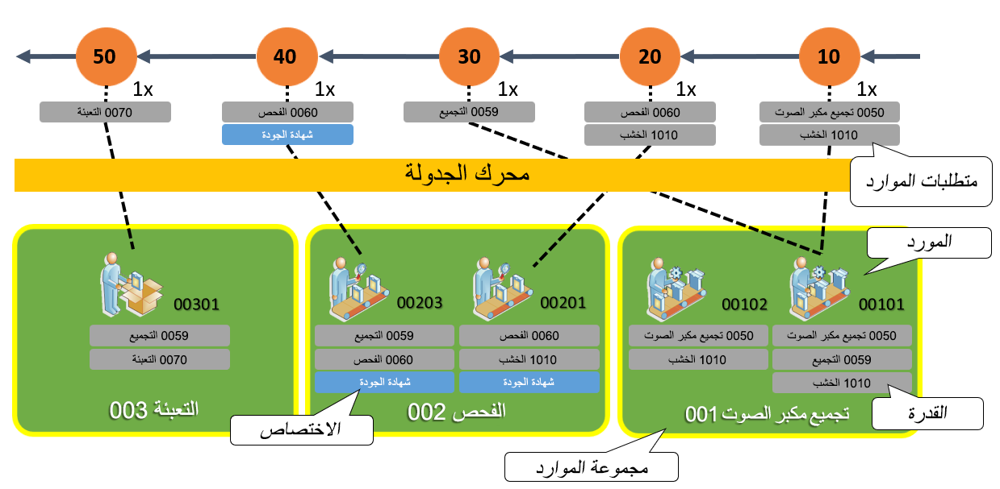

يمكن أن يؤدي استخدام تحسين التخطيط إلى زيادة الكفاءة الإجمالية للموارد عن طريق تأجيل تخصيص أي موارد حتى تتم جدولة عمليات الإنتاج. ومن خلال ذلك، فإن تحديد المورد المؤتمت أثناء جدولة عمليات الإنتاج يسمح بالتخصيص الأكثر فعالية للموارد.

وعندما يتعلق الأمر بتحسين التخطيط، يتم تحويل القدرة إلى الموارد المستخدمة للعمليات لتنفيذ وظيفة معينة. يمكن أن يكون لأي مورد عمليات قدرات متعددة، وعلى الجانب الآخر، يمكن تخصيص قدرة لأكثر من مورد واحد. وتتضمن بعض أمثلة القدرات التي يمكن تعيينها إلى الموارد المورّدين والأجهزة والأدوات ومرافق المواقع والموارد البشرية. بالنسبة للقدرات، يمكن تعيينها كأولوية والتي يمكن استخدامها لتحسين تحديد المورد عند العمل في الجدولة لضمان إجراء التحديد استناداً إلى أعلى أولوية متاحة. 

يتيح أسلوب التخطيط هذا إمكانية تعيين القدرات لكل مسار من العمليات بدلاً من تعيين موارد محددة أو مجموعات موارد. بعد الإعداد الأولي، تقوم عملية الجدولة بمطابقة القدرات المطلوبة مع القدرات المتاحة وتحديد تعيين المورد المناسب لوظيفة الإنتاج المحددة. 

تتمثل إحدى فوائد تنفيذ تحسين التخطيط في أنه يعمل كخدمة منفصلة. ومن خلال القيام بذلك، يمكن تشغيله في نفس الوقت دون إبطاء بقية النظام. يمكن للشركات المصنعة الاستفادة من هذا التنفيذ بشكل كبير بسبب بعض المناطق الأساسية المختلفة:

- يتم وضع تحسين التخطيط كخدمة منفصلة بحيث لا يؤدي إلى إبطاء عمليات النظام الأخرى.
- وباستخدام المعالجة في الذاكرة، تسمح جدولة الإنتاج بتحسين الأداء وقابلية التوسع.
- يمكن أن تقرض الرؤى في الوقت الحقيقي تقريباً تغييرات المتطلبات خلال ساعات العمل بالمكتب. 

يمكن عرض مجموعة الموارد والقدرات جنبًا إلى جنب مع تدفق الإنتاج لمطابقة التوفر في لقطة الشاشة أدناه. 

لمزيد من المعلومات حول عملية ترحيل "تحسين التخطيط"، [والجدولة مع تحديد المورد استناداً إلى القدرة](/dynamics365/supply-chain/master-planning/planning-optimization/capability-based-scheduling/?azure-portal=true).

يوضح الرسم التخطيطي التالي التحديد التلقائي للمورد استناداً إلى القدرات.
 

 
 

