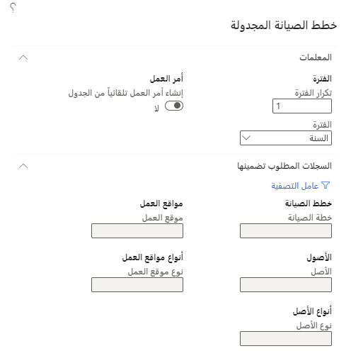
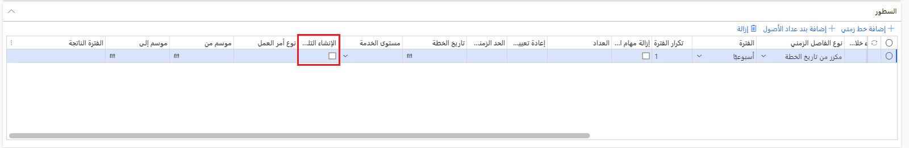
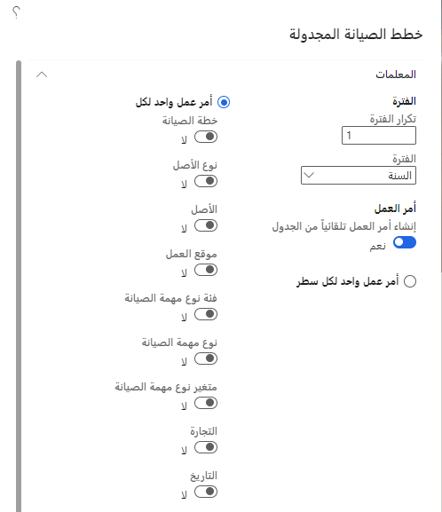

بعد قيامك بإنشاء خطط صيانة وقائية أو تفاعلية وتعيينها للأصول، ستحتاج إلى جدولة خطط الصيانة. ستقوم جدولة الصيانة الوقائية بإنشاء إدخالات التقويم على الأصول استناداً إلى خطط الصيانة التي يتم إعدادها في الأصل. يمكنك جدولة إدخالات التقويم استناداً إلى خطط الصيانة المحددة، وأنواع الأصول، والأصول. 

يمكنك جدولة خطط الصيانة في **إدارة الأصول > دوري > الصيانة الوقائية > جدولة خطط الصيانة**. 

 
في الصفحة **جدولة خطط الصيانة**، يمكنك تحديد المعلمات التالية:

- **الفترة** – الفترة الزمنية المتمثلة في السنة، ربع السنة، الشهر، الأسبوع، اليوم. 
- **تكرار الفترة** - في هذا الحقل، يمكنك تحديد التكرار استناداً إلى التحديد الذي أجريته في الحقل "الفترة". على سبيل المثال، إذا قمت بتحديد **اليوم** في الحقل **الفترة**، ثم قمت بإدخال **5** في الحقل **تكرار الفترة**، فسيتم إنشاء فترة زمنية بعد خمسة أيام. 
- **إنشاء تلقائي عند التحديد في البند** – يمكن تغيير هذا التبديل إلى **نعم** إذا كنت ترغب في إنشاء أوامر العمل تلقائياً وفقاً لبند خطة الصيانة. إذا قمت بتغيير هذا التبديل إلى **نعم** وتم تعيين زر التبديل **إنشاء تلقائي** إلى **نعم** في بنود خطة الصيانة في الصفحة **خطط الصيانة**، فسيتم إنشاء أوامر العمل استناداً إلى بنود خطة الصيانة، ويتم أيضاً إنشاء بنود جدول الصيانة التي تحتوي على الحالة **أمر العمل الذي تم إنشاؤه**. 
- **عامل التصفية** - عن طريق تحديد هذا الزر، يمكنك إضافة عوامل التصفية إلى المهمة الدورية. عند تحديد زر **عامل التصفية**، يمكنك إجراء تحديدات لإنشاء جداول بناءً على خطط الصيانة ومواقع العمل والأصول وأنواع الأصول وأنواع مواقع العمل. 

بعد تحديد كافة المعلمات لجدولة خطة الصيانة، حدد **موافق** لإنشاء الجداول. 

عند جدولة الصيانة الوقائية، لن يتم إنشاء بنود جدول الصيانة بتاريخ ووقت بدء متوقعين يسبقان تواريخ النظام ووقته. 

لمعرفة كيفية جدولة خطط الصيانة في إدارة الأصول، شاهد الفيديو التالي.

 > [!VIDEO https://www.microsoft.com/videoplayer/embed/RE4pjTw]

## تجميع بنود أوامر العمل التي يتم إنشاؤها تلقائياً أثناء تشغيل خطة الصيانة
عندما يتم تكوين النظام لإنتاج أوامر العمل تلقائياً وفقاً لجدول الصيانة، تتيح لك ميزة *تجميع بنود أوامر العمل التي يتم إنشاؤها تلقائياً أثناء تشغيل خطة الصيانة* تحديد قواعد لتجميع بنود أوامر العمل في أمر عمل واحد. يمكنك الآن فرز أوامر العمل حسب الأصل أو نوع الأصل أو الموضع الوظيفي.

حتى تتمكن من استخدام هذه الميزة، يجب تشغيلها في نظامك. يمكن للمسؤولين استخدام إعدادات إدارة الميزات للتحقق من حالة الميزة وتشغيلها.  في مساحة العمل **إدارة الميزات** يتم إدراج الميزة بالطريقة التالية:

- **الوحدة** - إدارة الأصول
- **اسم الميزة** - تطبيق قواعد تجميع أوامر العمل أثناء تشغيل خطة الصيانة

## إعداد تجميع أوامر العمل التي تم إنشاؤها تلقائياً
لإعداد تجميع أوامر العمل التي تم إنشاؤها تلقائياً، اتبع الخطوات التالية.

1.  انتقل إلى **إدارة الأصول > الإعداد > الصيانة الوقائية > خطط الصيانة**.
2.  لكل خطة تريد إنشاء أوامر عمل مجمعة بها، اتبع الخطوات التالية:
    - حدد الخطة في جزء القائمة.
    - في علامة التبويب السريعة **البنود**، تأكد من تحديد خانة الاختيار **إنشاء تلقائي** في كل بند.

    > [!div class="mx-imgBorder"]
    >  

3.  انتقل إلى **إدارة الأصول > دوري > الصيانة الوقائية > جدولة خطط الصيانة**.
4.  في مربع الحوار **جدولة خطط الصيانة** في قسم **الفترة** حدد الأفق الزمني للخطة (إلى أي مدى يمكن أن نتطلع عند العثور على مهام صيانة مجدولة لإنشاء عمل لها).
5.  قم بتعيين خيار **إنشاء أمر العمل تلقائياً من الجدول** إلى **نعم**.
6.  في قسم **أمر العمل** حدد أحد الخيارات التالية:
    - **أمر عمل واحد لكل بند**- إنشاء أمر عمل واحد لكل بند من بنود جدول الصيانة. (يوفر هذا الخيار الوظيفة نفسها التي تتوفر عند إيقاف تشغيل ميزة **تطبيق قواعد تجميع أوامر العمل أثناء تشغيل خطة الصيانة**.)
    - **أمر عمل واحد لكل** – إنشاء أوامر عمل مجمعة وفقاً لإعدادات الخيارات الأخرى التي تصبح متاحة عند تحديد هذا الخيار.
    > [!div class="mx-imgBorder"]
    >
7.  إذا كنت تريد تطبيق الخيارات عند تشغيل بعض خطط الصيانة الخاصة بك فقط، فأضف، في علامة التبويب السريعة **السجلات المراد تضمينها**، عوامل التصفية على النحو الذي تحتاج إليه، تماماً كما تفعل مع الوظائف الدُفعية الأخرى في Supply Chain Management.
8.  في علامة التبويب السريعة **التشغيل في الخلفية** قم بإعداد خيارات الدُفعات والجدولة على النحو الذي تحتاج إليه، تماماً كما تفعل مع الوظائف الدُفعية الأخرى في Supply Chain Management.
9.  حدد **موافق** لتشغيل و/أو جدولة خطط الصيانة المحددة.
