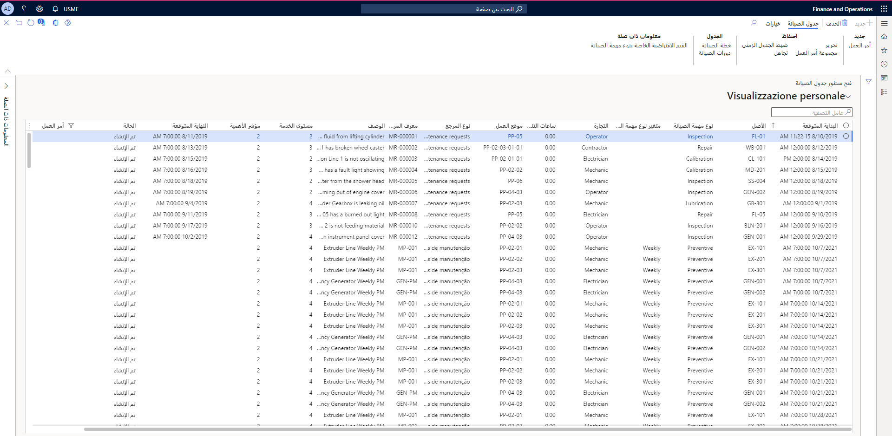

يمكنك إنشاء دورات الصيانة لأصولك في إدارة الأصول. يمكنك إنشاء دورات الصيانة لمختلف الأصول التي تحتاجها لإنجاز مهمة مماثلة على فترات منتظمة. قد يكون أحد الأمثلة على هذا السيناريو هو أنك تحتاج إلى إجراء فحوصات على أسطول الشاحنات لديك في نفس الفترات الزمنية. 

للبدء، ستحتاج إلى إنشاء دورة صيانة تتضمن جميع الأصول التي ستتطلب نفس شكل مهمة الصيانة. بعد ذلك، ستحتاج إلى جدولة دورات الصيانة. بعد اكتمال الوظائف، يمكنك رؤية جميع سجلات الوظائف ذات الصلة بالدورة في صفحة **بنود جدول الصيانة المفتوحة**. 

**إدارة الأصول > شائع > جدول الصيانة > بنود جدول الصيانة المفتوحة**.
 

تعرض الصورة السابقة جميع بنود جدول الصيانة المفتوحة في التطبيق. في هذه الصفحة، في **مجموعة الجداول** في جزء الإجراءات، يمكنك جدولة دورات الصيانة من خلال تحديد **دورات الصيانة**. يستعرض الإجراء التالي كيفية إعداد دورات الصيانة. 

## إعداد دورة الصيانة

لإعداد دورة الصيانة‬، اتبع هذه الخطوات:

1.  انتقل إلى **إدارة الأصول > الإعداد > الصيانة الوقائية > دورات الصيانة**. 
2.  لإنشاء دورة صيانة جديدة، حدد **جديد** في جزء الإجراءات. 
3.  في الحقل **دورة الصيانة**، أدخل معرفاً لدورة الصيانة الجديدة. 
4.  في علامة التبويب السريعة **الرأس**، حدد الحقول التالية:
    - **تاريخ البدء** – تاريخ البدء للدورة. 
    - **الانتهاء في غضون أيام** – مقدار الأيام المستغرق لإكمال الدورة. 
    - **الانتهاء في غضون ساعات** – عدد الساعات التي يجب إكمال الدورة خلالها. 
    - **إنشاء تلقائي** - تغيير التبديل إلى **نعم** إذا كنت ترغب في إنشاء أمر عمل تلقائياً من بنود جدول الصيانة التي تم إنشاؤها من دورة الصيانة. 
    - **مستوي الخدمة** – مستوي خدمة أمر العمل للدورة. 
5.  أضف بنوداً للأصول أو مواقع العمل، ثم أضف أوعية أوامر العمل لتضمينها في الدورة في كل علامة من علامات التبويب السريعة. 
6.  لإضافة أصل، قم بتوسيع علامة التبويب السريعة **بنود الأصول** ثم حدد "إضافة". 
7.  في البند الجديد، حدد أصلاً من القائمة المنسدلة **الأصل**. 
8.  في الحقل **نوع مهمة الصيانة**، استخدم القائمة المنسدلة لتحديد نوع مهمة صيانة. 
9.  حدد **نوع الفترة** و **تكرار الفترة** في البند. ستحدد هذه المواصفات عدد مرات تكرار دورة الصيانة. على سبيل المثال، إذا حددت **اليوم** في الحقل **نوع الفترة** ثم أدخلت **7** في الحقل **تكرار الفترة**، فسيتم إنشاء بنود دورة الصيانة الوقائية أثناء جدولة الصيانة الوقائية مرة واحدة أسبوعياً.  
10. حدد **حفظ** في جزء الإجراءات لحفظ دورة الصيانة الجديدة. 

الآن وبعد أن أنشأت دورة صيانة، يمكنك الاستمرار في إجراء دورات صيانة إضافية حسب الحاجة. 

## جدولة دورات الصيانة
اتبع هذه الخطوات لجدولة دورة الصيانة:

1.  انتقل إلى **إدارة الأصول > شائع > جدول الصيانة > بنود جدول الصيانة المفتوحة**. 
2.  حدد بند جدول الصيانة في القائمة، ثم في مجموعة الجداول في جزء الإجراء، حدد **دورات الصيانة**. 
3.  في صفحة مربع الحوار **جدولة دورات الصيانة**، يمكنك تحديد المعلمات. 
4.  في القائمة المنسدلة **الفترة**، حدد الفترة التي تريد الجدولة فيها. في هذه القائمة، يمكنك تحديد **السنة** أو **ربع السنة** أو **الشهر** أو **الأسبوع** أو **اليوم**. 
5.  في الحقل **تكرار الفترة**، أدخل التكرار حسب الفترة التي حددتها. 
6.  حدد **موافق**. 
7.  إذا كنت ترغب في رؤية مهام دورات الصيانة التي تمت جدولتها، انتقل إلى **إدارة الأصول > شائع > جدول الصيانة > كافة جداول الصيانة**. 

    
 
لمعرفة كيفية إعداد وجدولة دورات الصيانة من خلال استخدام إدارة الأصول، شاهد الفيديو التالي.

 > [!VIDEO https://www.microsoft.com/videoplayer/embed/RE4prHl]