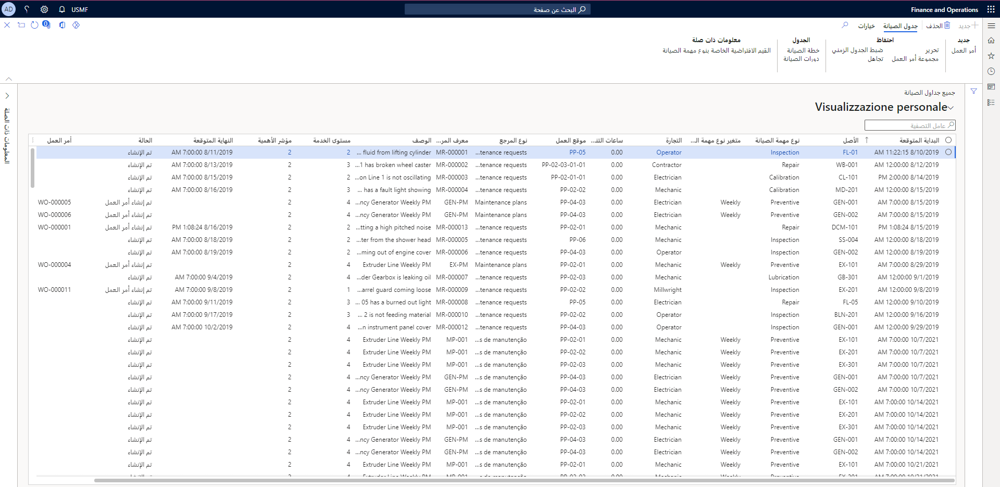
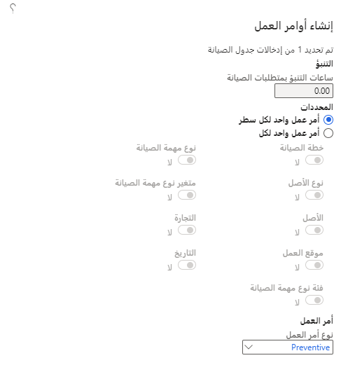

يمكنك العثور على طريقة عرض لجميع خطط الصيانة الوقائية المتوقعة والطلبات والدورات عن طريق تحديد **إدارة الأصول > عام > جدول الصيانة > كل جداول الصيانة**. 
 
تتمثل طرق العرض الثلاث المصفاة للجدولة فيما يلي: 

- **جدولة الأصول الخاصة بي** - يشير إلى الأصول المثبتة في مواقع العمل حيثما تعمل. 
- **فتح بنود جدول الصيانة** - جدولة البنود بالحالة **تم الإنشاء**، مما يشير إلى أنه لم يتم تحويلها إلى أمر عمل بعد. 
- **فتح أوعية جداول الصيانة** – يشير إلى جدولة البنود ذات الصلة بوعاء أوامر العمل. 

يمكنك عرض صفحة **كل جداول الصيانة** في **إدارة الأصول > عام > جدول الصيانة > كل جداول الصيانة**. 
 

 
يمكنك تنفيذ العديد من الإجراءات في الصفحة **كل جداول الصيانة**:  

- يحذف بنداً. 
- يقوم بتحديث الجدولة عن طريق تحديد **خطة الصيانة** أو **دورات الصيانة**. 
- يتجاهل بنداً عن طريق تحديد **تجاهل**. يمكن أن يكون هذا الخيار مفيداً إذا كانت لديك بنود متداخلة. على سبيل المثال، يمكن أن يحتوي الأصل على خطة صيانة تستغرق 100 ساعة وصيانة 500 ساعة. في حالة وجود كليهما، لن تكون في حاجة إلى البند لمدة 100 ساعة.  
- حدد بنوداً متعددة، وقم بتعيينها إلى **وعاء أوامر العمل**. 
- حدد بنوداً متعددة، وحدد **تسوية الجدولة** إذا كنت ترغب في تغيير جدولة مجموعة من البنود إلى نفس الوقت. 

عندما تكون مستعداً لإنشاء أمر عمل، حدد **أمر العمل** في القسم **جديد** من "جزء الإجراءات". سيتم عرض صفحة مربع الحوار **إنشاء أوامر العمل**، حيث يمكنك تحديد المعلمات لأمر العمل الجديد. 

 
في طريقة عرض تفاصيل **كل الأصول** ، يمكنك توسيع علامة التبويب السريعة "خطط صيانة الأصل" وتحديد خطط الصيانة للأصل. في وقت لاحق، إذا قمت بحذف بند خطة الصيانة المرتبط بأحد الأصول في  **كل الأصول**، سيتم أيضاً حذف جميع بنود جدول الصيانة تلقائياً بالحالة **تم الإنشاء** والتي تم إنشاؤها بناءً على خطة الصيانة هذه. 