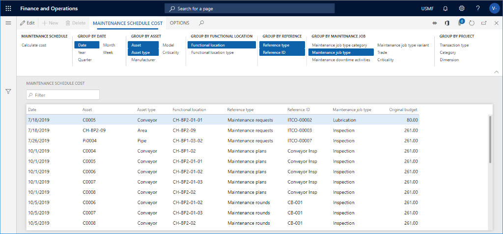

يمكنك حساب تكاليف الميزانية في أي من بنود جدول الصيانة. تساعدك هذه الطريقة في الحصول على نظرة عامة حول التكاليف المتوقعة في الصيانة الوقائية المخططة لسنة معينة، مثلاً. وتعتمد هذه التكاليف على البنود المجدولة الحالية في خطط الصيانة ودوراتها وطلباتها.  

لحساب تكاليف الميزانية في فترة جدول الصيانة، اتبع الخطوات الآتية:
 
1.  انتقل إلى **إدارة الأصول > الاستعلامات > الأصول > تكلفة جدول الصيانة**.
2.  حدد **مجموعة الأبعاد المالية** التي ترغب في استخدامها. يتيح لك هذا التحديد رؤية مجموعات التكاليف في الأبعاد المالية. 
3.  في الحقل **المستوى** ، وضح مدى التفاصيل التي تود الحصول عليها حول بنود جدول الصيانة فيما يتعلق بمواقع العمل.‬ 
    - كمثال على ذلك، إذا قمت بإدراج الرقم **2** في الحقل، وكانت لديك بنية موقع عمل متعددة المستويات، فسيتم عرض كافة بنود جدول الصيانة الخاصة بموقع العمل في المستوى العلوي؛ لذلك قد تتم إضافة الساعات في البند من مواقع العمل التي تقع في مستوى منخفض. إذا قمت بإدراج الرقم **0** في الحقل  **المستوى** ، فسترى نتيجة تفصيلية تُظهر جميع بنود جدول الصيانة في جميع مستويات مواقع العمل المرتبطة بها. 
4.  اختر الأصول المحددة من خلال تحديد **عامل التصفية** في الحقل **السجلات المراد تضمينها**، حيث يمكنك تعيين تاريخ **البدء المتوقع** أو تحديد **الحالة** لحساب التكلفة.  
5.  حدد **موافق** لإجراء العملية الحسابية. 
6.  في الصفحة **تكلفة جدول الصيانة**، ستتمكن من الحصول على رؤية أكثر تعمقاً باستخدام خيارات **التجميع حسب** في علامة التبويب السريعة. كما هو موضح في الصورة الآتية، يمكنك التجميع باستخدام عدة خيارات مختلفة. 
7.  كرر العملية بتحديد الزر **حساب التكلفة** في جزء الإجراءات. 
 
    