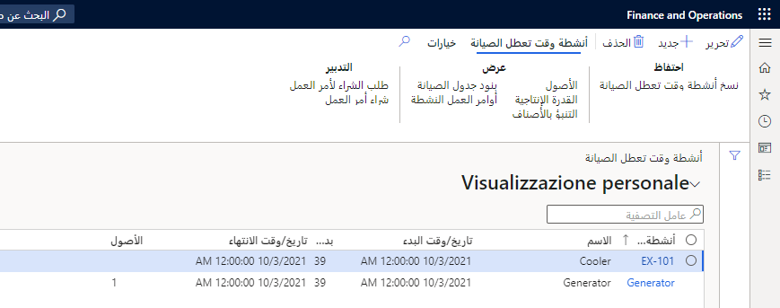
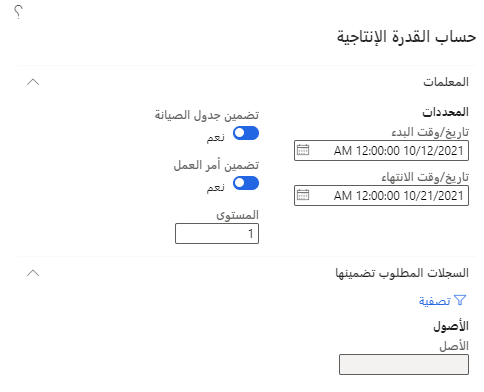

يتم استخدام وقت تعطل الصيانة للتسجيل في حالة عدم توفر أحد الأصول لفترة زمنية محددة، على سبيل المثال، في بيئة التشغيل.  
 
تفصِّل الصفحة **أنشطة وقت تعطل الصيانة** بنود جدول الصيانة ووظائف أمر العمل في الأصول خلال فترة زمنية معينة. ويكون لجميع مهام الصيانة تاريخ بدء متوقع مع فترة وقت التعطل، والتي تفيد في تعديل مهام الصيانة المخطط لها: 
 
- ألقِ نظرة عامة على فترات إيقاف التشغيل المطلوبة لمعدات الإنتاج (الأصول). 
- ألقِ نظرة عامة على الصيانة المخطط لها (بالساعات)، والتي تم تجميعها حسب الاختصاصات (مجموعات عمال الصيانة المسؤولة أو عمال الصيانة)، على سبيل المثال، القدرة الإنتاجية في مجموعات فنييّ الكهرباء أو الحدادين أو مجموعات عمال الصيانة الأخرى اللازمة لإجراء مهام الصيانة المخطط لها. 
- قم بتعديل بنود جدول الصيانة أو مهام صيانة أمر العمل المرتبطة بالأصول، على سبيل المثال، تغيير أوقات البدء والانتهاء المتوقعة في أحد البنود أو تحديد عمال الصيانة الآخرين لتحسين سير العمل لعمال الصيانة ومجموعات عمال الصيانة. 

عند تحديد الأصول في تسجيل وقت التعطل، يتم تضمين بنود جدول الصيانة المفتوحة ومهام أمر العمل في تسجيل وقت التعطل.  
 
## أنشطة وقت تعطل الصيانة 
عند فتح **إدارة الأصول > شائعة > أنشطة وقت تعطل الصيانة > جميع أنشطة وقت تعطل الصيانة**، ستحصل على قائمة بأنشطة وقت التعطل والمعلومات المتنوعة ذات الصلة. تعرض لقطات الشاشة الآتية أمثلة على القائمة والبنود. 
 

 
## إنشاء نشاط وقت تعطل الصيانة
اتبع الخطوات الآتية لإنشاء نشاط وقت تعطل الصيانة:

1.  انتقل إلى **إدارة الأصول > شائعة > أنشطة وقت تعطل الصيانة > جميع أنشطة وقت تعطل الصيانة**. 
2.  حدد **جديد**. 
3.  أدخِل معرّفاً في الحقل  **أنشطة وقت تعطل الصيانة**.
4.  أدخِل اسماً لنشاط وقت التعطل في الحقل **الاسم** . 
5.  حدد **تاريخ/وقت البدء** و **تاريخ/وقت الانتهاء** لوقت التعطل.
6.  في علامة التبويب السريعة **أصول أنشطة وقت تعطل الصيانة**، حدد **إضافة بند** لإضافة الأصول. 
7.  من القائمة المنسدلة **الأصل**، حدد الأصل الذي تنشئ له نشاط وقت التعطل من القائمة. سيتم ملء تفاصيل الأصل تلقائياً في البند. 
8.  إذا كنت بحاجة إلى إضافة المزيد من البنود، حدد **إضافة بند**. 
9.  حدد **حفظ** في جزء الإجراء.  
    - سيتم الآن عرض مهام الصيانة الخاصة بأمر العمل وبنود جدول الصيانة المفتوحة المرتبطة بالأصول المحددة في علامتي التبويب السريعتين **مهام صيانة أمر العمل الناتجة** و **بنود جدول الصيانة**. 
10. حدد بنداً من علامة التبويب السريعة **أنشطة وقت تعطل الصيانة**. 
11. في الجزء "الإجراءات"، في المجموعة **طريقة العرض**، حدد **القدرة الإنتاجية**.
سيتم فتح صفحة الحوار **حساب القدرة الإنتاجية**.
 
    

    التواريخ التي يتم عرضها في مربع الحوار هي تواريخ البدء والانتهاء المحددة في الصفحة  **أنشطة وقت تعطل الصيانة**. ويتضمن هذا الحساب الأصول المتعلقة بنشاط وقت تعطل الصيانة. 
12. اختياري: يمكنك تعديل التاريخ وتضمين جدول الصيانة وتضمين أمر العمل. 
13. حدد  **موافق**  لبدء الحساب. 

    