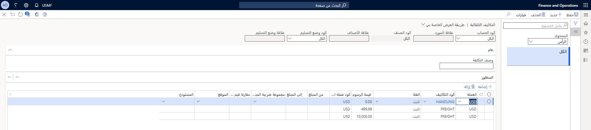
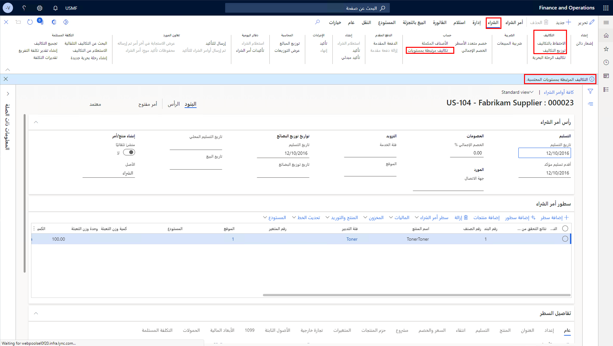
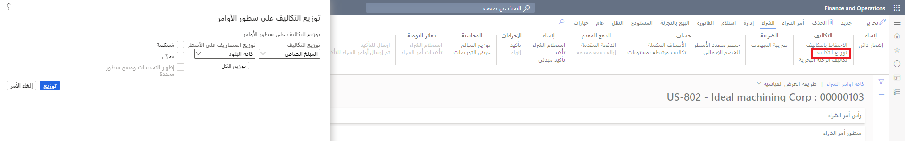

المصاريف هي تكاليف ورسوم يمكنك إضافتها إلى تكلفة الأصناف والمشتريات وفقاً للإعداد. فيما يلي أمثلة على المصاريف:

-   الشحن
-   النقل
-   التخليص البريدي
-   التأمين
-   إعادة التدوير
-   التغليف والتعبئة
 
الطرق التي يمكنك استخدامها لإضافة مصاريف إلى أمر الشراء هي:

-   **رسوم الأسعار** - هذه رسوم ثابتة يتم إعدادها لصنف معين، على سبيل المثال، رسوم بدء التشغيل التي يتم تحصيلها في كل مرة يتم فيها تداول الصنف. يتم إعداد ميزة **رسوم الأسعار** في صفحة **المنتجات الصادرة**.

-   **الإعداد اليدوي للرسوم** - يمكنك إضافة هذا النوع من الرسوم يدوياً إلى رأس الأمر أو سطر الأمر لأمر المبيعات أو الشراء. مثال على ذلك هو رسم لمرة واحدة يتم تحصيله من الأمر بأكمله أو بند معين في الأمر. يمكنك أيضاً إضافة هذا النوع من الرسوم إلى عنوان أو بند فاتورة أمر الشراء. يستخدم هذا النوع من الرسوم رموز الشحن، على سبيل المثال، إذا كنت بحاجة إلى تعيين رمز رسوم للشحن بناءً على نسبة ثابتة، أو نسبة مئوية، أو أجهزة كمبيوتر، أو خيارات أخرى لعملات مختلفة. يتم تعيين هذه الرسوم على مستوى العنوان ضمن **أمر الشراء > علامة تبويب إجراء الشراء > الرسوم > الاحتفاظ بالرسوم** وعلى مستوى البند ضمن **الأمور المالية > الرسوم > الاحتفاظ بالرسوم**.

-   **الإعداد التلقائي للرسوم** - يتم تعيين هذا النوع من الرسوم لإضافة الرسوم تلقائياً عند إنشاء أمر شراء أو مبيعات.    تم إعداد هذه الرسوم في وحدات الحسابات المدينة أو الحسابات الدائنة أو التدبير والتوريد ضمن **الإعداد >  الرسوم > الرسوم التلقائية**.

## رسوم الأسعار

رسم السعر هو المبلغ الذي تتم إضافته إلى سعر الصنف. يمكن أن يكون الرسم تكاليف الإنتاج والإعداد أو الرسوم أو الشحن.

يمكنك إعداد رسوم الأسعار باستخدام إحدى الطرق التالية:

-   مستقل عن كمية الأصناف. الرسم عبارة عن مبلغ ثابت يُضاف إلى سعر الأمر بشكل مستقل عن كمية الصنف. سواء تم بيع 10 أو 20 صنفاً، فإن الرسوم في بند الأمر هي نفس الشيء.

-   تعتمد على كمية الأصناف. يتم احتساب الرسوم بناءً على كمية الصنف وتتم إضافتها إلى بند الأمر.

تأمل المثال التالي:

تبلغ تكلفة الصنف 10.00 دولارات أمريكية، وعند شراء الصنف، تتم إضافة 2.00 دولاراً أمريكياً إضافياً إلى السعر الإجمالي لتغطية تكلفة النقل. بدلاً من إضافة رسوم بمبلغ 2.00 دولاراً أمريكياً في بند أمر الشراء دائماً، تتم إضافة رسوم السعر إلى الصنف للتأكد من تضمين الرسوم دائماً. يتم تحديد هذا الرسم في صفحة **الأصناف** لهذا الصنف في علامة التبويب **السعر/الخصم**. ويكون إعداد المعلمات في مجموعة حقل **سعر الشراء الأساسي** على النحو التالي:

-   السعر: 10.00
-   وحدة السعر: 1.00
-   رسوم الأسعار: 2.00

عند إنشاء أمر شراء لخمسة من هذه الأصناف، يُظهر المبلغ الصافي في بند أمر الشراء 52.00 دولاراً أمريكياً لأنه تمت إضافة رسوم بمبلغ 2.00 دولاراً أمريكياً إلى سعر جميع الأصناف الخمسة.

استعرض إجمالي الرسوم في علامة التبويب السريعة **تفاصيل البند** عن طريق تحديد علامة التبويب **السعر والخصم** في بند أمر الشراء وعرض حقل **الرسوم في الشراء**.

### رموز الرسوم

قبل أن تخطط لإضافة رسوم يدوية أو تلقائية عند إنشاء أمر بيع أو شراء، يجب عليك إعداد رموز الرسوم. يتم استخدام هذه الأكواد لتحديد نوع المصاريف والكيفية التي سيتم بها خصم المصاريف أو إضافتها.

وتتوفر الحقول التالية في صفحة **رموز الرسوم**:

-   **رمز الرسوم** - يجب أن يكون رمزاً فريداً في الكيان القانوني لتحديد الرسوم.
-   **الوصف** - وصف موجز لرسم، كلما كان أبسط، كان ذلك أفضل. أنت مقيد بـ 30 حرفاً.
-   **مجموع ضريبة مبيعات الصنف** - يمكنك افتراضياً تعيين مجموعة ضريبة مبيعات الصنف التي يمكن استخدامها لحساب الضرائب لرمز الرسوم.
-   **الحد الأقصى للمبلغ** - يمكنك تعيين الحد الأقصى للمبلغ المسموح به لرمز الرسم.

في علامة التبويب السريعة **ترحيل**، يمكنك تحديد كيفية الخصم والائتمان للرسم تلقائياً. يحتوي كل من قسمي الخصم والائتمان على الحقول التالية:

-   **نوع الخصم/نوع الائتمان**:
    -   **الصنف** - تتم إضافة رسم إلى تكلفة الصنف.
    -   **حساب دفتر الأستاذ** - تتم فوترة الرسم داخلياً لحساب دفتر الأستاذ.
    -   **العميل/المورد** - تتم فوترة الرسم للعميل/المورد.

-   **ترحيل الخصم/ترحيل الائتمان** - تحديد نوع الترحيل لرمز الرسم. لمزيد من المعلومات حول أنواع الترحيل، ارجع إلى [إنشاء التقاويم المالية والسنوات والفترات في Dynamics 365 Finance](/learn/modules/create-fiscal-calendars-years-periods-dyn365-finance/?azure-portal=true) و[تكوين دفاتر الأستاذ ودفاتر اليومية في Dynamics 365 Finance](/learn/modules/configure-ledgers-journals-dyn365-finance/?azure-portal=true).

-   **الحساب** - تحتاج إلى تحديد حساب دفتر الأستاذ الذي يجب خصمه/قيده عند تعيين نوع الخصم أو الائتمان إلى **حساب دفتر الأستاذ**.

-   **المقارنة بين أوامر الشراء وقيم الفواتير** - إذا تم تحديد هذا الخيار، فسيتم تضمين قيم الرسوم لرمز الرسوم الحالية في مقارنات لأوامر الشراء والفواتير. يمكنك عرض المقارنات في صفحة **تفاصيل إجماليات الرسوم - الفاتورة**. يتوفر هذا الحقل فقط في الحسابات الدائنة، وفقط إذا كان نوع الخصم أو نوع الائتمان هو **العميل/المورد**.

### الرسوم اليدوية

عند إنشاء أمر مبيعات أو شراء، يمكنك إضافة رسوم إلى عنوان الأمر و/أو بنود الأمر. عادةً، يمكنك إضافة الرسوم يدوياً إلى أمر المبيعات أو الشراء عندما يتم تطبيق الرسوم على الأمر المحدد فقط.

على سبيل المثال، يتصل أحد العملاء ويطلب أمراً كبيراً. نظراً لأن هذا ليس أمراً شائعاً للعميل، فإن آخذ الأمر يضيف الرسوم مباشرة إلى أمر المبيعات بدلاً من إعداد الرسوم للصنف.

تشبه عملية الإعداد اليدوي لرسم أمر شراء عملية الإعداد لأمر المبيعات. ومع ذلك، بالنسبة لأوامر الشراء، يجب تخصيص رسوم العنوان للبنود.

ستقوم عادةً بتخصيص الرسوم للبنود عندما يجب تخصيص التكلفة لكل صنف بند في أمر الشراء. عند إضافة رسوم إلى عنوان أمر الشراء، حدد كيفية تخصيص الرسوم للبنود عن طريق تحديد خيار **تخصيص الرسوم في مجموعة الرسوم** على علامة التبويب **شراء** في جزء الإجراء.

### التكاليف التلقائية

يتم تطبيق الرسوم التلقائية، التي يُشار إليها باسم الرسوم التلقائية، تلقائياً عند إنشاء أمر شراء. يمكنك تحديد المصاريف التلقائية لعميل أو صنف معين، أو لمجموعات من العملاء أو لجميع الأصناف. تم إعداد هذه المصاريف في وحدات الحسابات المدينة أو الحسابات الدائنة أو المشتريات وتحديد المصادر ضمن **الإعداد > المصاريف > المصاريف التلقائية**.

في حقل **المستوى**، حدد المستوى الذي تريد تطبيق الرسم التلقائي عليه. الخيارات هي: **العنوان**، الذي يطبق الرسوم على عنوان الأمر أو **البند**، الذي يطبق الرسوم على بنود الأمر.

1. حدد حساباً في القائمة المنسدلة **كود الحساب** لتكون **جدول** لتعيين المصاريف لعميل محدد أو **مجموعة** لتعيين المصاريف **لمجموعة مصاريف** متنوعة أو **كل** التي تعين المصاريف لكافة العملاء.

2. في القائمة المنسدلة، **علاقة المورد**، حدد عميلاً محدداً إذا حددت **الجدول**، أو حدد مجموعة رسوم عميل إذا حددت **مجموعة**.
 
3. في القائمة المنسدلة **كود الصنف**، حدد كود الصنف. يمكنك تحديد كود صنف فقط عند تحديد المصاريف التلقائية على مستوى السطور. إذا قمت بتحديد **الجدول**، سيقوم النظام بتعيين الرسوم لصنف معين. اختر **مجموعة** لتعيين المصاريف لمجموعة تكاليف الصنف، أو حدد **الكل** لتعيين المصاريف لكافة الأصناف. (مستوى البند فقط).

4. في القائمة المنسدلة، **علاقة الصنف**، حدد صنفاً محدداً إذا حددت **الجدول**، أو حدد مجموعة مصاريف الصنف إذا حددت **مجموعة**.
 
5. في القائة المنسدلة **رمز وضع التسليم**، حدد رمز وضع التسليم. إذا قمت بتحديد **جدول**، سيقوم النظام بتعيين المصاريف لوضع التسليم. اختر **مجموعة** لتعيين المصاريف لمجموعة وضع التسليم، أو حدد **الكل** لتعيين المصاريف لجميع أوضاع التسليم
 
6. في القائمة المنسدلة **علاقة وضع التسليم**، حدد وضع التسليم المعين إذا قمت بتحديد **جدول**، أو حدد وضع مجموعة مصاريف التسليم إذا قمت بتحديد **المجموعة**.

7. قم بتوسيع علامة التبويب السريعة **البنود**.

8. في حقل **العملة**، حدد العملة المراد استخدامها لحساب المصاريف.

9. حدد **كود المصاريف** من القائمة المنسدلة. قبل أن تخطط لإضافة رسوم يدوية تلقائية عند إنشاء أمر شراء، يجب عليك إعداد رموز الرسوم أولاً. يتم استخدام هذه الأكواد لتحديد نوع المصاريف والكيفية التي سيتم بها خصم المصاريف أو إضافتها.

10. اختر **فئة** الرسوم، مثل المبلغ الثابت، النسبة المئوية، إلخ.
    
    **ثابت** - يتم إدخال المصاريف كمبلغ ثابت في السطر. يمكن استخدام المصاريف الثابتة على المصاريف في رأس الأمر وفي بنود الأمر.

    **القطع** - تعتمد الرسوم على الوحدة. يمكن استخدام هذه الرسوم فقط في بنود الأوامر.

    **النسبة المئوية** - يتم إدخال الرسوم كنسبة مئوية في البند. يمكن استخدام الرسوم كنسبة مئوية على الرسوم في رأس الأمر وفي بنود الأمر.

    **النسبة المئوية للشركات الشقيقة** - يتم إدخال المصاريف كنسبة مئوية في السطر للأوامر بين الشركات الشقيقة. يمكن استخدام رسوم النسبة المئوية بين الشركات الشقيقة فقط في بنود الأوامر.

    **خارجي** - يتم احتساب المصاريف بواسطة خدمة تابعة لجهة خارجية مقترنة بشركة شحن واحدة أو أكثر.

11. أدخل **قيمه المصاريف** التي تنتمي إليها **الفئة** الخاصة بالمصاريف.

12. إن أمكن، في حقل **رمز عملة الرسوم**، حدد عملة للرسم لاستخدام عملة مختلفة عما هو محدد في حقل **العملة**. وهذا ممكن إذا كان نوع **الخصم** أو **الائتمان** إما **حساب دفتر الأستاذ** أو **الصنف** لرمز الرسوم المحدد.

13. إذا كان ذلك ممكناً، حدد مبلغاً أولياً لتطبيق الرسوم التلقائية عليه في حقل **المبلغ من**. في حقل **المبلغ من**، حدد مبلغاً نهائياً لتطبيق المصاريف التلقائية عليه . يشير المبلغ الموجود في هذا السياق إلى إجمالي الأمر. يعد هذا الأمر اختيارياً ومستوى الرأس فقط.

14. إن أمكن، حدد **مجموعة ضريبة المبيعات**.

15. من خلال تحديد خانة الاختيار **الاحتفاظ**، يمكنك الاحتفاظ بحركة المصاريف بعد إعداد الفواتير.

16. إن أمكن، حدد **الموقع** و **المستودع** من القوائم المنسدلة للرسوم لتطبيقها عليه (اختياري).

بمجرد إعداد الرسوم التلقائية، عند إضافة بنود إلى أمر شراء جديد، حدد **الرسوم المتدرجة في مستويات** في جزء إجراء **الشراء**. وبعد ذلك، حدد الزر **تخصيص الرسوم** لتطبيق الرسوم على النحو المتوقع.

