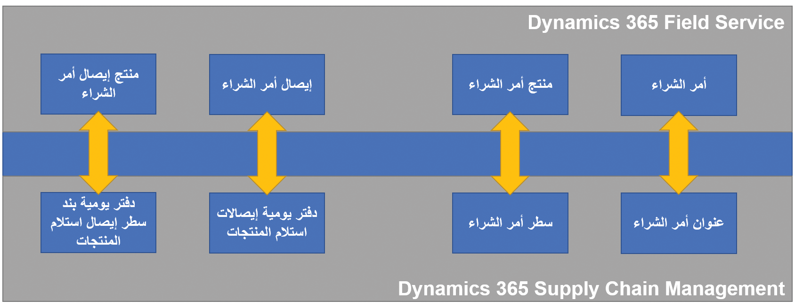

يوفر Microsoft Dynamics 365 Supply Chain Management وظائف شراء قوية للمؤسسات التي تستخدم التطبيق. يوفر Microsoft Dynamics 365 Field Service وظائف مماثلة تدعم عمليات الشراء المرتبطة بعملية الخدمة. يمكن دمج الوظائف في هذين التطبيقين من خلال الكتابة المزدوجة، ويتم تمكين حالات الاستخدام متعددة الوظائف الناتجة من خلال تعيينات الجدول ومنطق الحل وطرق العرض والنماذج.

يتيح لك التكامل بين Dynamics 365 Supply Chain Management وDynamics 365 Field Service مشاركة بيانات المشتريات بشكل ثنائي الاتجاه، مما يسمح لك بإجراء تحديثات من كلا التطبيقين في الوقت الفعلي تقريباً. على سبيل المثال، يمكن لمؤسستك إنشاء أمر شراء في Supply Chain Management ثم تحديث أمر الشراء، مثل تحديث بنود التسليم أو أوامر الشراء في Field Service. تتم مشاركة التغييرات التي تجريها في أي من التطبيقين في الوقت الفعلي تقريباً. بالإضافة إلى ذلك، يمكنك تتبع حالة أمر الشراء ودورة الحياة في كلا التطبيقين.

يوضح الرسم البياني التالي جداول في كلا النظامين وعلاقاتهما. في Field Service، تتوافق أوامر الشراء مع صف حساب، ولكن في Supply Chain Management، تشير أوامر الشراء إلى صف المورد. لحل التكامل، تستخدم الكتابة المزدوجة مرجعاً لربط صفوف المورد بصفوف الحساب.

> [!div class="mx-imgBorder"]
> 

عندما يتم دمج البيانات بين Supply Chain Management والتطبيقات الأخرى، مثل Dynamics 365 Field Service، فأنت بحاجة إلى فهم كيفية تعيين البيانات وكيفية إنشاء علاقات الجداول. على سبيل المثال، يعتبر البائع مفهوماً راسخاً في Supply Chain Management، بينما في تطبيقات مشاركة العملاء، لا يوجد مفهوم الموردين. لسد هذه الفجوة، يمكنك زيادة تحميل جدول الحساب/جهة الاتصال لتخزين بيانات المورد. يقدم مدير المورد المتكامل مفهوم بائع صريح في تطبيقات تفاعل العملاء. يمكنك استخدام تصميم البائع الجديد أو تخزين بيانات المورد في جدول الحساب/جهة الاتصال. تدعم الكتابة المزدوجة كلا النهجين. إذا كنت لا تريد تخزين بيانات المورد في جدول الحساب/جهة الاتصال في Microsoft Dataverse، يمكنك إعداد تصميم مورد جديد.

لمزيد من المعلومات، راجع [تدفق بيانات المورد](/dynamics365/fin-ops-core/dev-itpro/data-entities/dual-write/vendor-mapping?azure-portal=true).
