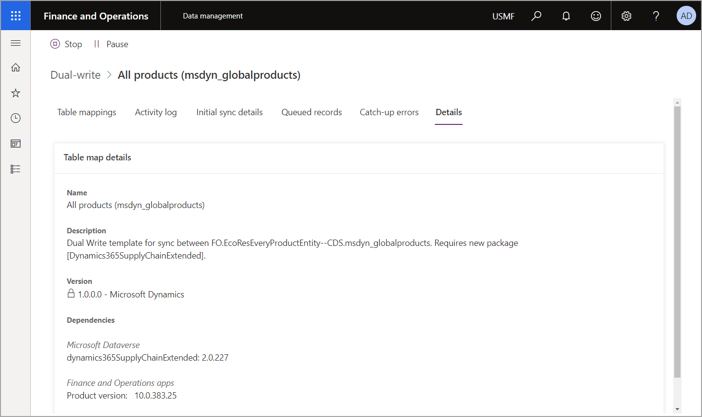
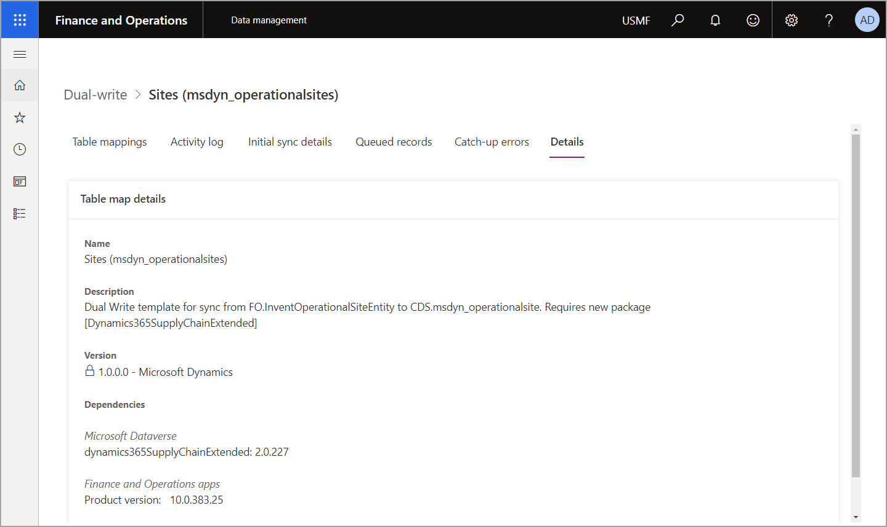
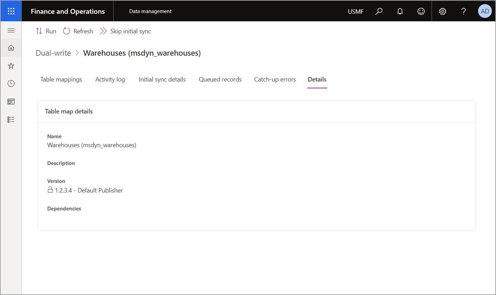
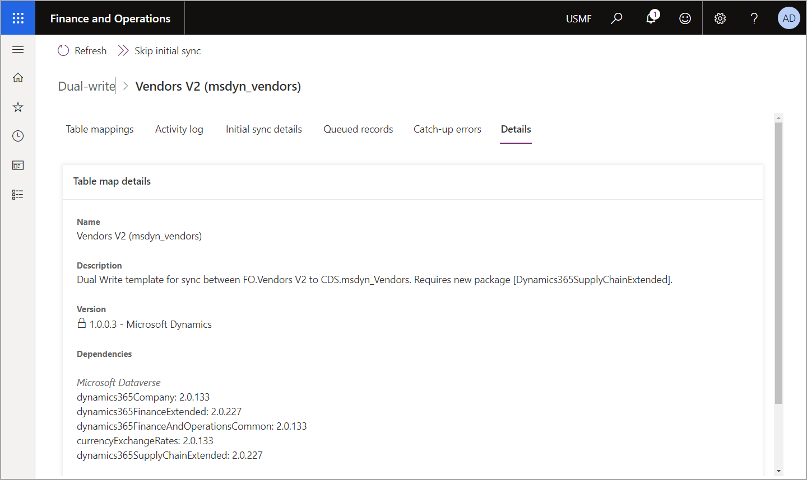
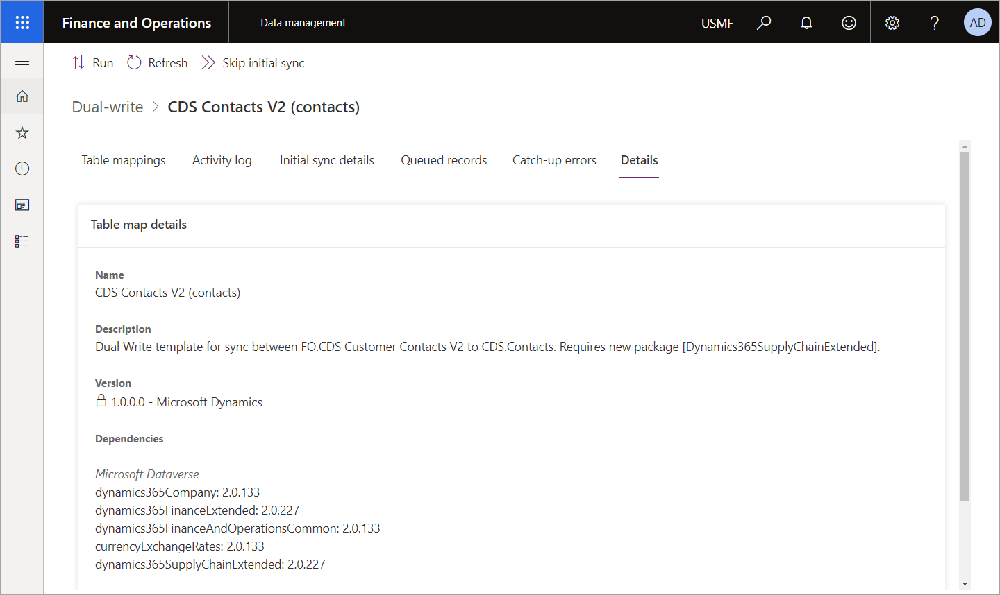
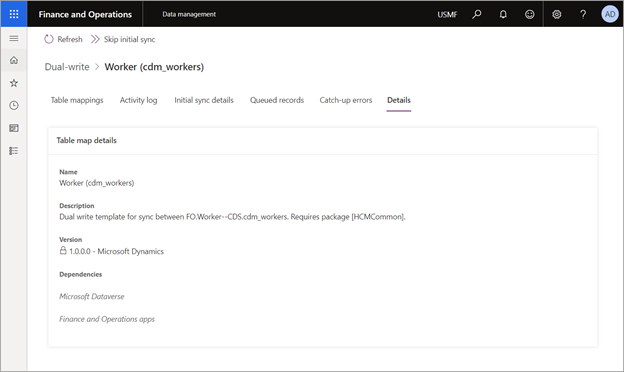
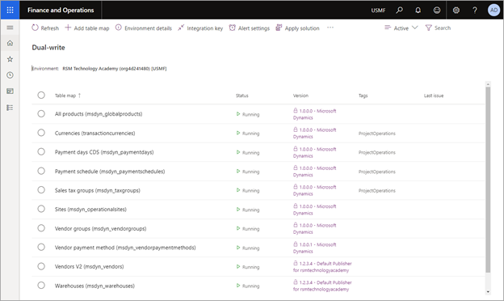
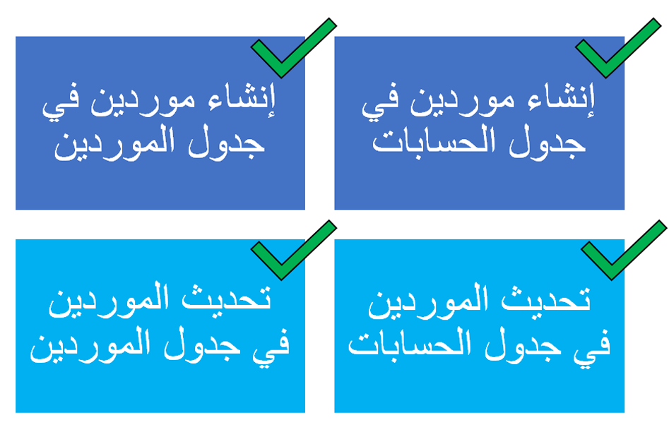

يجب مزامنة البيانات المرجعية بين Supply Chain Management وDataverse لإنشاء أوامر شراء جديدة وللعمل مع أوامر الشراء الحالية. لتحديد الجداول التي يجب تمكينها لخريطة معينه، يمكنك استخدام وظيفة الكتابة الأولية للكشف عن علاقات الجداول وتحديد الجداول التي يجب تمكينها.
استخدم مساحة عمل **إدارة البيانات** لتكوين الكتابة المزدوجة. 

الجداول التي تحتاج إلى مزامنتها لاستخدام الوظيفة هي:

- **قوالب المنتج** - عند تشغيل الكتابة الأولي، ستحصل علي قائمة كاملة بالجداول المطلوبة. تتضمن الأمثلة على هذه القوالب ما يلي:

  - جميع المنتجات

  - المنتجات الصادرة V2

  - المنتجات المميزة الصادرة‬ من Dataverse

    > [!div class="mx-imgBorder"]
    > 

- **المواقع**

    > [!div class="mx-imgBorder"]
    > 

- **المستودعات**

    > [!div class="mx-imgBorder"]
    > 

- **قوالب فئة التدبير** - تتضمن الأمثلة علي هذه القوالب:

  - فئات التدبير

  - Pro

  - التدرج الهرمي لفئات المنتجات

  - تعيينات فئات المنتج

- **قوالب الموردين**، مثل المورد V2

    > [!div class="mx-imgBorder"]
    > 

- **قوالب شخص جهة الاتصال**، مثل جات اتصال CDS V2

    > [!div class="mx-imgBorder"]
    > 

- **قوالب العاملين**، مثل العامل

    > [!div class="mx-imgBorder"]
    > 

تتم مزامنة الجداول لضمان توفر كافة مستندات Supply Chain Management (أوامر الشراء وإيصالات استلام المنتجات) في Dataverse. فيما يلي مثال علي الجداول التي تحتاج إلى تزامن.

> [!div class="mx-imgBorder"]
> 

## جداول الحساب والمورد

يمكنك استخدام جدول الحساب لتتبع أوامر الشراء الخاصة بالمورد في Field Service. كنتيجة لذلك، يمكنك استخدام الحسابات لتعقب الموردين في جداول Dataverse للحصول على جداول أوامر الشراء. للاحتفاظ بمزامنة الحسابات والموردين، تأكد من أنك تقوم بالاشتراك مع مهام سير العمل الأربع التالية لاستيعاب هذا الاختلاف الكبير.

> [!div class="mx-imgBorder"]
> 

يتم تنشيط مهام سير العمل هذه تلقائيا إذا تم تثبيت OneFSSCM مع Field Service وSupply Chain Management الملحقة. تكون هذه الطريقة مطلوبة إذا لم تكن Field Service مثبتة وتريد استخدام جداول أوامر الشراء من Dataverse. إذا لم تبدأ من البداية، فقد تحتاج إلى إنشاء كافة حسابات الموردين في Dataverse قبل إنشاء أوامر الشراء؛ وقد تحدث الأخطاء بخلاف ذلك.

## المزامنة الأولية للقوالب

لجعل أوامر الشراء وإيصالات استلام المنتجات الموجودة متوفرة في كلا النظامين، ستحتاج إلى القيام بمزامنة أولية للقوالب التالية:

- رأس أمر الشراء V2

- بند أمر الشراء CDS

- الحذف المبدئي لبند أمر الشراء CDS

- إيصال أمر الشراء

- منتج إيصال أمر الشراء
