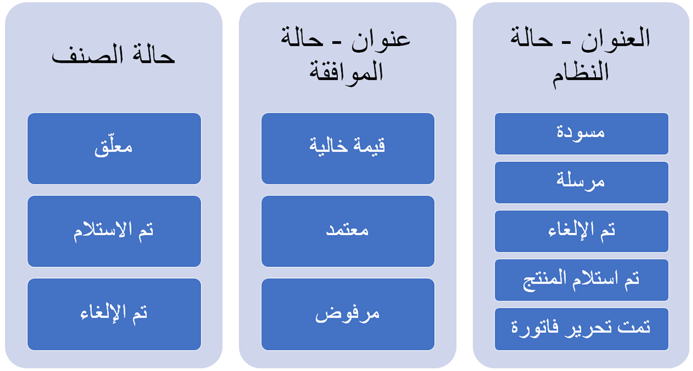

تختلف حالات أمر الشراء في Field Service عن حالات أمر الشراء في Supply Chain Management. ستراجع الأقسام التالية تلك الاختلافات.

## حالة أمر الشراء في Field Service وحالة منتج أمر الشراء

تشمل حالة أمر الشراء في Field Service وحالة منتج أمر الشراء الآتي:

- العنوان - النظام

- العنوان - الاعتماد

- العنصر

> [!div class="mx-imgBorder"]
> 

## حالة أمر الشراء في Supply Chain Management وحالة بند أمر الشراء

لا تنشط حالات اعتماد البنود إلا عند وجود سير عمل البند.

> [!div class="mx-imgBorder"]
> 

تُطبق القواعد التالية على أعمدة الحالة:

- يتعذر على Field Service تغيير الحالة في Supply Chain Management. عند تغيير حالة أمر شراء في Supply Chain Management، يجري تحديث الحالة في Field Service في بعض الحالات.

- تكون حالة الاعتماد الخاصة بأمر الشراء في Supply Chain Management عبارة عن **مسودة** أو **قيد المراجعة** إذا كان الأمر ضمن إدارة التغيير وتجري معالجة التغيير. سيجري تعيين حالة اعتماد Field Service إلى **حالة فارغة** في هذه الحالة.

- سيجري تعيين حالة اعتماد أمر الشراء في Field Service إلى **معتمدة** إذا كانت حالة اعتماد أمر الشراء في Supply Chain Management معينة إلى **معتمدة** أو **‏‫قيد المراجعة الخارجية‬** أو **مؤكدة** أو **تم الانتهاء**.

- سيجري تعيين حالة اعتماد أمر الشراء في Field Service إلى **مرفوضة** إذا كانت حالة اعتماد أمر الشراء في Supply Chain Management معينة إلى **مرفوضة**.

- سيجري تغيير حالة أمر الشراء في Field Service إلى **تم الإرسال** إذا تم تغيير حالة عنوان المستند في Supply Chain Management إلى **أمر مفتوح (أمر متأخر)** وكانت حالة أمر الشراء في Field Service **مسودة** أو **تم الإلغاء**.

- في حال تغيير حالة عنوان المستند في Supply Chain Management إلى  **تم الإلغاء**، ولم يكن أي منتج من منتجات إيصالات أوامر الشراء في Field Service مرتبطة بأمر الشراء (من خلال منتجات أوامر الشراء)، فإن حالة نظام Field Service تكون معينة إلى  **تم الإلغاء**.

- في حال كانت حالة بند أمر الشراء في Supply Chain Management معينة إلى  **تم الإلغاء**، يتم تعيين حالة منتج أمر الشراء في Field Service إلى  **تم الإلغاء**. كما أنه في حال تغيير حالة بند أمر الشراء في Supply Chain Management من  **تم الإلغاء** إلى **أمر متأخر**، يتم تعيين حالة عنصر أمر الشراء في Field Service إلى  **معلقة**.
