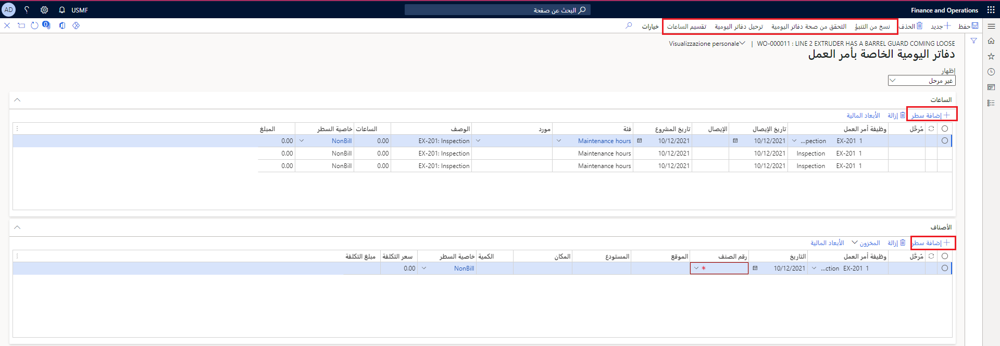

عند انتهاء مهمة الصيانة، تكون الخطوة التالية هي تسجيل الاستهلاك وترحيل المعلومات إلى دفاتر اليومية. 

تتكون التسجيلات من أنواع الاستهلاك التالية: 

- الساعات‬
- الأصناف
- المصرُوفات 

يعمل إعداد دفتر اليومية في إدارة الأصول على ترحيل دفاتر يومية منفصلة للساعات والأصناف والمصروفات في وحدة إدارة المشاريع ومحاسبتها.  

اتبع الخطوات التالية لتسجيل الاستهلاك:

1.  انتقل إلى **إدارة الأصول > شائع > أوامر العمل > جميع أوامر العمل** أو **أوامر العمل النشطة** ثم حدد "أمر عمل".
2.  في القسم **المشروع**، حدد **دفاتر اليومية**. تظهر صفحة **دفاتر يومية أمر العمل**.
3.  من القائمة "جزء الإجراءات"، حدد **نسخ من التنبؤ**. سيتم فتح مربع الحوار **نسخ من التنبؤ**، حيث يمكنك تحديد أنواع الاستهلاك التي تريد نسخها من أمر العمل وذلك بتبديل زر التبديل إلى **نعم**. بعد إكمال المهمة، حدد **موافق**، والذي سيعيد توجيهك إلى صفحة **دفاتر يومية أمر العمل**.

    
 
4.  في الصفحة **دفاتر يومية أمر العمل**، يمكنك إضافة المزيد من بنود الاستهلاك لكل نوع استهلاك على علامات التبويب السريعة الخاصة بها. 

    على سبيل المثال، أثناء الفحص، وجد العامل مشكلة أخرى تتطلب ساعة واحدة من وقت الكهربائي. وبالتالي، تحتاج إلى الانتقال إلى علامة التبويب السريعة **ساعات**، وحدد **إضافة بند** وحدد مورداً من حقل **المورد** وأدخل **1** في الحقل **ساعات** لإضافة الوقت الإضافي.

5.  حدد **التحقق من صحة دفاتر اليومية** لضمان صحة سطور دفاتر اليومية قبل الترحيل. في حالة حدوث خطأ، ستظهر رسالة خطأ. حدد الرسالة لعرض التفاصيل. إذا كان كل شيء صحيحاً، فستتلقى إخطاراً يفيد بأن دفتر اليومية صحيح.
6.  بعد التحقق من صحة دفتر اليومية، حدد **ترحيل دفاتر اليومية** لترحيل سطور دفاتر اليومية. 

توضح لقطة الشاشة التالية مثالاً لتسجيلات الساعات والأصناف في أمر عمل في صفحة **دفاتر يومية أمر العمل**.

شاهد الفيديو التالي للاطلاع على عرض توضيحي حول كيفية تسجيل الاستهلاك وترحيل دفاتر اليومية. 

 > [!VIDEO https://www.microsoft.com/videoplayer/embed/RE4pwU1]

والآن بعد ترحيل دفتر اليومية، سترغب في إظهار أن أمر العمل مكتمل. لتنفيذ هذه المهمة، تحتاج إلى تحديث حالة دورة حياة أمر العمل إلى **مكتملة** أو **انتهت**. 

1. لعرض كافة دفاتر اليومية المرحّلة، انتقل إلى الحقل **إظهار** في الجزء العلوي من صفحة **دفاتر يومية أمر العمل** وحدد **مُرحّلة**. تحتوي دفاتر اليومية المرحّلة على علامة اختيار في خانة الاختيار **مُرحّلة**. 
1. من الصفحة **أوامر العمل النشطة**، حدد أمر العمل المرحّل، وفي القسم **حالة دورة الحياة**، حدد تحديث حالة أمر العمل لفتح مربع الحوار حيث يمكنك تحديد **مكتملة**.

قبل ترحيل المعلومات في دفاتر اليومية، ضع في اعتبارك العوامل التالية: 

- يمكن إنشاء حالة دورة حياة أمر العمل لترحيل دفاتر اليومية تلقائياً. لمعرفة المزيد حول كيفية إعداد هذه الميزة، انتقل إلى حالات دورة حياة أمر العمل.
- عندما تضيف سطور الصنف إلى دفتر يومية أمر العمل، يتم نقل أبعاد منتج الصنف وأبعاد التتبع تلقائياً إلى سطر دفتر اليومية.

## تقسيم الساعات في أوامر العمل 
ضع في اعتبارك السيناريو الذي يكون لديك خلاله أمر عمل كبير يتطلب 10 ساعات من الصيانة. بدلاً من تعيينه لعامل واحد، فأنت تريد تقسيم الساعات بين عاملين بحيث يمكن إنجاز المهمة في يوم واحد. يوضح الإجراء التالي كيف يمكنك تحقيق ذلك.

1.  انتقل إلى **إدارة الأصول > شائع > أوامر العمل > جميع أوامر العمل** أو **أوامر العمل النشطة**، وحدد أمر العمل، ثم حدد **دفاتر اليومية**.
2.  في علامة التبويب السريعة **الساعات**، حدد سطر أمر العمل الذي ترغب في تقسيمه، ثم حدد **تقسيم الساعات** من جزء الإجراءات.
3.  يتم فتح مربع الحوار **تقسيم الساعات في مهام صيانة أمر العمل**. في الحقل **العامل**، حدد اسم الشخص الذي ترغب في إضافته إلى أمر العمل هذا. 
4.  في الحقل **الفئة**، حدد فئة للوقت المستغرق.
5.  في الحقل **الساعات**، أدخل عدد الساعات التي تريد أن يعمل فيها. في هذه الحالة، تريد تعيين خمس ساعات له. بعد إكمالك للمهمة، حدد **موافق**.

    
 
في لقطة الشاشة التالية، لاحظ أنه تم تقسيم الساعات بين عاملين، مع تخصيص خمس ساعات عمل لكل منهما. الآن وقد تم تقسيم الوقت، يمكن إما حذف السطر الأصلي الذي يعرض 10 ساعات أو الاحتفاظ به.
**إدارة الأصول > عام > أوامر العمل > جميع أوامر العمل**
 

## الأبعاد المالية في تسجيلات الاستهلاك
عند تسجيل الاستهلاك، بناءً على نوع التسجيل، تتم إضافة الأبعاد المالية إلى التسجيلات في التسلسل التالي.

تسجيلات الساعات والمصروفات: 

1.  الأبعاد المالية من رأس دفتر اليومية 
2.  الأبعاد المالية من مشروع أمر العمل المرتبط
3.  الأبعاد المالية من المورد

تسجيلات الأصناف: 

1.  الأبعاد المالية من رأس دفتر اليومية 
2.  الأبعاد المالية من مشروع أمر العمل المرتبط 
3.  الأبعاد المالية من الموقع 
4.  الأبعاد المالية من الصنف

> [!NOTE]
> يتم التحقق من صحة كافة مجموعات الأبعاد المالية. في حالة وجود أي مجموعات غير صالحة، سيتم تفريغها. هذا الإعداد قياسي للعديد من تطبيقات Finance and Operations.