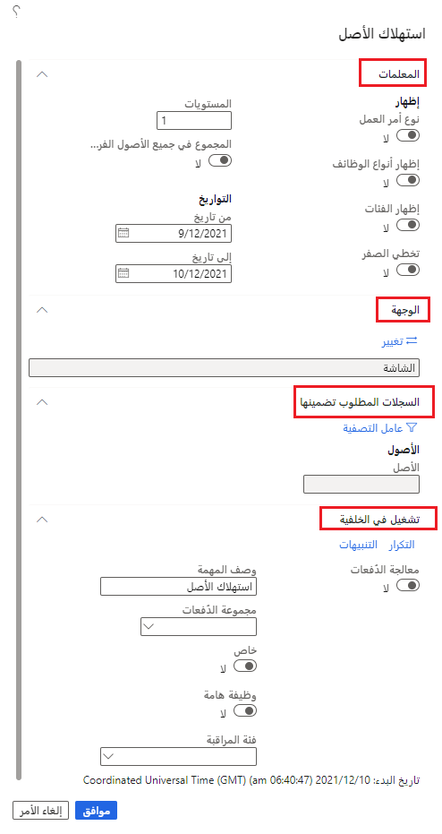

الآن بعد أن قمت بإنشاء ونشر تسجيلات الاستهلاك في أوامر العمل، يمكنك عرض تفاصيل الاستهلاك بطريقتين: استهلاك الأصول واستهلاك أوامر العمل.

## تقرير استهلاك الأصول
سيوضح لك تقرير استهلاك الأصول؛ الساعات وتكاليف الساعات وتكاليف الأصناف والمصروفات المُرحلة في الأصول. يوضح الإجراء التالي كيف يمكنك عرض هذا التقرير.

1.  انتقل إلى **إدارة الأصول > التقارير > الأصول > استهلاك الأصول**. يظهر مربع الحوار **استهلاك الأصول**، حيث يمكنك تعيين المعلمات ومقدار التفاصيل التي ترغب في رؤيتها في التقرير. على سبيل المثال، إذا كنت تريد أن يتضمن التقرير أنواع أوامر العمل أو يعرض أنواع الوظائف، فحدد **نعم** في تلك الأزرار. 

     

2.  حقل **المستويات** هو المكان الذي يمكنك من خلاله تجميع بنود الأصول حسب مواقع العمل. على سبيل المثال، إذا أدخلت **1**، فسيتم عرض كافة الأصول الخاصة بموقع العمل في المستوى العلوي. يمكن أن يكون هذا النهج مفيداً إذا كانت لديك بنية موقع العمل متعددة المستويات. إذا أدخلت **0**، فسيعرض التقرير كافة الأصول على كافة المستويات الوظيفية التي يرتبط بها. 
3.  في زر التبديل **المجموع في كافة الأصول**، حدد **نعم** إذا كنت تريد أن يقوم التقرير بتضمين الإجمالي لكل أصل فرعي.
4.  أدخل تاريخ البدء للتقرير في الحقل **تاريخ البدء** والتاريخ الذي تريد أن ينتهي التقرير فيه في الحقل **تاريخ الانتهاء**. 
5.  علامة التبويب السريعة **الوجهة** هي المكان الذي يمكنك فيه تحديد طريقة عرض التقرير. يمكنك التحديد من **على الشاشة**، أو **طباعة**، أو **حفظه كملف**، أو **بريد الكتروني**.
6.  في علامة التبويب السريعة **السجلات المطلوب تضمينها**، يمكنك استخدام عامل التصفية لتحديد أصول محددة ليتم تضمينها في التقرير. 
7.  تتيح لك علامة التبويب السريعة **تشغيل في الخلفية** تحديد تكرار، إذا كنت ترغب في تشغيل هذا التقرير في وقت أو تاريخ أو بمعدل تكرار محدد. بالإضافة إلى ذلك، يمكنك إعداد تنبيه وظيفة دفعية لإعلامك إذا انتهى التقرير، أو حدث خطأ، أو إذا تم إلغاء التقرير.
8.  بعد إكمالك للمهمة، حدد **موافق** لإنشاء التقرير.

     
 
## تقرير استهلاك أوامر العمل
يعرض تقرير استهلاك أوامر العمل الساعات وتكاليف الساعات وتكاليف الأصناف والمصروفات التي تم ترحيلها في أوامر العمل.

1.  انتقل إلى **إدارة الأصول > التقارير > أوامر العمل > استهلاك أوامر العمل** لفتح مربع الحوار **استهلاك أوامر العمل**.
2.  يتشابه مربع الحوار **استهلاك أوامر العمل** مع مربع الحوار **استهلاك الأصول**، حيث يمكنك تحديد المعلمات التي تريد تضمينها في التقرير عن طريق تحديد **نعم** على أزرار التبديل ذات الصلة في القسم **إظهار**.
3.  أدخل تاريخ البدء للتقرير في الحقل **تاريخ البدء** والتاريخ الذي تريد أن ينتهي التقرير فيه في الحقل **تاريخ الانتهاء**. 
4.  علامة التبويب السريعة **الوجهة** هي المكان الذي يمكنك فيه تحديد طريقة عرض التقرير. يمكنك التحديد من **على الشاشة**، أو **طباعة**، أو **حفظه كملف**، أو **بريد الكتروني**.
5.  في علامة التبويب السريعة **السجلات المطلوب تضمينها**، يمكنك استخدام عامل التصفية لتحديد أصول محددة ليتم تضمينها في التقرير. 
6.  تتيح لك علامة التبويب السريعة **تشغيل في الخلفية** تحديد تكرار، إذا كنت ترغب في تشغيل هذا التقرير في وقت أو تاريخ أو بمعدل تكرار محدد. بالإضافة إلى ذلك، يمكنك إعداد تنبيه وظيفة دفعية لإعلامك إذا انتهى التقرير، أو حدث خطأ، أو إذا تم إلغاء التقرير.
7.  بعد الانتهاء من المهمة، حدد **موافق** لإنشاء التقرير.

> [!NOTE]
> يمكنك أيضاً إنشاء تقرير يحتوي على مزيد من تفاصيل أوامر العمل. لمعرفة المزيد حول هذه العملية، انتقل إلى [تقرير أمر العمل](https://docs.microsoft.com/dynamics365/supply-chain/asset-management/work-orders/work-order-report/?azure-portal=true).