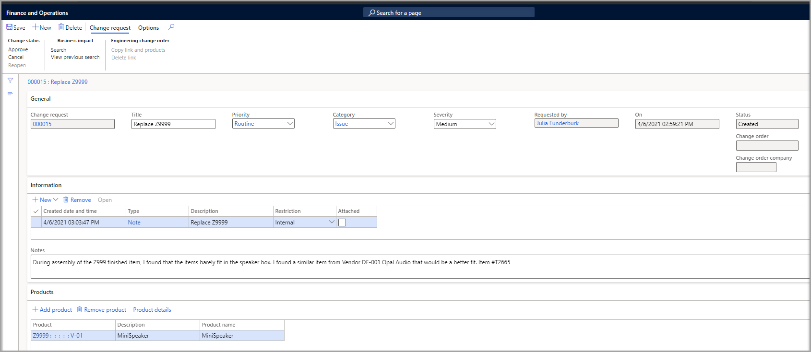
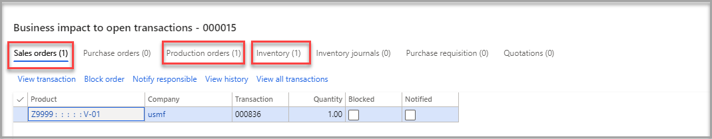
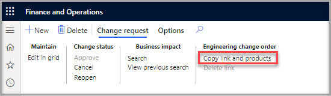

تسمح عملية طلب التغيير الهندسي لأي مستخدم بطلب تغيير منتج هندسي. يتيح السماح لأي مستخدم بتقديم طلبات فرصة لاقتراح تحسين المنتج بشكل منهجي، أو إنشاء أفكار لمنتج جديد، أو الإبلاغ عن مشكلة في أحد المنتجات. بعد إرسال طلب التغيير، سيقوم مالك المنتج أو المستخدمون ضمن سير العمل بمراجعة الطلبات والتصرف بناءً عليها.

## إنشاء طلب تغيير هندسي جديد

لإنشاء طلب تغيير هندسي، اتبع الخطوات التالية:

1.  انتقل إلى **إدارة التغيير الهندسي > عام > إدارة التغيير الهندسي > طلبات التغيير الهندسي** ثم حدد **جديد** في جزء الإجراءات. 
    
    بدلاً من ذلك، يمكنك فتح صفحة **تفاصيل المنتج** لمنتج هندسي موجود. 

    في جزء الإجراءات، في علامة التبويب  **مهندس** ، في مجموعة  **إدارة التغيير الهندسي** ، حدد  **طلب تغيير هندسي > طلب تغيير هندسي جديد**.

1.  في حقل **العنوان**، أدخل النص الذي يصف التغييرات في الطلب بإيجاز أو يحددها.

1.  في حقل **الأولوية**، حدد قيمة للإشارة إلى مدى أولوية التغيير. 

1.  في حقل **الفئة**، حدد قيمة لوصف نوع التغيير الذي تطلبه.

1.  في حقل **درجة الخطورة**، حدد قيمة للإشارة إلى خطورة المشكلة التي يجب إصلاحها من خلال تنفيذ الطلب. 

    سيتم ملء الحقول **المطلوبة من قبل**، **تشغيل** و **الحالة** تلقائياً.

1.  الحقل **أمر التغيير** هو رقم أمر التغيير إذا تمت متابعة طلب التغيير من خلال أمر التغيير.

1.  في علامة التبويب السريعة **المعلومات** حدد **جديد** لتحميل ملف أو صورة أو ملاحظة أو عنوان URL من حيث صلتها بطلب التغيير.

1.  في علامة التبويب السريعة **المنتجات**، أضف المنتجات المتأثرة بطلب التغيير.

    > [!div class="mx-imgBorder"]
    > 

## تقييم تأثير الأعمال لطلب التغيير

عند إنشاء طلب تغيير أو إرساله إلى سير عمل، يجب على مالك المنتج أو المعتمدين على سير العمل تقييم طلب التغيير وتأثيره على المعاملات المفتوحة. لإنجاز هذه المهمة، يمكنك البحث عن التبعيات، وهي أي حركات مفتوحة مثل أوامر المبيعات وأوامر الإنتاج والمخزون الفعلي، والتي يجب تقييمها قبل إجراء أي تغيير.

لتقييم طلب التغيير الهندسي، اتبع الخطوات التالية:

1.  انتقل إلى  **إدارة التغيير الهندسي> عام > إدارة التغيير الهندسي > طلبات التغيير الهندسي**.

1.  افتح طلب التغيير في جزء الإجراءات.

1.  في جزء الإجراءات، في علامة التبويب  **طلب التغيير** ، في مجموعة  **تأثير الأعمال** ، حدد أحد الأزرار التالية:

    -   **بحث** - يمسح جميع المعاملات المفتوحة ثم يفتح مربع الحوار **تأثير الأعمال لفتح المعاملات** ، الذي يسرد جميع المعاملات التي تأثرت بالتغيير. في الصورة التالية، تشير المربعات الحمراء إلى نوع المعاملة التي يحتوي عليها المنتج وعدد المعاملات في كل صفحة.

    -   **عرض البحث السابق** - افتح مربع الحوار **تأثير الأعمال لفتح المعاملات** الذي يسرد السابق نتائج البحث. (لا يتم تشغيل بحث جديد.)

    > [!div class="mx-imgBorder"]
    > 

1.  إذا كانت المشكلة التي تتطلب التغيير حرجة، فيمكنك تحديد **حظر الأمر** لمنع المعاملات المفتوحة، أو يمكنك تحديد **إبلاغ المسؤول** لإخطار المستخدم المسؤول في مربع الحوار **تأثير الأعمال لفتح المعاملات** .

1.  حدد **موافقة** في جزء الإجراءات لقبول طلب التغيير.

## إنشاء أمر تغيير من طلب التغيير

عندما يقرر المهندس أو مالك المنتج الذي يراجع طلب التغيير أنه يجب إنشاء أمر التغيير، يمكنه إنشاء أمر التغيير مباشرةً من صفحة **طلب التغيير الهندسي**.

لإنشاء أمر تغيير، حدد  **نسخ الارتباط والمنتجات** في صفحة **طلبات التغيير الهندسي** في جزء الإجراءات، في علامة التبويب **طلب التغيير** في مجموعة **ترتيب التغيير الهندسي** .

> [!div class="mx-imgBorder"]
> 

اتبع الخطوات الواردة في الوحدة التالية لإكمال أمر التغيير.
