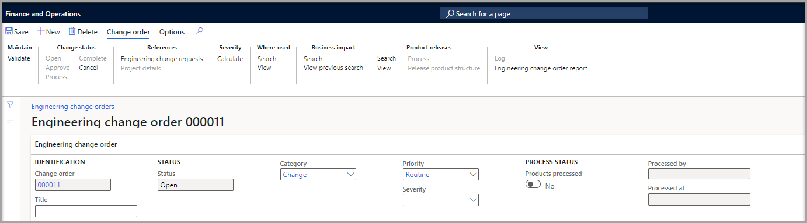
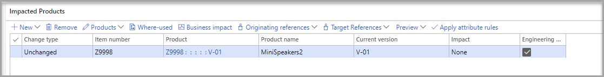

توفر أوامر التغيير الهندسي عملية منظمة لك لإجراء تغييرات على المنتجات الهندسية. يمكنك إنشاء أوامر التغيير باستخدام طلبات أوامر التغيير أو يمكنك إنشاء أمر جديد.

لتضمين منتجات متعددة في أمر التغيير الهندسي، اتبع أياً من الخطوات التالية:

-   حدد المنتجات يدوياً.

-   استخدم BOM لتضمين العناصر الفرعية.

-   استخدم بحث **مكان الاستخدام** لتضمين العنصر الأصلي لسطر قائمة مكونات الصنف.

بعد اكتمال التغييرات المقترحة على الصفحة، يمكنك أتمتة عملية المراجعة والموافقة باستخدام مهام سير العمل، كما تمت مناقشته. سواء اختارت شركتك معالجة أوامر التغيير الهندسي مباشرة بعد الموافقة عليها، كجزء من سير العمل، أو كخطوة يدوية، عند معالجة أمر التغيير، سيتم تحديث البيانات الهندسية للمنتج.

## أوامر التغيير الهندسي في الشركات الهندسية أو التشغيلية

اعتماداً على نوع الكيان القانوني الذي تُنشئ فيه أمر التغيير، سواء كانت شركة هندسية أو تشغيلية، تختلف بيانات المنتج التي يمكنك تغييرها، على سبيل المثال:

- لأوامر التغيير الهندسي في **شركة هندسية**، يمكنك إجراء تغييرات أساسية على البيانات الهندسية. على سبيل المثال، يمكنك إنشاء إصدارات جديدة من أحد المنتجات، وتغيير بنية المنتج من خلال قائمة مكونات الصنف، وتغيير قيم السمات الهندسية. لكل منتج متأثر، حدد إحدى القيم التالية في الحقل **التأثير**:

    - **بلا** - تحديث إصدار المنتج الموجود (التحديث داخل الإصدار).

    - **إصدار جديد** - إنشاء إصدار جديد يستند إلى إصدار المنتج المحدد.

    - **منتج جديد** - إنشاء منتج جديد يستند إلى إصدار المنتج المحدد.

    - **متغير جديد** - إنشاء متغير جديد للصنف بناءً على إصدار المنتج المحدد. سيتم نسخ قائمة مكونات الصنف ومعلومات المسار.

- بالنسبة لأوامر التغيير الهندسي في  **شركة تشغيلية**، يمكنك تغيير البيانات اللوجستية للمنتج. على سبيل المثال، يمكنك إثراء قائمة مكونات الصنف الحالية بإعدادات تحديد المصادر، وإضافة مسارات محلية أو قائمة مكونات الصنف المحلية، وحتى إثراء قائمة مكونات الصنف عن طريق إضافة سطور قائمة مكونات الصنف جديدة لمواد التعبئة المحلية، أو سوائل التشحيم، أو الإرشادات باللغة المحلية.

عند إجراء تغييرات في الشركة الهندسية، يجب طرح المنتجات للشركات العاملة.

## إنشاء أمر تغيير هندسي

لإنشاء أمر تغيير هندسي، سواء كان من طلب أو تقوم بإنشاء أمر جديد، اتبع الخطوات التالية:

1.  انتقل إلى **إدارة التغيير الهندسي > عام > إدارة التغيير الهندسي > أوامر تغيير المهندس**.

1.  حدد **جديد**.

1.  في حقل **العنوان**، أدخل النص الذي يصف التغييرات في الطلب بإيجاز أو يحددها.

1.  في حقل **الأولوية**، حدد قيمة للإشارة إلى مدى أولوية التغيير. 

1.  في حقل **الفئة**، حدد قيمة لوصف نوع التغيير الذي تطلبه.

1.  في حقل **درجة الخطورة**، حدد قيمة للإشارة إلى خطورة المشكلة التي يجب إصلاحها من خلال تنفيذ الطلب. يمكنك حساب الخطورة تلقائياً عن طريق تحديد **حساب** في مجموعة **الخطورة** في جزء الإجراءات.

1.  سيتم ملء قسم الحالة **العملية** عند معالجة التغيير. على سبيل المثال، يكون ترتيب التغيير مشابهاً لملف، حيث تتم صياغة التغييرات أو تصميمها. عند تحديد مفتاح التبديل **العملية** تحدث هذه التغييرات، وبالتالي يتم **تحرير المنتج** أو **تعديل المنتج** في الشركة الهندسية مع التغييرات التي تنعكس في أمر التغيير.

    > [!div class="mx-imgBorder"]
    > 

1.  في علامة التبويب السريعة **المنتجات المتأثرة** حدد **جديد** لإضافة منتجات إلى أمر التغيير.

1.  على غرار طلب التغيير، يمكنك البحث عن المنتجات وإضافتها بطرق مختلفة، والاطلاع على تأثير الأعمال، وفتح المعاملات، والمزيد، من علامة التبويب السريعة **المنتجات المتأثرة**.

    > [!div class="mx-imgBorder"]
    > 

1. عندما يحدد مالك المنتج **موافقة** في **تغيير الترتيب** جزء الإجراءات في قسم **تغيير الحالة** تمت الموافقة على التغيير في النظام.
