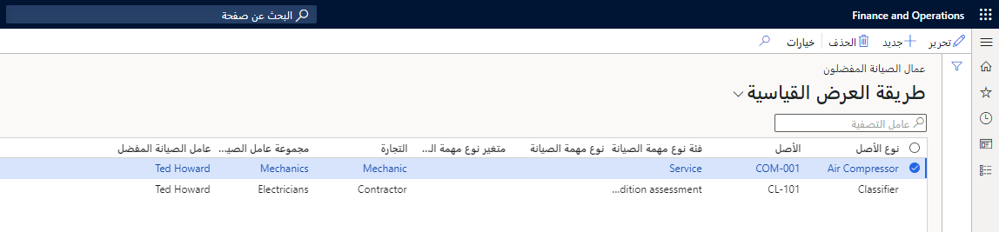

قبل أن تتمكن من البدء في جدولة أوامر العمل ليتم تشغيلها، تحتاج أولاً إلى إنشاء جدول زمني لعمال الصيانة والأدوات والأصول. ستكون مهمتك الأولى هي إنشاء التقويمات ثم تعيينها للعاملين لديك. 

> [!NOTE]
> عند إنشاء التقويمات، يجب أن تدرك أن عمال الصيانة مرتبطون بمورد، وأن تقويمات وقت العمل معدة للموارد. 

عند عرض عامل في صفحة **العاملون** في Dynamics 365 Supply Chain Management، يمكنك عرض المورد الذي يرتبطون به والتقويم الذي تم تعيينه للمورد. 

لتعيين عامل إلى تقويم، تحتاج إلى تخصيص مورد. سيتم بعد ذلك تعيين التقويم المرتبط بالمورد تلقائياً. 

لمعرفة كيفية تعيين الموارد والتقويمات لأحد العمال، شاهد الفيديو التالي. 

 > [!VIDEO https://www.microsoft.com/videoplayer/embed/RE4oRR3]

## إعداد عمال الصيانة المفضلين
قبل جدولة أوامر العمل، يمكنك استخدام إدارة الأصول للقيام بتفضيل عند تحديد عامل الصيانة أو مجموعة العاملين التي يتم تخصيصها لإكمال أمر العمل. هذا الإعداد غير مطلوب لجدولة أوامر العمل؛ ومع ذلك، فهو يسمح لك بتحديد عامل الصيانة الأكثر كفاءة لإكمال وظيفة معيّنة. 

ضع في اعتبارك النقاط التالية إذا كنت تستخدم هذه الوظيفة:

- يمكن إعداد التفضيل على أساس مهارات وكفاءات العمال. 
- يمكن جدولة عمال الصيانة المتاحين في وقت الجدولة فقط.
- في حالة مطابقة عامل مفضل لأمر العمل أثناء الجدولة وتعيين العامل لوظيفة أخرى، ستتم جدولة أمر العمل لعامل صيانة آخر متاح. 
- يمكن إعداد العاملين ومجموعات العاملين للجدولة المفضلة. 

يمكن إعداد العاملين أو مجموعات العاملين كعامل مفضل أو مجموعة عاملين بطرق عديدة، استناداً إلى المعلمات التالية:

- **التجارة** - المهارة التي يمتلكها العامل، على سبيل المثال، ميكانيكي أو فني تكنولوجيا المعلومات.
- **الأصل** – أي نوع من المعدات، مثل آلة أو جزء من آلة يتطلب صيانة أو خدمة أو إصلاحاً.
- **نوع الأصل** – يحدد أنواع مهام الصيانة (وبالتالي، مهام الصيانة) التي يمكن إجراؤها في الأصول.
- **نوع مهمة الصيانة** عند إنشاء أمر عمل، يتعين عليك تحديد نوع مهمة صيانة. يمكنك تحديد فقط أنواع مهام الصيانة المرتبطة بإعداد نوع الأصل المستخدم للأصل.
- **متغير نوع مهمة الصيانة** – يحدد التباينات لنوع الوظيفة، مثل الأحجام (صغيرة أو متوسطة أو كبيرة) والفترات (أسبوعياً أو مرة كل أسبوعين أو شهر واحد أو ثلاثة أشهر) والتكوينات (ذات مستوى منخفض أو مرنة أو ذات أداء عالٍ).
- **فئة نوع مهمة الصيانة** – تُستخدم لتجميع مجموعة من أنواع مهام الصيانة لأغراض الاستعراض العام.

## إعداد العمال المفضلين
استخدم هذه الخطوات لإعداد العمال المفضلين لجدولة أوامر العمل. ضع في اعتبارك أنه يمكنك القيام بأكثر من تحديد لنفس السجل؛ وكلما زادت التحديدات التي تقوم بها، كان الإعداد الذي ستحصل عليه أكثر تحديداً. 

1.  انتقل إلى **إدارة الأصول > إعداد > العاملون > عمال الصيانة المفضلون**.
2.  حدد **جديد** في جزء الإجراءات من صفحة قائمة **عمال الصيانة المفضلون**. 
3.  حدد من الحقول العديدة في البند التي يمكنك تكوينها:
    - نوع الأصل 
    - الأصل
    - فئة مهمة الصيانة
    - نوع مهمة الصيانة
    - متغير مهمة الصيانة
    - التجارة
    - مجموعة عامل الصيانة المفضل
    - عامل الصيانة المفضل

    
 
4.  في لقطه الشاشة السابقة، لاحظ أن Jodi Christiansen سيكون العامل المفضل للأصول في النوع **سير متحرك**، والتي تُعتبر أوامر عمل وقائية. ليست كل الحقول مطلوبة؛ يتم تحديدها من قِبل مؤسستك اعتماداً على مدى الدقة التي تريدها عند إعداد عمال الصيانة المفضلين. 
5.  عند الانتهاء من تكوين الحقول، حدد **حفظ** في جزء الإجراءات.