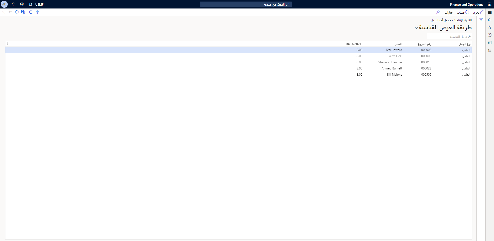

إذا كنت ترغب في الحصول على نظرة عامة على حمل العمل على الموارد لفترة محددة، يمكنك استخدام صفحة **حساب القدرة الإنتاجية**.

يمكنك حساب القدرة الإنتاجية استناداً إلى ما يلي:

- عمال الصيانة
- مجموعات العاملين
- الأدوات
- الأصول

لاستخدام صفحة **حساب القدرة الإنتاجية**، اتبع الخطوات التالية:

1.  انتقل إلى **إدارة الأصول > الاستعلامات > جدولة > القدرة الإنتاجية**. سيظهر مربع الحوار **حساب القدرة الإنتاجية**، حيثما يمكنك تحديد المعلمات للاستعلام.
2.  في الحقل **إظهار**، يمكنك تحديد ما إذا كنت تريد الحساب أم لا. يمكنك تحديد **القدرة الإنتاجية**، أو **المحجوز**، أو **المتبقي**. 
3.  إذا قمت بتعيين زر التبديل **تخطي التكلفة الصفرية** إلى **نعم**، فلن ترى النتائج التي تحتوي على صفر. 
4.  يمكنك تحديد الموارد المطلوب حسابها عن طريق تعيين زر التبديل **العامل**، أو **مجموعة عاملي الصيانة**، أو **الأداة**، أو **الأصل** إلى **نعم**. 
5.  يمكنك تحديد التاريخ والفترة الزمنية الخاصة بالحساب. في الحقل **نوع الفترة الزمنية**، يمكنك تحديد **يوم**، أو **أسبوع**، أو **شهر**، أو **ربع سنة**. 
6.  حدد **تاريخ من** لتشغيل هذا الحساب. 
7.  في الحقل **تكرار الفترة**، يمكنك إدخال عدد الفترات الزمنية التي تريد حسابها. على سبيل المثال، إذا قمت بتحديد **أسبوع** وأدخلت **5** في الحقل **تكرار الفترة**، فسوف تقوم بحساب خمسة أسابيع من تاريخ البدء. 
8.  حدد **موافق**. سيتم عرض استعلام مثل الصورة التالية. 

    
 
10. في الاستعلام، يمكنك رؤية **نوع حمل العمل**، و **رقم المرجع**، و **الاسم** والساعات لكل يوم. 