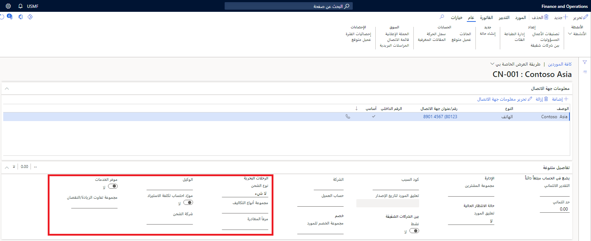

عند تمكين الوحدة النمطية **التكلفة شاملة التفريغ‬‬‬**، يُضاف عدد كبير من الحقول إلى صفحة **المورّدون**. يمكنك استخدام هذه المعلمات لإعداد المورّدين الذين سيتم استخدامهم مع ميزات **التكلفة شاملة التفريغ**.

لعرض الحقول ذات الصلة وإعدادها، انتقل إلى **التدبير والتوريد > المورّدون > جميع المورّدين**. يمكنك إنشاء مورّد جديد أو فتح مورّد موجود ثم الانتقال إلى علامة التبويب السريعة **متفرقات‬**. ضمن عنوان **الرحلات البحرية**، ستظهر الحقول الجديدة باعتبارها مضافة بواسطة الوحدة النمطية **التكلفة شاملة التفريغ**.

> [!div class="mx-imgBorder"]
> 

تقدم القائمة التالية شرحاً لحقول الإعدادات المتوفرة للمورّد لخيار **التكلفة شاملة التفريغ**.

- **نوع الشحن** - حدد الدور الذي يؤديه المورّد بالنسبة إلى **التكلفة شاملة التفريغ**‬‬‬:

    - **بلا** – لا يؤدي المورّد أي دور معين. هذا الإعداد هو الافتراضي لأن معظم المورّدين لا يؤدون أي دور معين.
    
    - **شركة الشحن** – المورّد هو شركة الشحن. يمكن تحديد المورّدين الذين قاموا بتمكين هذا الخيار في حقل **شركة الشحن** في صفحة **الرحلات البحرية**.
    
    - **وسيط العميل** – المورّد هو الوسيط الجمركي. يمكن تحديد المورّدين الذين قاموا بتمكين هذا الخيار في حقل **الوسيط الجمركي** في صفحة **حافظات الأوراق**.
    
    - **المندوب** – المورّد هو مندوب. يمكن تحديد المورّدين الذين قاموا بتمكين هذا الخيار في حقل **المندوب** في الصفحتين **المورّدون** و **أمر الشراء**.

- **مجموعة نوع التكلفة** - تعيين المورّد إلى مجموعة نوع تكلفة للمساعدة في تحديد التكاليف التلقائية.

- **منفذ المغادرة** - حدد نقطة منشأ الرحلة البحرية.

- **المندوب** - حدد المندوب الافتراضي عند الشراء من هذا المورّد.

- **مورّد تكلفة الاستيراد** - الإشارة إلى ما إذا كان هذا المورّد هو مورّد **التكلفة شاملة التفريغ**.

    > [!TIP]
    > يمكنك استخدام الحقل **مورّد تكلفة الاستيراد**، مع الأمان على مستوى السجل، لتقييد عدد أوامر الشراء التي تظهر عند إنشاء رحلة بحرية.
- **شركة الشحن** - حدد شركة الشحن التي يتم استخدامها كشركة الشحن الافتراضية عند إنشاء أوامر الشراء لهذا المورّد.

- **موفر الخدمات** - الإشارة إلى ما إذا كان المورّد هو موفر خدمات.

- **مجموعة التفاوت بالزيادة/النقصان** - حدد مجموعة التفاوت بالزيادة/النقصان التي تنطبق على هذا المورّد.