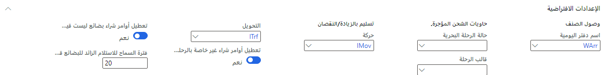

تعد صفحة **معلمات التكلفة شاملة التفريغ** هي المكان الذي تقوم فيه بإعداد المعلومات العامة وخيارات التكوين التي تريد استخدامها خلال الوحدة النمطية **التكلفة شاملة التفريغ** للترحيل، وتحديثات الحالة، والتسلسل الرقمي، والسلوك. بعد إعداد المعلمات، قم بمشاركتها مع الكيانات القانونية الأخرى، وبعد ذلك يمكن للمسؤول معالجة التحديثات.

يمكنك الوصول إلى صفحة **معلمات التكلفة شاملة التفريغ** بالانتقال إلى **التكلفة شاملة التفريغ > الإعداد >معلمات التكلفة شاملة التفريغ**.

نظراً لأن المعلمات ضرورية لتحديد التكاليف شاملة التفريغ، تشرح الأقسام التالية هذه الصفحة قسماً تلو الآخر.

## علامة تبويب عام

القسم الأول في صفحة **معلمات التكلفة شاملة التفريغ** هو علامة التبويب **عام** والتي تحتوي على علامات التبويب السريعة التالية:

-   **عام** - يستخدم في تعيين الأساس لبعض المعلمات العامة المرتبطة بالرحلات البحرية.

-   **التكلفة** - تخبر النظام بكيفية التعامل مع المواقف المختلفة المتعلقة بتكاليف الرحلة البحرية.

-   **التحقق من الصحة** - يخبر النظام بكيفية التعامل مع الموقف أو التحقق من صحته عند حدوث بعض الحالات الشاذة.

-   **الافتراضيات** - تعيين الافتراضيات الأساسية للرحلات البحرية.
> [!div class="mx-imgBorder"]
> 

### علامة التبويب السريعة عام
تتضمن علامة التبويب السريعة **عام** الحقول التالية:

- **استخدام سعر الشحن** - يحدد سعر الشحن الافتراضي الذي تريد استخدامه لرحلاتك البحرية. لدى معظم الشركات سعر شحن محدد مسبقاً يتم استخدامه لفترة معينة لتقدير تكلفة العناصر التي يتم تسعيرها بعملات متعددة. حدد **نعم** إذا كنت تريد استخدام سعر الشحن المحدد للرحلات البحرية.

- **نوع سعر الصرف** - يحدد سعر الصرف المستخدم في الحسابات متعددة العملات لرحلة ما والتكاليف المرتبطة بها. من القائمة المنسدلة، حدد السعر الذي يجب تطبيقه على جميع الرحلات البحرية.

- **تحديث كمية أمر الشراء** - يحدد ما يحدث عندما يحاول المستخدم تغيير الكمية في بند أمر الشراء الذي يعد جزءاً من رحلة بحرية. حدد أحد الإجراءات التالية من القائمة المنسدلة:

    - **قبول** - يتم تحديث كمية الرحلة البحرية تلقائياً.

    - **تحذير** - يتم عرض تحذير ويتم تحديث الكمية.

    - **خطأ** - يتم عرض تحذير خطأ ويمنع المستخدم من تعديل أمر الشراء. لكي يتابع المستخدم، يجب عليه إزالة بند الأمر من الرحلة البحرية.

- **تحديث عدد الكراتين تلقائياً** - يحدد كيفية عرض الكراتين في الرحلة البحرية.

    - في حالة تعيين مفتاح التبديل إلى **نعم**، فسيتم دمج جميع الكراتين وعرضها على مستوى الرحلة البحرية والحاوية.

    - إذا تم تعيين مفتاح التبديل إلى **لا**، فسيتم تعيين عدد الكراتين مبدئياً على 0 (صفر) وسيتطلب من المستخدم تعديلها يدوياً حسب الحاجة.

### علامة التبويب السريعة التكلفة

> [!div class="mx-imgBorder"]
> 

تتضمن علامة التبويب السريعة **التكاليف** الحقول التالية.

-   **مواصفات الترحيل** - تحدد كيفية ظهور تعديل القيمة في دفتر الأستاذ. استخدم القائمة المنسدلة لتحديد أحد الخيارات التالية:

    -   **الإجمالي** - سيتم ترحيل المبلغ الإجمالي إلى دفتر الأستاذ.

    -   **مجموعة الأصناف** - سيتم ترحيل كل مجموعة أصناف كمبلغ إلى دفتر الأستاذ، مما يوفر مزيداً من التفاصيل.

    -   **رقم الصنف** - سيقوم كل رقم صنف بترحيل مبلغ إلى دفتر الأستاذ، والذي يوفر المعلومات الأكثر تفصيلاً.

- **السماح بتكاليف صفرية** - تحدد ما إذا كنت تريد السماح بأن تكون التكاليف الصفرية جزءاً من الرحلة البحرية.

    -   إذا تم تعيين مفتاح التبديل إلى **نعم**، فسيسمح للرحلة البحرية باحتواء الأصناف بتكلفة صفرية. في هذه الحالة، يتم تعيين سعر بقيمة 0 (صفر) لمنطقة التكلفة هذه، مما يسمح بمعالجة فاتورة تكلفة المورد بعد استلام الرحلة البحرية.

    -   إذا تم تعيين مفتاح التبديل إلى **لا**، فسيقوم النظام بإنشاء رسالة خطأ ويمنع المستخدم من ترحيل فاتورة أو أمر شراء بقيمة 0 (صفر) للتكلفة المتوقعة. يوفر لك هذا الخيار تقديراً أكثر دقة مقابل افتراض عدم وجود تكاليف. (مستحسن)

    في هذه الحالة، يكون لدى المستخدم الخيارات التالية:

    - تغيير التقدير يدوياً.
    
    - تغيير طريقة عمل التكلفة التلقائية.
    
    - سحب القيمة الجديدة.
    
    - حذف التكلفة إذا لم يتم تطبيقها.

- **تاريخ ترحيل التعديل** - عندما تقوم بترحيل فاتورة تكلفة رحلة بحرية إلى حسابات المدفوعات، يتم أيضاً تحديث جدول التسويات (تعديلات المخزون). يحدد تاريخ ترحيل التعديل التاريخ الافتراضي الذي سيظهر في صفحة **تحديد تكاليف الرحلات البحرية** في دفتر يومية الفاتورة:

    -   **تاريخ الحركة** - الترحيل أو تاريخ دفتر اليومية.

    -   **تاريخ فاتورة أمر الشراء** - تاريخ الترحيل المالي لفاتورة الصنف (أمر الشراء).

    -   **التاريخ المحدد** - يحدد المستخدم تاريخ الترحيل. إذا كان حقل **التاريخ المحدد** واضح، سيتلقى المستخدم رسالة خطأ عند ترحيل فاتورة التكلفة.

- **استخدام فاتورة أمر الشراء** - تحدد ما إذا كنت تريد استخدام نفس رقم فاتورة أمر الشراء لحركات استحقاق التكلفة.

    -   في حالة تعيين مفتاح التبديل إلى **نعم**، تستخدم حركات استحقاق التكلفة نفس رقم الإيصال الخاص بفاتورة أمر الشراء.
    -   في حالة تعيين مفتاح التبديل إلى **لا**، سيقوم النظام باستخدام رقم إيصال استحقاق التكلفة التالي المتوفر في الصفحة **معلمات التكلفة شاملة التفريغ‏** في علامة التبويب **التسلسلات الرقمية**. 

    > [!NOTE]
    > لا يكون هذا الخيار نافذ المفعول ما لم يتم تعيين خيار **ترحيل الحساب في دفتر الأستاذ** في علامة التبويب **الفاتورة** في صفحة **معلمات حسابات المدفوعات** على **نعم**.                                                                                                                                                                   

- **حظر الترحيل اليدوي إلى حساب المقاصة** - يحدد الحركات التي يتم ترحيلها إلى حسابات المقاصة.

    -   في حالة تعيين مفتاح التبديل إلى **نعم**، فسيتم إيقاف الحركات غير المرتبطة برحلة بحرية من الترحيل إلى حسابات المقاصة. يمكنك ربط التكاليف برحلة بحرية بالانتقال إلى جزء الإجراءات في دفتر يومية فاتورة المورد وتحديد **الوظائف > تحديد تكاليف الرحلة**. (*مستحسن*)

    -   إذا تم تعيين مفتاح التبديل إلى **لا**، فسيتم ترحيل جميع الحركات إلى حسابات المقاصة.

    ونوصي بتعيين مفتاح التبديل هذا إلى **نعم** لضمان التسوية الصحيحة لحسابات الرحلة البحرية والمقاصة.                                                                                                                                                                                                                                      

- **استخدام حساب الاستحقاق المسؤول عن نوع التكلفة** - يحدد ما إذا كان حساب تراكم التكاليف سيُستخدم لتجميع التكاليف كمصروفات. حدد **نعم** إذا كنت تريد أن يستخدم النظام حساب تراكم النفقات المحدد في صفحة **أكواد نوع التكلفة** لاستحقاق التكاليف كمصروفات.

    > [!NOTE]
    > لا يسري هذا الخيار إلا إذا تم تعيين الخيار **ترحيل الحساب في دفتر الأستاذ** على **نعم** في علامة التبويب **الفاتورة** في صفحة **معلمات حسابات المدفوعات**.                                                                                                                                                                

- **ترحيل التسويات كنسبة الفرق** - تحدد كيفية معالجة الفروق بين التكاليف التقديرية والتكاليف الفعلية.

    -   في حالة تعيين مفتاح التبديل إلى **نعم**، سيتم ترحيل حركات تعديل المخزون بنسب الفرق إلى حساب التباين، وبالتالي يتم تجاوز الوظيفة القياسية.

    -   في حالة تعيين مفتاح التبديل إلى **لا**، ستتم معالجة حركات تعديل المخزون بنسب الفرق وفقاً لأسلوب التكلفة وإعدادات كود نوع التكلفة. بالنسبة للتكاليف القياسية، سيتم ترحيل المبالغ إلى حساب نسبة الفرق. بالنسبة للمتوسط ​​المرجح المتحرك (MWA)، سيتم ترحيل المبالغ إلى حساب نسبة الفرق أو المخزون. |

    > [!NOTE]
    > لا يسري هذا الخيار إلا إذا تم تعيين الخيار **ترحيل الحساب في دفتر الأستاذ** على **نعم** في علامة التبويب **الفاتورة** في صفحة **معلمات حسابات المدفوعات**.

### علامة التبويب السريعة التحقق من الصحة

> [!div class="mx-imgBorder"]
> 

تحتوي علامة التبويب السريعة **التحقق من الصحة** على الحقول التالية.

- **فواتير التكلفة المتعددة** - تحدد ما يحدث عند معالجة فواتير متعددة لنفس الرسوم المتنوعة لرحلة بحرية أو سجل أو حاوية.

    - **قبول** – يسمح هذا الإعداد بالعديد من الفواتير.

    - **تحذير** – تظهر رسالة تحذير.

    - **خطأ** – تظهر رسالة خطأ.

- **العديد من الموردين لكل ورقة** - يحدد كيف سيتعامل النظام مع أوامر الشراء من موردين متعددين لسجل ما.
    - **قبول** – يسمح هذا الإعداد بأوامر الشراء من موردين مختلفين.

    - **تحذير** – تظهر رسالة تحذير، ولكن سيظل النظام يقوم بإضافة أوامر الشراء من موردين مختلفين.

    - **خطأ** – تظهر رسالة خطأ وتمنع إضافة أوامر الشراء المختلفة.

    > [!NOTE]
    > قد يتطلب وسيط الجمارك أو القوانين المحلية أن يكون لهذا الحقل قيمة محددة.

- **تفاوت وضع التسليم المتعدد** - يحدد كيفية تعامل النظام مع أمر الشراء الذي يستخدم طريقة تسليم مختلفة عن تلك المحددة في البداية في الرحلة البحرية.

    - **قبول** – تتم إضافة أمر الشراء.

    - **تحذير** – تظهر رسالة تحذير لكنها تسمح بإضافة أمر الشراء.

    - **خطأ** – تظهر رسالة خطأ وتمنع إضافة أمر الشراء.

- **تفاوت المستودعات المتعددة** - يحدد كيفية تعامل النظام مع رحلة بحرية تحتوي على بنود أوامر متعددة يجب تسليمها إلى مستودعات منفصلة وتقسيمها بين أوامر شراء متعددة.

    - **قبول** – يسمح هذا الإعداد بالإجراء.

    - **تحذير** – تظهر رسالة تحذير.

    - **خطأ** – تظهر رسالة خطأ.

- **وحدة تخزين مفقودة** - تحدد ما يحدث عندما يضيف المستخدم صنفاً بدون وحدة تخزين.

    - **قبول** – تتم إضافة الصنف.

    - **تحذير** – تظهر رسالة تحذير. 

    - **خطأ** – تظهر رسالة خطأ. 

    نوصي باستخدام **تحذير** أو **خطأ** لحساب أو توزيع المصاريف على أساس الحجم.

- **موفر الخدمات بدون رحلة التكلفة** - يحدد ما يحدث عند معالجة فاتورة لموفر خدمة غير مرتبط برحلة بحرية.

    - **قبول** – تتم معالجة الفاتورة.

    - **تحذير** – تظهر رسالة تحذير. (مستحسن)

    - **خطأ** – تظهر رسالة خطأ.

### علامة التبويب السريعة الافتراضات

> [!div class="mx-imgBorder"]
> 

ستقوم علامة التبويب السريعة **الإعدادات الافتراضية** بتعيين المعلمات الافتراضية للحقول التالية:

- **اسم دفتر اليومية** حدد دفتر اليومية الذي ستستخدمه وظيفة **إنشاء دفتر يومية وصول**.

- **حالة الرحلة البحرية** حدد الحالة الافتراضية للرحلة قبل أن يتمكن المستخدم من إنشاء حاوية شحن مستأجرة. (بشكل عام، يحدث هذا السيناريو عندما تكون البضائع في طريقها العابر أو عند الرصيف.)

- **قالب الرحلة** حدد قالب الرحلة الذي تريد استخدامه عند إنشاء حاويات شحن إيجار جديدة. تتضمن معظم قوالب الرحلات تكاليف الإيجار.

- **الحركة** حدد دفتر يومية الحركة الذي تريد استخدامه عندما يقع المبلغ الزائد/الناقص ضمن النطاق المحدد. يجب أن يحتوي حقل **الحساب المقابل** لدفتر اليومية هذه على قيمة.

- **تحويل** حدد دفتر يومية النقل المراد استخدامه عند معالجة التسليم الناقص وتحويل كمية الإيصال القصير إلى مستودع.

- **تعطيل أوامر الشراء لغير الرحلات البحرية** حدد **نعم** إذا كنت ترغب في تعطيل وظيفة **التسليم بالزيادة/النقص للتكلفة شاملة التفريغ** لأوامر الشراء غير المرتبطة برحلة.

- **تعطيل أوامر الشراء التي لا تستخدم البضاعة بالطريق** حدد **نعم** إذا كنت ترغب في تعطيل وظيفة **التسليم الزائد/الناقص للتكلفة شاملة التفريغ** لأوامر الشراء التي لا تستخدم البضاعة بالطريق.

- **البضاعة بالطريق عبر فترة السماح بالاستلام** حدد عدد الأيام لمعالجة الإيصالات الإضافية لحاوية الشحن بعد وصول الاستلام الأولي.

## علامة تبويب تحديثات الحالة

باستخدام علامة التبويب **تحديثات الحالة**، يمكن إعداد القيم التي تمثل حالة الرحلة البحرية. بعد تحديد القيم، ستتم إضافتها تلقائياً إلى الرحلات من خلال تتبع الرحلة البحرية والعمليات الدُفعية الدورية. بالإضافة إلى ذلك، يمكنك تحديثها يدوياً عن طريق فتح صفحة رحلة بحرية محددة، والانتقال إلى علامة التبويب **إدارة** في جزء الإجراءات، ثم تحديد الحالة التي ترغب في تغييرها، ضمن مجموعة **تحديث الرحلات البحرية**.

> [!div class="mx-imgBorder"]
> 

يمكنك إضافة أي عدد تريده من قيم حالة الرحلة البحرية؛ ومع ذلك، تحتاج إلى تعيين الحقول التالية على أنها مستخدمة لغرض خاص في علامة التبويب **تحديثات الحالة** الخاصة بالصفحة **معلمات التكلفة شاملة التفريغ**. يلخص الجدول التالي الحقول المتوفرة.

|     الحقل                |     الوصف‏‎                                                                                                                                                                                                                                                                                                 |
|--------------------------|-----------------------------------------------------------------------------------------------------------------------------------------------------------------------------------------------------------------------------------------------------------------------------------------------------------------|
|     التكاليف               |     حدد الحالة التي تحدد وقت انتهاء الرحلة البحرية.                                                                                                                                                                                                                                              |
|     قيد النقل           |     حدد الحالة التي تحدد وقت مرور الرحلة البحرية.                                                                                                                                                                                                                                             |
|     جاهزة لاحتساب التكلفة    |     حدد الحالة التي تحدد متى تكون الرحلة البحرية جاهزة لتقدير التكاليف. بشكل أساسي، ستتم معالجة جميع فواتير شراء المخزون وفواتير تكلفة الرحلة البحرية حيث تم تعيين حقل **رصيد تكلفة الرحلة البحرية** إلى مورّد. الرحلات البحرية التي تفشل في العملية ستحصل على حالة **جاهزة لاحتساب التكلفة**.          |
|     احتساب التكاليف الأولية           |     حدد الحالة التي تحدد وقت احتساب تكلفة الرحلة البحرية مسبقاً.   يعني احتساب التكلفة مسبقاً أن الرحلة البحرية التي تم تحديد تكاليفها مسبقاً أضافت حركة تكلفة جديدة، مثل رسوم تأخير غير متوقعة أو فاتورة شحن جديدة.   يتم تطبيق هذه الحالة عند إضافة تكلفة رحلة بحرية جديدة إلى رحلة محسوبة التكاليف.            |

## علامة التبويب منشئ الرحلة البحرية

> [!div class="mx-imgBorder"]
> 

تتضمن علامة التبويب **منشئ الرحلة البحرية** الأقسام التالية.

|     الحقل                   |     الوصف‏‎                                                                                                                                                                                                                                                                                                                                                                                                                                                                                                                |
|-----------------------------|--------------------------------------------------------------------------------------------------------------------------------------------------------------------------------------------------------------------------------------------------------------------------------------------------------------------------------------------------------------------------------------------------------------------------------------------------------------------------------------------------------------------------------|
|     الاختلافات              |     تعرّف الحدود التي يؤدي تجاوزها إلى اعتبار البضائع على أنها ذات حجم ووزن زائدين عن طريق تعيين الحدود في الحقلين **تفاوت الحجم الخارجي** و **تفاوت الوزن الخارجي**. يتم تحديد قيمة كل حقل كنسبة مئوية من الحجم أو الوزن الأقصى لحاوية الشحن. بعد إدخال القيمة، سيظهر تحذير إذا تجاوزت البضائع المضافة إلى صفحة **محرر الرحلة البحرية** القيمة. يجب أن تكون القيمة الموصى بها بين 5 إلى 10 بالمائة من الحجم أو الوزن الأقصى.          |
|     إعداد إنشاء حافظة أوراق    |     أثناء عملية إنشاء الرحلة البحرية، يمكن للنظام إنشاء حافظات أوراق. يحدد هذا القسم متى يجب إنشاء سجل جديد عن طريق إضافة صف جديد واختيار الجدول والحقل المناسبين. بعد الانتهاء، يتحقق النظام من الجدول والحقل المحددين ثم يقوم بإنشاء سجل جديد لكل قيمة حقل فريدة.                                                                                                                                                                         |

## علامة التبويب تقديرات التكلفة

> [!div class="mx-imgBorder"]
> 

تحتوي علامة التبويب **تقديرات التكلفة** على الحقل **إصدار التكلفة الافتراضية** الذي يحدد إصدار التكلفة الافتراضية لمهمة فترة **تحديث سعر تكلفة الصنف**. ضع في اعتبارك المعلمات التالية:

-   هذا الإعداد قابل للتطبيق فقط عندما تكون طريقة حساب التكلفة **التكلفة القياسية**.

-   قد تحتاج إلى ضبط هذا الإعداد عندما تبدأ سنة مالية جديدة.

## علامة التبويب "أبعاد المخزون"

تحدد علامة التبويب **أبعاد المخزون** أبعاد المخزون المتاحة التي ستظهر بشكل افتراضي على صفحات مختلفة في الوحدة النمطية **للتكلفة شاملة التفريغ**.

> [!div class="mx-imgBorder"]
> 

من القائمة، حدد بُعداً ثم حدد **نعم** لخيارات **بنود الرحلة البحرية** و **البضاعة بالطريق** و/أو **تقديرات التكلفة** في كل صفحة حيث يجب عرض هذا البعد افتراضياً. قم بتكرار هذه العملية للأبعاد الأخرى حسب الحاجة.

تحدد الإعدادات الموجودة في علامة التبويب هذه الأبعاد الافتراضية للصفحة المخصصة لكل كيان قانوني. ومع ذلك، يمكن للمستخدمين الذين يعملون على إحدى الصفحات المحددة تغيير القياسات الافتراضية بالانتقال إلى **المخزون> أبعاد العرض** في جزء الإجراءات.

## علامة تبويب التسلسلات الرقمية

> [!div class="mx-imgBorder"]
> 

تسرد علامة التبويب **التسلسلات الرقمية** كل نوع من التسلسلات الرقمية للمرجع والتي تتطلبها الوحدة النمطية **للتكلفة شاملة التفريغ** ولكن لا تتم مشاركتها عبر الكيانات القانونية. انتقل إلى السطر المرجعي، وفي العمود **التسلسل الرقمي**، حدد كود التسلسل الرقمي من القائمة المنسدلة لإجراء التغييرات.

> [!NOTE]
> إذا كان الإعداد يتضمن تكويناً متعدد الشركات، فيجب أن يكون لكل شركة أو كيان قانوني تسلسل رقمي مختلف.

## علامة تبويب التسلسلات الرقمية المشتركة

> [!div class="mx-imgBorder"]
> 

تسرد علامة التبويب **التسلسلات الرقمية المشتركة** كل تسلسل أرقام مرجعية مشترك بين الكيانات القانونية للوحدة النمطية **التكلفة شاملة التفريغ**. في هذه الحالة، يتم استخدام تسلسل رقمي مشترك واحد فقط لمعرف الرحلة عندما تقوم بإنشاء رحلة بحرية جديدة.

يمكن للمستخدمين عرض جميع الرحلات عبر جميع الكيانات القانونية في صفحة **جميع الرحلات البحرية**. يجب أن يكون المستخدمون في الكيان القانوني للسجل المحدد لتحديث الرحلة البحرية ومعالجتها.

## علامة تبويب رؤية الميزة

> [!div class="mx-imgBorder"]
> 

تعمل **التكلفة شاملة التفريغ** على تحسين العديد من الصفحات المستخدمة بشكل متكرر في Microsoft Dynamics 365 Supply Chain Management عن طريق إضافة ميزات (الحقول والوظائف). تتضمن هذه الصفحات البيانات الرئيسية للمورد والأصناف الصادرة وأوامر الشراء وأوامر التحويل وتكوين المستودع. إذا كنت تستخدم تكاليف شاملة التفريغ، فتأكد من جعل هذه الميزات مرئية في جميع المواقع للاستفادة منها.

-   قم بتعيين خيار **التنشيط** إلى **نعم** في علامة التبويب **رؤية الميزة** لجعل ميزات **التكلفة شاملة التفريغ** مرئية أينما كانت متوفرة.

-   قم بتعيين خيار **التنشيط** إلى **لا** إذا كنت ترغب في إخفاء الميزات الموجودة في الصفحات القياسية خارج **التكلفة شاملة التفريغ**. حتى في حالة تعيين الخيار على **لا**، ستكون الوحدة النمطية، بما في ذلك صفحة **معلمات التكلفة شاملة التفريغ**، قابلة للوصول للأشخاص الذين لديهم الحقوق المناسبة.

## معلمات الشراء وتحديد المصادر التكلفة شاملة التفريغ

تحتوي صفحة **معلمات التدبير والتوريد** على بعض خيارات التكوين المفيدة عند استخدام الوحدة النمطية للتكلفة شاملة التفريغ. يسمح لك مربع الحوار **تحديث بنود الأمر**، الذي يمكنك الوصول إليه من صفحة **معلمات التدبير والتوريد**، بتحديد كيفية تحديث بنود أمر الشراء تلقائياً عند تعديل البيانات الرئيسية لأمر الشراء.

> [!div class="mx-imgBorder"]
> 

اتبع الخطوات لإعداد معلمات التوريد وتحديد المصادر.

1.  انتقل إلى **التدبير والتوريد > إعداد > معلمات التدبير والتوريد**.

1.  في علامة التبويب **عام**، حدد **تحديث بنود الأمر**.

1.  سيعرض مربع الحوار **تحديث بنود الأمر** قائمة بالحقول في البيانات الرئيسية للأمر والتي يمكن تحديثها تلقائياً في بنود الأمر ذات الصلة. قم بتعيين إحدى القيم التالية لكل حقل في القائمة:

    -   **دائماً** - يتم تحديث بنود الأمر تلقائياً عند تغيير عنوان الأمر.

    -   **أبداً** - لا يتم تحديث بنود الأمر عند تغيير عنوان الأمر.

    -   **المطالبة** - يُطلب من المستخدم تحديد ما إذا كان يجب تحديث بنود الأمر.
