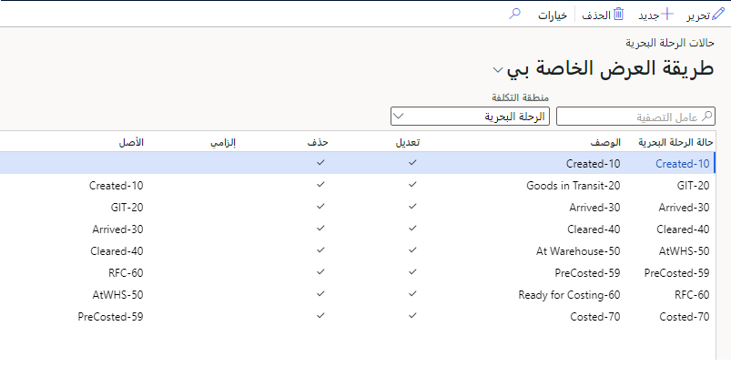
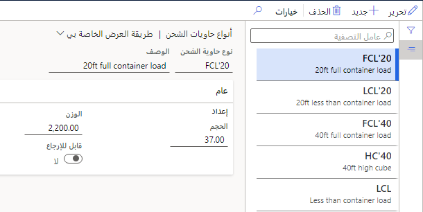

في هذه الوحدة، ستتعرف على كيفية إعداد الرحلات البحرية وحاويات الشحن.

## حالة الرحلة البحرية

صفحة **حالات الرحلة البحرية** هي المكان الذي ستحدد فيه مجموعة قيم الحالة التي يمكن للمستخدمين أن ينسبوها إلى الرحلات البحرية. يمكن للمستخدمين تعيين قيم حالة الرحلة البحرية لكل مستوى من مستويات الرحلة البحرية، بما في ذلك الرحلة البحرية وحاوية الشحن وحافظة الأوراق وأمر الشراء والصنف (بنود الشراء وبنود أوامر التحويل). توفر قيم حالة الرحلة البحرية وظيفتين:

-   إخطار المستخدم بحالة الرحلة البحرية أو حاوية الشحن أو حافظة أوراق أو أمر الشراء أو الأصناف (بنود الشراء وبنود أوامر التحويل).

-   الحد من استخدام منطقة التكلفة عن طريق تقييد تعديلها أو حذفها.

> [!div class="mx-imgBorder"]
> 

للشروع في العمل، انتقل إلى **التكلفة شاملة التفريغ > الإعداد > حالات الرحلة البحرية**، حيث يمكنك تعديل الحالات الحالية أو إنشاء حالات جديدة أو حذف الحالات القديمة باستخدام أزرار جزء الإجراءات.

لكل منطقة تكلفة مجموعتها الخاصة من حالات الرحلة البحرية والتدرجات الهرمية. ونتيجةً لذلك، سيتعين عليك الانتقال إلى حقل **منطقة التكلفة** وتحديد المنطقة التي ترغب في عرضها، أو يمكنك إنشاء حالة جديدة. وبعد ذلك، لكل حالة لرحلة بحرية، قم بتعيين الحقول كما يلي.

|     الحقل            |     الوصف‏‎                                                                                                                                                                                                         |
|----------------------|-------------------------------------------------------------------------------------------------------------------------------------------------------------------------------------------------------------------------|
|     حالة الرحلة البحرية    |     أدخل اسم حالة الرحلة البحرية.                                                                                                                                                                                       |
|     الوصف‏‎      |     أدخل وصف حالة الرحلة البحرية.                                                                                                                                                                                |
|     التعديل           |     حدد خانة الاختيار للسماح للمستخدمين بتعديل الرحلات البحرية بهذه الحالة.                                                                                                                                            |
|     الحذف           |     حدد خانة الاختيار للسماح للمستخدمين بحذف الرحلات البحرية بهذه الحالة.                                                                                                                                            |
|     إلزامية        |     حدد خانة الاختيار لجعل حالة الرحلة البحرية إلزامية، مما يمنع تخطيها.                                                                                                                        |
|     أصلية           |     استخدم هذا الحقل لإنشاء تدرج هرمي بين قيم الحالة. يمكنك فقط تعديل حالات الرحلات البحرية إلى أسفل في التدرج الهرمي (يدوياً أو تلقائياً) من الحالة الأصلية إلى إحدى حالاتها الفرعية.    |

ويمكن لأحداث النظام، مثل القواعد التي يتم إعدادها من خلال مركز التحكم في التعقب، تعديل حالة الرحلة البحرية تلقائياً.

> [!NOTE]
> يمكنك فقط إعداد حالات الرحلات البحرية التي تستخدمها شركتك. حالات الرحلات البحرية النموذجية هي: **تم التأكيد**، و **البضاعة بالطريق**، و **تم الاستلام**، و **تم الاستعداد لتقدير التكاليف** و **تم تحديد التكلفة**. ومع ذلك، قد توجد بعض الحالات الأخرى.

## حاويات الشحن

لإعداد حاويات الشحن، تحتاج أولاً إلى تحديد أنواع حاويات الشحن المختلفة المتاحة للاستخدام أثناء الشحن والرحلات البحرية.

> [!div class="mx-imgBorder"]
> 

انتقل إلى **التكلفة شاملة التفريغ > إعداد الحاويات > أنواع حاويات الشحن** للعمل مع أنواع حاويات الشحن. في هذه الصفحة، يمكنك عرض سجلات أنواع الحاويات وتحريرها وإنشاؤها وحذفها. تصف القائمة التالية الحقول المختلفة الموجودة في الصفحة.

|     الحقل                      |     الوصف‏‎                                                                                                                                                                                                                                                            |
|--------------------------------|----------------------------------------------------------------------------------------------------------------------------------------------------------------------------------------------------------------------------------------------------------------------------|
|     نوع حاوية الشحن    |     أدخل معرفاً فريداً لنوع حاوية الشحن، مثل الاسم أو الرقم.                                                                                                                                                                               |
|     الوصف‏‎                |     أدخل وصف نوع حاوية الشحن.                                                                                                                                                                                                                         |
|     الحجم                     |     أدخل الحد الأقصى للحجم المسموح به.                                                                                                                                                                                                                                      |
|     قابل للإرجاع                 |     حدد ما إذا كان من الممكن إعادة هذا النوع من حاويات الشحن إلى البائع بعد استخدامها في الرحلة البحرية أم لا. إذا تم تعيين هذا الخيار على **نعم**، فقد يتم تطبيق رسوم إضافية لإعادة حاويات الشحن من هذا النوع إلى مرفأ المنشأ.          |

### سجلات حاويات الشحن

تحدد سجلات حاويات الشحن كل حاوية يتم استخدامها في الرحلة البحرية. لذلك، عند إنشاء رحلة بحرية، يمكنك اختيار حاوية معينة من قائمة جميع سجلات حاويات الشحن التي قمت بتحديدها. تكون هذه الميزة مفيدة بشكل خاص إذا كان لدى شركتك حاويات الشحن.

لا يلزم تضمين أرقام حاويات الشحن إذا تم استخدام حاوية الشحن مرة واحدة فقط. بدلاً من ذلك، يمكنك إضافة رقم حاوية الشحن عند إنشاء الرحلة البحرية.

انتقل إلى **التكلفة شاملة التفريغ > إعداد الحاويات > حاويات الشحن** للعمل مع حاويات الشحن. في هذه الصفحة، يمكنك عرض السجلات وتحريرها وإضافتها وحذفها لحاويات الشحن الخاصة بك. تصف القائمة التالية الحقول الموجودة في صفحة **حاويات الشحن**.

|     الحقل                      |     الوصف‏‎                                                                                                                    |
|--------------------------------|------------------------------------------------------------------------------------------------------------------------------------|
|     حاوية الشحن         |     أدخل معرفاً فريداً لحاوية الشحن.                                                                          |
|     نوع حاوية الشحن    |     حدد نوع حاوية الشحن. لمزيد من المعلومات، انتقل إلى قسم **إعداد أنواع حاويات الشحن** في هذه الوحدة.    |

> [!NOTE]
> تذكر دائماً العوامل التالية قبل إعداد حاويات الشحن:
>
>   -   يتم استخدام سجلات حاويات الشحن فقط لوحدة **التكلفة شاملة التفريغ**. ولا يتم تضمينها في الوظيفة القياسية لوحدة إدارة النقل.
>
>   -   يكون تكوين حاوية الشحن اختيارياً. ويتم استخدامه عادةً إذا كانت المؤسسة تمتلك حاويات الشحن الخاصة بها أو تعيد استخدام حاويات الشحن نفسها بشكل متكرر.
>
>   -   ولا يتم حساب أرقام التحقق لأرقام حاويات الشحن.

### إعداد أنواع الوحدات

تضع أنواع الوحدات حاويات الشحن في مجموعات وطرق تعريف أخرى. في معظم الحالات، يمكنك استخدام نوع الوحدة لتحديد الحاوية التي يتم فيها تجميع البضائع، مثل الصناديق أو المنصات النقالة أو الأسطوانات. عند إنشاء حاوية في صفحة **كافة حاويات الشحن**، يمكنك تحديد نوع الوحدة.

انتقل إلى **التكلفة شاملة التفريغ > إعداد الحاوية > أنواع الوحدات**، حيث يمكنك عرض سجلات أنواع الوحدات المتعددة وتحريرها وإضافتها وحذفها. تشتمل أنواع الوحدات على الحقول التالية.

|     الحقل          |     الوصف‏‎                                           |
|--------------------|-----------------------------------------------------------|
|     نوع الوحدة      |     أدخل معرفاً فريداً لنوع الوحدة.          |
|     الوصف‏‎    |     أدخل وصفاً لنوع الوحدة.                      |

### إعداد أنواع التبريد

مثل أنواع الوحدات، يمكنك استخدام أنواع التبريد لتجميع حاويات الشحن وتحديدها (بمعنى آخر، حاويات التبريد).

انتقل إلى **التكلفة شاملة التفريغ > إعداد الحاوية > أنواع التبريد**، حيث يمكنك عرض سجلات أنواع التبريد وتحريرها وإضافتها وحذفها. تتضمن أنواع التبريد الحقول التالية.

|     الحقل                 |     الوصف‏‎                                                    |
|---------------------------|--------------------------------------------------------------------|
|     نوع التبريد    |     أدخل معرفاً فريداً لنوع التبريد.          |
|     الوصف‏‎           |     أدخل وصفاً لنوع التبريد.                      |
