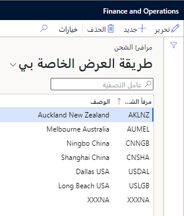
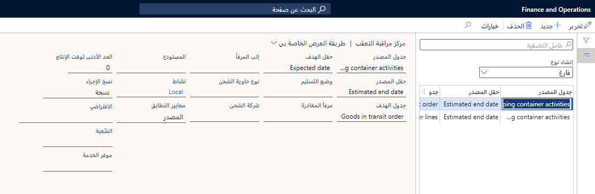

توضح لك هذه الوحدة كيفية إعداد معلومات التسليم لتكاليف الشحن شاملة التفريغ.

## منافذ الشحن

تحدد منافذ الشحن منشأ ووجهة البضائع المشحونة. يتم تحديد **منفذ الوصول** و **منفذ المغادرة** لكل رحله استناداً إلى المسار الذي تم اختياره من سفينة الشحن. تساعدك منافذ الشحن في إنشاء مسار الرحلة والأنشطة المرتبطة بها. وعادة ما يتم تحديدها بواسطة اسم المدينة والبلد أو المنطقة التي يقع بها منفذ الشحن.

> [!div class="mx-imgBorder"]
> 

انتقل إلى **التكلفة شاملة التفريغ > إعداد معلومات التسليم > منافذ الشحن** للعمل مع منافذ الشحن. في هذه الصفحة، يمكنك عرض السجلات وتحريرها وإضافتها وحذفها لمنافذ الشحن الخاصة بك. تصف القائمة التالية الحقول المتوفرة لكل سجل.

|     الحقل            |     الوصف‏‎                                               |
|----------------------|---------------------------------------------------------------|
|     منفذ الشحن    |     أدخل معرفاً فريداً لمنفذ الشحن.          |
|     الوصف‏‎      |     إدخال وصف المنفذ.                             |

## مركز مراقبة التعقب

مركز **التحكم في التعقب** هو المكان الذي يمكنك من خلاله إعداد المواعيد الزمنية وتحديثات الحالة والمعلومات المرتبطة بالرحلة حيث تنتقل منافذ الشحن من مرحلة إلى أخرى في الرحلة. سيؤدي إنشاء سجل تحكم بالتعقب إلى ربطه باتجاه محدد من الرحلة. عند تحديث اتجاه الرحلة، سيتم تحديث السجل المرتبط به وتعبئته على النحو المحدد. يمكنك تغيير معلومات التعقب لرحلات معينة في صفحة **كل الرحلات**.

انتقل إلى **التكلفة شاملة التفريغ > إعداد معلومات التسليم > مركز التحكم في التعقب**.

بناءً على القيمة التي حددتها في المربع **إنشاء نوع** في جزء القائمة، سيعرض **مركز التحكم في التعقب** طريقة عرض واحدة من ثلاث طرق عرض للصفحة: **فارغ**، **مهلة** أو **تحديث الحالة**. تعمل كل مشاهدة للصفحة على تحديث مجموعة مميزة من المعلومات المتعلقة بتقدم الرحلة من نقطة البداية إلى الوجهة النهائية.

> [!div class="mx-imgBorder"]
> 

يحتوي كل نوع من أنواع الإنشاء الثلاثة في مركز التحكم في التعقب على الحقول التالية:

- **جدول المصدر، حقل المصدر** - تحدد هذه الحقول جدول مصدر قاعدة البيانات والحقل. ستقوم القاعدة بتحميل القيمة من الحقل ثم استخدامها بالطريقة المحددة بواسطة الخيارات الأخرى للقاعدة.                                                                                                  

- **الجدول الهدف، الحقل الهدف** - تحدد هذه الحقول الجدول والحقل الوجهة لقاعدة البيانات. ستقوم القاعدة بتحميل القيمة في الحقل ثم استخدامها (أو الكتابة فوقها) بالطريقة الموضحة في الخيارات الأخرى للقاعدة.                                                                                

- **النشاط** - يعرف هذا الحقل نوع النشاط المطبق علي إحدى حاويات الشحن التي تطابق إحدى القواعد.                                                                                                                                                                               

- **معايير المطابقة** - يحدد هذا الحقل كيفية تحديد النظام لمطابقة القاعدة. في كل حالة، يفحص النظام بيانات المصدر والوجهة لتحديد ما إذا كان ينبغي تحديث حقل في البيانات الهدف. إليك مثال على ذلك: 

    - **جدول المصدر =** الرحلات -> **الجدول المستهدف =** عنوان الشراء أو سطور الشراء 
                                                                                                                                                                                            
    - **منفذ المغادرة =** هونج كونج-> **منفذ المغادرة =** شانغهاي       

        -   **كلاهما** - لم يتم تحديث الحقل الهدف لأن المنفذين غير متطابقين.                                                                                       
        -   **المصدر** - يتم تحديث الحقل الهدف لأن المنفذ "من" للجدول المصدر هو *هونج كونج*.                                                                                       
        -   **الهدف** - لم يتم تحديث الحقل الهدف لأن منفذ جدول الوجهة "من" هو *شنغهاي* (وليس *هونج كونج*).                                                                                                                                           
                                                                                                                                                                                                                 
- **إجراء النسخ** - هناك خياران، **نسخ** أو **افتراضي**.                                                                                                                                                                                                                                 

    -   حدد **نسخ** لنسخ القيمة من حقل المصدر إلى حقل الوجهة.     
                                                                                                                                                                                     
    -   حدد **افتراضي** لتعيين قيمة ثابتة لحقل الوجهة.                                                                                                                                                                                                       

- **افتراضي** - عند تعيين **إجراء النسخ** على **افتراضي**، يحدد الحقل **افتراضي** حقل الوجهة القيمة الافتراضية. على سبيل المثال، إذا كان الإجراء متعلقاً بتحديث منفذ وتم تعيين الحقل **إجراء النسخ** على **افتراضي**، فإن الحقل **افتراضي** يحدد منفذ. 

- **اتجاه** - يحدّد هذا الحقل مرحلة الرحلة التي يحدث فيها إجراء محدد، مثل التحميل أو الجمارك.                                                                                                                                                                  

- **مزود الخدمة** - يحدد هذا الحقل مقدم الخدمة إذا تم استخدام واحد محدد لتحديث/تشغيل الحالة الحالية/اتجاه للرحلة. حساب المورد هو المكان الذي يتم فيه تحديد مقدمي الخدمة.                                                                                               

### قواعد وقت الإنتاج

وقت الإنتاج هو الوقت المتوقع والمطلوب لرحلة ما لإنهاء جزء معين من رحلتها. يمكنك استخدام وقت الإنتاج لكل مرحلة من مراحل السفر لتحديد تاريخ التسليم المتوقع للرحلة. بعد ذلك، يتم تسجيل هذا التاريخ في كل سطر شراء في حقل **تاريخ التسليم المؤكد**.

تساعدك قواعد وقت الإنتاج في إدارة تحديثات التاريخ. يتم إنشاء هذه التحديثات تلقائياً إذا تم إنشاء الرحلة باستخدام قالب الرحلة.

اتبع هذه الخطوات لإضافة قاعدة وقت الإنتاج في **مركز التحكم في التعقب**:

1.  يمكنك البدء بإحدى الطريقتين التاليتين:

    -   انتقل إلى **التكلفة شاملة التفريغ > إعداد رحلة متعددة الاتجاهات > الاتجاهات**.

        -   حدد الاتجاه حيث تريد إعداد أوقات الإنتاج.

        -   من جزء الإجراءات، حدد **مركز التحكم في التعقب**، والذي سيقوم بالتحميل المسبق لمعلومات الاتجاه المحدد.

    -   انتقل إلى **التكلفة شاملة التفريغ > إعداد معلومات التسليم > مركز التحكم في التعقب**. ستقوم يدوياً بتحديد ساق في الخطوة الرابعة من هذا الإجراء.

1.  في جزء القائمة، عيّن **إنشاء نوع** على **وقت الإنتاج**.

1.  في جزء الإجراءات، حدد **جديد**.

1.  بناءً على الإجراء الذي اتخذته في الخطوة الأولى، استخدم إحدى الخطوات التالية:

    -   إذا بدأت من صفحة **الاتجاهات** فلا داعي لاتخاذ أي إجراء. تم تعيين الحقل **الاتجاه** على الساق التي حددتها في الخطوة الأولى.

    -   إذا بدأت من **مركز التحكم في التعقب**، فانتقل إلى حقل **الاتجاه** وحدد الاتجاه الذي تريد إنشاء قاعدة وقت إنتاج.

    بناءً على قيمة الحقل **اتجاه**، سوف يتم تعيين الحقول التالية تلقائياً:

    -   **مصدر الجدول** - أنشطة الحاويات
    
    -   **حقل المصدر** - تاريخ الانتهاء الفعلي
    
    -   **الجدول الهدف** - تم ترك هذا الحقل فارغاً
    
    -   **حقل الهدف** - تم ترك هذا الحقل فارغاً

1.  في حقل **النشاط**، حدد أين تريد تطبيق القاعدة.

1.  في الحقل **وقت الإنتاج**، أدخل عدد الأيام التي سيتم تطبيقها عند تشغيل هذه القاعدة.

شاهد الفيديو لمشاهدة عرض توضيحي لكيفية إعداد قاعدة وقت الإنتاج.

> [!VIDEO https://www.microsoft.com/videoplayer/embed/RWU3E8]

### قواعد تحديث الحالة

عند ضبط **إنشاء نوع** على **تحديث الحالة**، سيتم تحديث السجلات في الرحلة أو حاوية الشحن أو مستوى السجل لتعكس سطور أمر الشراء وتغييرات الحالة. يمكنك إعداد هذه السجلات بشكل مستقل، ويمكنك استخدامها لتحديث المستخدم أو القسم بحالة الرحلة (مثل المستندات المستلمة أو بضاعة بالطريق).

عندما يتم تعيين **إنشاء نوع** على **تحديث الحالة**، فإن علامة التبويب السريعة **البنود** هي المكان الذي يمكنك من خلاله تحديد منطقة التكلفة وتحديث حالة الرحلة. على سبيل المثال، إذا كان لديك خط **منطقة التكلفة** تم ضبطها على **حاوية** و **حالة الرحلة** مضبوطة على **بضاعة بالطريق**، عند اكتمال الطلب، سيتم تحديث حقل **حالة الرحلة** الخاص بحاوية الشحن إلى **بضاعة بالطريق**.

توفر تحديثات الحالة حالة الرحلة عبر جميع الرحلات وخطوط أوامر الشراء المرتبطة بتلك الرحلة. على سبيل المثال، مع تقدم الرحلة من ميناء إلى آخر حتى وصولها إلى وجهتها النهائية، يمكنك عرض مرحلة العناصر في حقل **حالة الرحلة** في سجل الرحلة.

اتبع هذه الخطوات لإضافة قاعدة تحديث الحالة إلى **مركز التحكم في التعقب**:

1.  يمكنك البدء بإحدى طريقتين:

    -   انتقل إلى **التكلفة شاملة التفريغ > إعداد رحلة متعددة الاتجاهات > الاتجاهات**.

        -   حدد الجزء الذي تريد إعداد تحديث الحالة فيه.

        -   في جزء الإجراءات، حدد **مركز التحكم في التعقب**، المحمّل مسبقاً بمعلومات حول الساق المحددة.

    -   انتقل إلى **التكلفة شاملة التفريغ > إعداد معلومات التسليم > مركز التحكم في التعقب**. ستحدد قدماً يدوياً أثناء الخطوة الرابعة.

1.  في جزء القائمة، اضبط **نوع الإنشاء** على **تحديث الحالة**.

1.  في جزء الإجراءات، حدد **جديد**.

1.  بناءً على الإجراء الذي اتخذته في الخطوة الأولى، استخدم إحدى الخطوات التالية:

    -   إذا بدأت من صفحة **الاتجاهات** فلا داعي لاتخاذ أي إجراء. تم تعيين الحقل **الاتجاه** على الساق التي حددتها في الخطوة الأولى.

    -   إذا بدأت من **مركز التحكم في التعقب**، فانتقل إلى حقل **الاتجاه** وحدد الاتجاه الذي تريد إنشاء قاعدة وقت إنتاج.

    بناءً على قيمة الحقل **اتجاه‏‎**، سيتم تعيين الحقول التالية تلقائياً:

    -   **مصدر الجدول** - أنشطة الحاويات
    
    -   **حقل المصدر** - تاريخ الانتهاء الفعلي
    
    -   **الجدول الهدف** - تم ترك هذا الحقل فارغاً.
    
    -   **حقل الهدف** - تم ترك هذا الحقل فارغاً.

1.  في حقل **النشاط** حدد المكان الذي تريد تطبيق القاعدة فيه.

1.  في علامة التبويب السريعة **البنود** أدخل تحديثات الحالة لكل منطقة تكلفة.

### قواعد النوع الفارغة

يمكنك استخدام السجلات مع تعيين الحقل **إنشاء نوع** على **فارغ** لتجاوز قيمة حقل أو إدخالها بناءً على بيانات حقل آخر. على سبيل المثال، استناداً إلى قواعد **مركز التحكم في التعقب**، سيحل الحقل من **التكلفة شاملة التفريغ** محل البيانات في مناطق Supply Chain Management الأخرى.

1.  انتقل إلى **التكلفة شاملة التفريغ > إعداد معلومات التسليم > مركز التحكم في التعقب**.

1.  في جزء القائمة، عيّن الحقل **إنشاء نوع** على **فارغ**.

1.  في جزء الإجراءات، حدد **جديد.**

1.  حدد قيم المصدر والوجهة ومعايير المطابقة ونسخ الإجراء والمعلمات الأخرى ذات الصلة كما هو مطلوب لقاعدتك.

### إعداد التحكم في التعقب المطلوب

مطلوب سجلين لكل قالب رحلة في **مركز التحكم في التعقب**. يحتوي كلا السجلين على **إنشاء نوع** معين على **فارغ** ويتم استخدامهما في جميع عمليات تنفيذ تكاليف الشحن. تضمن هذه السجلات تحديث تاريخ تأكيد الشراء والعناصر قيد النقل المقدرة بالطريقة المتوقعة للرحلات وبنود أوامر الشراء ذات الصلة.

السجل الأول مطلوب لتحديث سطور الشراء، ويجب أن يحتوي على الإعدادات التالية:

-   **مصدر الجدول** - أنشطة الحاويات

-   **‎حقل المصدر** - تاريخ الانتهاء المقدر

-   **جدول الهدف** - بنود الشراء

-   **حقل الهدف** - تاريخ التأكيد أو التسليم

السجل الثاني مطلوب لتحديث حركات بضاعة بالطريق، ويجب أن يحتوي على الإعدادات التالية:

-   **مصدر الجدول** - أنشطة الحاويات

-   **‎حقل المصدر** - تاريخ الانتهاء المقدر

-   **جدول الهدف** - أمر بضاعة بالطريق

-   **حقل الهدف** - التاريخ المتوقع
