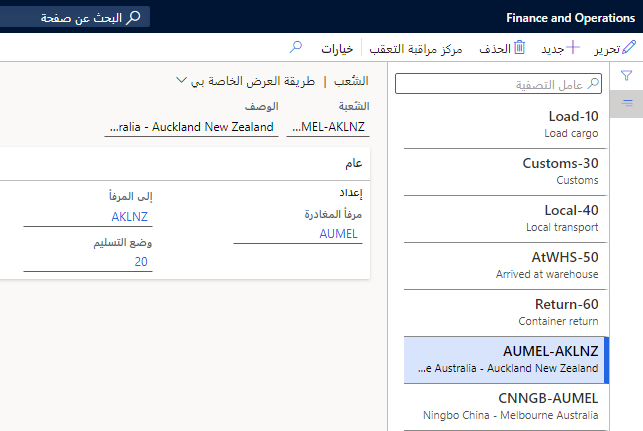
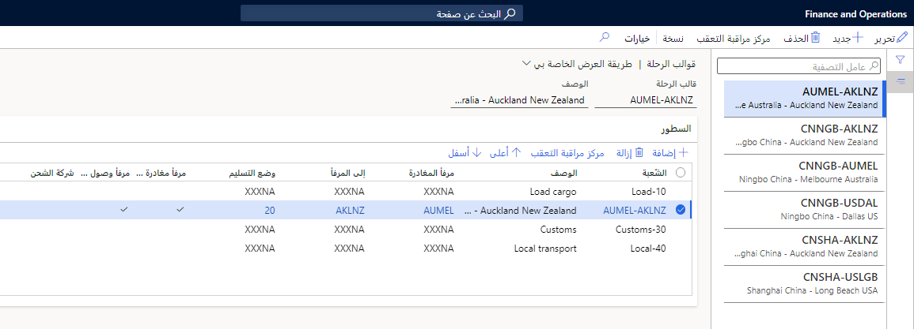

تشرح هذه الوحدة كيفية تكوين الرحلات متعددة المراحل.

## المراحل

تساعدك المراحل على تمييز الأجزاء المختلفة من الرحلة. يمكنك إنشاء كل مرحلة من خلال تحديد خيارات **منفذ الوصول** و **منفذ المغادرة** خيارات منفذ الشحن و **طريقة النقل**. قد يكون لكل مرحلة وقت انتاج خاص بها. يمكنك استخدام أوقات الإنتاج هذه لتعقب شحنة وحساب تاريخ التسليم المتوقع للأصناف في الرحلة. بالإضافة إلى ذلك، بعد انتهاء مرحلة من الرحلة، سيقوم نظام التحكم في التعقب بتحديث حالة الرحلة البحرية وحاوية الشحن وبنود أوامر الشراء المرتبطة.

يمكن استخدام المراحل بواسطة قالب رحلة واحد أو مع العديد من قوالب الرحلة. تتضمن أمثلة أنواع المراحل هذه تحميل الحاويات والجمارك والنقل المحلي، ويمكنك إعداد كل مرحلة بمنفذ شحن غير محدد.

> [!div class="mx-imgBorder"]
> 

انتقل إلى **التكلفة شاملة التفريغ > إعداد الرحلة متعددة المراحل > المراحل** لبدء العمل بالمراحل. في هذه الصفحة، يمكنك عرض سجلات أنواع المراحل وتحريرها وإنشاؤها وحذفها. يحتوي كل سجل على الحقول التالية.

|     الحقل              |     الوصف‏‎                                                                                                                    |
|------------------------|------------------------------------------------------------------------------------------------------------------------------------|
|     المرحلة                |     أدخل معرفاً فريداً للمرحلة.                                                                                         |
|     الوصف‏‎        |     إدخال وصف المرحلة. يشتمل هذا الحقل عادةً على مواقع **منفذ الوصول** و **منفذ المغادرة** أو خطوة الرحلة.          |
|     منفذ المغادرة          |     أدخل نقطة الأصل لبضائع المرحلة.                                                                                 |
|     منفذ الوصول            |     أدخل نقطة الوجهة لبضائع المرحلة.                                                                               |
|     طريقة التسليم    |     أدخل طريقة النقل للمرحلة.                                                                                |

## قوالب الرحلة

يوضح نموذج الرحلة متعددة المراحل التي تقوم بها البضائع بين منفذين أثناء الرحلة. يتم دمج مراحل الرحلة لتحديد طول الوقت الذي ستستغرقه المنتجات للانتقال من نقطة الأصل الخاصة بالمورد إلى وجهة المستودع النهائية. عندما تضع المراحل في ترتيب محدد في قالب الرحلة، ستشير أوقات الانتاج إلى تاريخ كل مرحلة وحالة خطوط الرحلة والحاوية وشراء الرحلة. يمكنك استخدام **مركز التحكم في التعقب** لإعداد أوقات الإنتاج المرتبطة بكل جزء من قالب الرحلة. عند إعداد التكاليف السيارات لرحلة ما، سيتم أيضاً استخدام نموذج الرحلة. بعد تحديد الرحلة، يمكنك تحديد التكلفة المرتبطة بنقل البضائع في صفحة **تكاليف السيارات**.

انتقل إلى **التكلفة شاملة التفريغ > إعداد الرحلة متعددة المراحل > قوالب الرحلة**، حيث يمكنك عرض قوالب الرحلة وتعديلها وإنشاؤها وحذفها.

> [!div class="mx-imgBorder"]
> 

لكل قالب رحلة تقوم بإنشائه، تحتاج إلى تعيين الحقول التالية في العنوان.

|     الحقل               |     الوصف‏‎                                                                                                                                |
|-------------------------|------------------------------------------------------------------------------------------------------------------------------------------------|
|     قالب الرحلة    |     أدخِل اسماً فريداً للقالب. يشير الاسم عادة إلى نقطة الأصل ووجهة الرحلة.                |
|     الوصف‏‎         |     إدخال وصف القالب. يشير الوصف عادةً إلى **منفذ الوصول**، و **منفذ المغادرة**، وطريقة النقل.          |

في منطقة **البنود**، أضف بنداً لكل مرحلة من مراحل السفر ثم رتبها بالترتيب الصحيح باستخدام الأسهم الموجودة على شريط الأدوات. تصف القائمة التالية الحقول المتاحة لكل بند.

|     الحقل                |     الوصف‏‎                                                                                                                                                                                                     |
|--------------------------|---------------------------------------------------------------------------------------------------------------------------------------------------------------------------------------------------------------------|
|     المرحلة                  |     حدد مرحلة لإضافتها إلى الرحلة.                                                                                                                                                                             |
|     الوصف‏‎          |     أدخِل وصفاً للمرحلة.                                                                                                                                                                                 |
|     منفذ المغادرة            |     أدخل نقطة الأصل للبضائع. هذا الحقل هو **منفذ الوصول** الذي يحدد تكاليف السيارات للرحلة.                                                                                             |
|     منفذ الوصول              |     أدخل موقع الوجهة النهائي للبضائع الموجودة في المرحلة.                                                                                                                                                  |
|     وضع التسليم     |     أدخل طريقة التسليم للمرحلة.                                                                                                                                                                       |
|     منفذ مغادرة الرحلة    |     إذا كان هذا المنفذ هو نفس المنفذ المستخدم لتحديد التكاليف السيارات، فحدد مربع الاختيار. سيحدد هذا الإعداد المنفذ باعتباره منفذ **مغادرة الرحلة** وسيضيفه إلى رأس الرحلة.          |
|     منفذ وصول الرحلة      |     إذا كان هذا المنفذ هو نفس المنفذ المستخدم لتحديد التكاليف السيارات، فحدد مربع الاختيار. سيحدد هذا الإعداد المنفذ باعتباره منفذ **وصول الرحلة** وسيضيفه إلى رأس الرحلة.            |
|     شركة الشحن     |     أدخل شركة الشحن المستخدمة لهذه المرحلة.                                                                                                                                                            |

## الأنشطة

تحدد صفحة **الأنشطة** الأنشطة التي يمكن أن تحدث في منفذ وجهة المرحلة. يمكن للمستخدمين الذين يعملون في صفحة **جميع حاويات الشحن** الاختيار من بين هذه القيم عند تقدير طول كل نشاط ومقارنته بالمدة الفعلية.

انتقل إلى **التكلفة شاملة التفريغ > إعداد رحلة متعددة المراحل > الأنشطة‬**. في هذه الصفحة، يمكنك عرض الأنشطة وإضافتها وحذفها وتحريرها باستخدام الأزرار الموجودة في جزء الإجراءات. تصف القائمة التالية الحقول المتاحة لكل نشاط.

|     الحقل               |     الوصف‏‎                                                 |
|-------------------------|-----------------------------------------------------------------|
|     النشاط            |     اسم النشاط.                                          |
|     الوصف‏‎         |     وصف النشاط.                                   |
|     شركة الشحن    |     حساب المورد الخاص بشركه الشحن لهذا النشاط.    |
