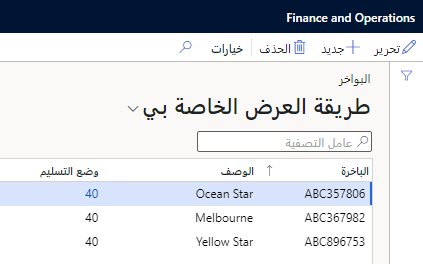
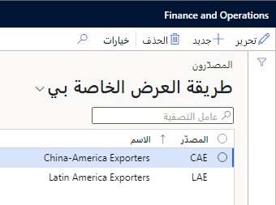
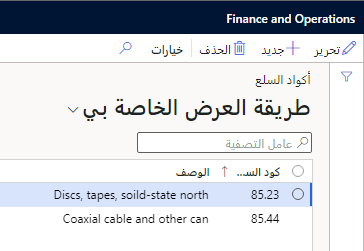
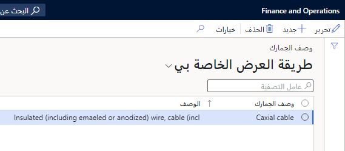

تصف هذه الوحدة كيفية إعداد معلومات الشحن لتكاليف الشحن.

## وصف البضائع

تساعدك صفحة **أوصاف البضائع** في تحديد الرحلة أو حاوية الشحن أو سجل البضائع والمنتجات المضمنة في هذه الصفحة. بعد إنشاء وصف سجلات البضائع، يمكنك تحديد وصف للبضائع من حاوية الشحن أو رأس السجل.

انتقل إلى **تكلفة الشحن> إعداد معلومات الشحن> وصف البضائع**. في هذه الصفحة، يمكنك عرض وتحرير وإنشاء وحذف وصف السجلات الجيدة. يحتوي كل سجل على الحقول التالية.

|     الحقل                   |     الوصف‏‎                                                                                           |
|-----------------------------|-----------------------------------------------------------------------------------------------------------|
|     وصف البضائع    |     أدخل اسماً فريداً أو رقماً لنوع البضائع التي تستخدمها في هذا الوصف.          |
|     الوصف‏‎             |     صف نوع البضائع التي تم تضمينها في هذه الفئة.                                      |

## سفن الشحن

السفينة الشحن هي الاسم الفريد الذي يطلق على السفينة أو القارب الذي تستخدمه شركة أو وكالة شحن. عندما تقوم برحلة جديدة، يجب عليك دائماً دخول سفينة. ومع ذلك، إذا كنت تستخدم نفس الرحلات بشكل متكرر، فيمكنك جعل عملية إنشاء رحلة جديدة أكثر كفاءة من خلال إنشاء سجل لكل سفينة الشحن. يسمح هذا الأسلوب للمستخدمين بتحديد السفينة الشحن من قائمة بدلاً من إدخال الاسم أو الرقم يدوياً في كل مرة.

انتقل إلى **تكلفة الإنزال> إعداد معلومات الشحن> السفن** لإنشاء سفينة الشحن أو تعديلها. في هذه الصفحة، يمكنك عرض سجلات سفينة الشحن أو تحريرها أو إنشائها أو حذفها.

> [!div class="mx-imgBorder"]
> 

تصف القائمة التالية الحقول المتاحة في صفحة **سفن الشحن**.

|     الحقول              |     الوصف‏‎                                                                                                        |
|-------------------------|------------------------------------------------------------------------------------------------------------------------|
|     سفينة الشحن              |     أدخِل الاسم/الرقم الفريد للسفينة التي تنقل البضائع في رحلة.                           |
|     الوصف‏‎         |     أدخل وصفاً. يحتوي هذا الوصف عادة على اسم السفينة وشركة الشحن.          |
|     وضع التسليم    |     حدد طريقة التسليم التي سيتم استخدامها (الهواء، والمحيط، والقطار، وما إلى ذلك).                                       |

## المصدّر‬ون

يحدد كل سجل مُصدِّر المُصدِّر الذي يمكن تعيينه كمورد لرحلة معينة. بعد تحديد سجل المُصدِّر، يمكنك إضافة المُصدِّر إلى رحلة ما ثم استخدامه لأغراض إعداد التقارير.

انتقل إلى **التكلفة شاملة التفريغ> إعداد معلومات الشحن> المصدرين**، حيث يمكنك عرض سجلات المُصدِر أو تحريرها أو إنشائها أو حذفها.

> [!div class="mx-imgBorder"]
> 

يحتوي كل سجل مصدر على الحقول التالية.

|     الحقل          |     الوصف‏‎                                                                                                       |
|--------------------|-----------------------------------------------------------------------------------------------------------------------|
|     المصدّر‬       |     أدخل اسماً/رقماً فريداً لمصدر البضائع المنقولة في رحلة.                          |
|     الوصف‏‎    |     أدخل وصفاً. يحتوي هذا الوصف عادةً على الاسم الكامل لشركة الشحن أو المندوب.          |

## أكواد السلع

تساعدك أكواد السلع في تحديد الجمارك وحسابات معدل الرسوم للسلع في رحلة ما. يمكنك تحديد أكواد السلع في صفحة **المنتجات الصادرة**.

انتقل إلى **تكلفة الوصول> إعداد معلومات الشحن> أكواد السلع**، حيث يمكنك عرض سجلات أكواد السلع وتعديلها وإنشاؤها وحذفها.

> [!div class="mx-imgBorder"]
> 

يحتوي كل سجل في صفحة **أكواد السلع** على الحقول التالية.

|     الحقل             |     الوصف‏‎                                             |
|-----------------------|-------------------------------------------------------------|
|     كود السلعة    |     أدخِل اسماً فريداً / رقماً للسلعة.           |
|     الوصف‏‎       |     أدخِل وصفاً للسلع في الكود.    |

## وصف الجمارك

الأوصاف الجمركية تحدد البضائع للأغراض الجمركية. يمكنك تحديد الأوصاف الجمركية في سطور أوامر الشراء أو في صفحة **المنتجات الصادرة**.

انتقل إلى **التكلفة شاملة التفريغ> إعداد معلومات الشحن> وصف الجمارك**، حيث يمكنك عرض سجلات الوصف الجمركي أو تحريرها أو إنشائها أو حذفها.

> [!div class="mx-imgBorder"]
> 

يحتوي كل سجل في صفحة **وصف الجمارك** على الحقول التالية.

|     الحقل                  |     الوصف‏‎                                                                                                                                                              |
|----------------------------|------------------------------------------------------------------------------------------------------------------------------------------------------------------------------|
|     وصف الجمارك    |     أدخِل اسماً فريداً / رقماً. عادةً ما يتطابق هذا الوصف مع الاسم الرسمي والقيمة النوعية للبضائع التي تقدمها سلطة الجمارك.          |
|     الوصف‏‎            |     أدخِل وصفاً يطابق التصنيف الجمركي.                                                                                                           |

