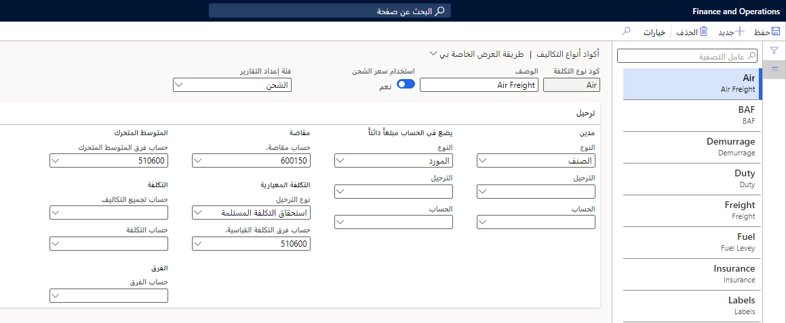
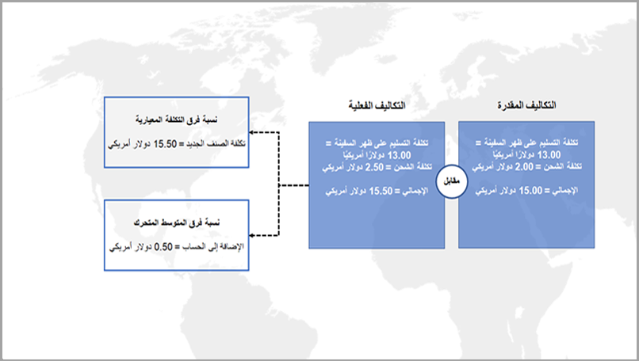
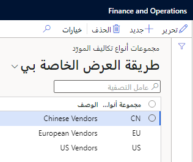
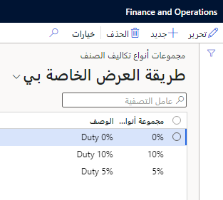
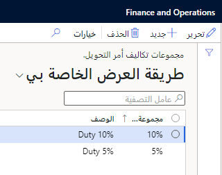
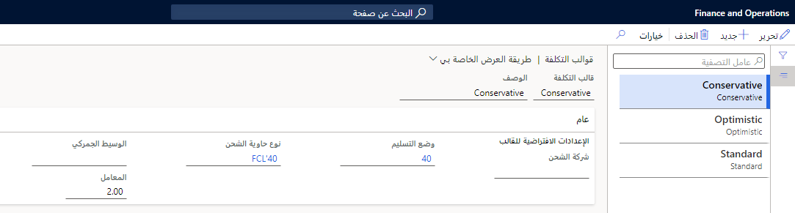
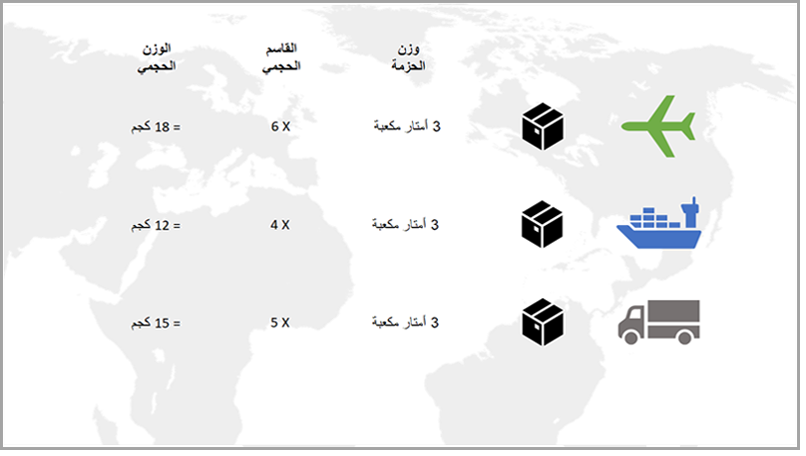

عند إعداد الوحدة النمطية للتكلفة شاملة التفريغ، يمكن تحديد مجموعات متعددة من القيم العامة والإعدادات المرتبطة لكل قيمة. ستتوفر هذه القيم لاحقاً في مناطق أخرى من التطبيق عند تحديد أنواع معينة من قيم معلمات التكلفة. يوضح هذا القسم كيفية إعداد مجموعات القيم هذه.

## إعداد رموز نوع التكلفة

إن رموز نوع التكلفة تحدد نوع التكلفة المتكبَدة عند تسليم المنتجات إلى المستودع أو مع التكاليف شاملة التفريغ لرحلة ما. وبينما تؤدي عادةً إلى زيادة قيمة البضائع، يمكنك استخدامها لتتراكم المبالغ في دفتر الأستاذ. ويتم إجراء التسويات على دفتر الأستاذ عندما تكون التكلفة متراكمة على مدار الوقت أو خلال سلسلة من الرحلات، ثم تتم الإزاحة في حركة واحدة.

> [!NOTE]
> إذا كان الجدول **نوع التكلفة** مشتركاً بين الكيانات القانونية، تجب مشاركة مخطط الحسابات أيضاً. وإلا، فستفشل حركات الترحيل.

> [!div class="mx-imgBorder"]
> 

انتقل إلى **التكلفة شاملة التفريغ > إعداد التكلفة > رموز نوع التكلفة**. في هذه الصفحة، يمكنك عرض رموز نوع التكلفة أو تحريرها أو إنشاؤها أو حذفها. يحتوي كل رمز من رموز نوع التكلفة على الحقول التالية.

- **رمز نوع التكلفة** - أدخِل اسماً للرمز.

- **الوصف** - أدخِل وصف الرمز. 

- **استخدام سعر الشحن** - قم بتعيين مفتاح التبديل هذا على **نعم** إذا كنت تستخدم سعر صرف الرحلة (يُعرف أيضاً بسعر الإدارة) لتحديد قيمة هذه التكلفة. في هذه الحالة، سيتم استخدام سعر الشحن لصرف فواتير العملة الأجنبية بدلاً من سعر الصرف الافتراضي أو سعر الصرف الفوري.

- **فئة إعداد التقارير** - لتحديد فئة إعداد التقارير لنوع التكلفة. يمكنك تشغيل التقارير عن طريق فئة إعداد التقارير أو نوع التكلفة.

- **نوع الخصم** - لتحديد ما إذا كان يجب أن تقوم التكلفة بالخصم من الصنف أو حساب دفتر الأستاذ أو المورد.

- **ترحيل الخصم** - في حالة تعيين الحقل **نوع الخصم** على **حساب دفتر الأستاذ**، حدد وصف الترحيل الذي ترغب في استخدامه.

- **حساب الخصم** - في حالة تعيين الحقل **نوع الخصم** على **حساب دفتر الأستاذ**، حدد حساب الخصم المراد استخدامه.

- **نوع الائتمان** - لتحديد ما إذا كان يجب تلقي الائتمان لنوع التكلفة من الصنف أو حساب دفتر الأستاذ أو المورد.

- **ترحيل الائتمان** - في حالة تعيين الحقل **نوع الائتمان** على **حساب دفتر الأستاذ**، حدد وصف الترحيل الذي ترغب في استخدامه.

- **حساب الائتمان** - في حالة تعيين الحقل **نوع الائتمان** على **حساب دفتر الأستاذ**، حدد حساب الائتمان المراد استخدامه.

- **حساب المقاصة** - حدد حساب المقاصة الذي ترغب في استخدامه. للمساعدة في عملية التسوية، نوصي بإنشاء حساب مقاصة منفصل لكل نوع تكلفة.

- **نوع التكلفة القياسي** - إذا كنت تستخدم التكاليف القياسية، فستحتاج إلى تحديد وصف الترحيل.

- **حساب نسبة فرق التكلفة القياسية** - إذا كنت تستخدم تكاليف قياسية، فأنت بحاجة إلى تحديد الحساب الذي ستقوم بترحيل نسب الفرق إليه. في الصفحة **أسعار الأصناف**، سيستخدم هذا الحساب تصنيف التكلفة شاملة التفريغ. يمكنك إنشاء هذا التصنيف من خلال تشغيل الروتين الدوري لتحديث الأسعار.

    على سبيل المثال، السعر القياسي لصنف ما هو 15,00 دولاراً أمريكياً، وسعر التسليم على ظهر السفينة (FOB) هو 13,00 دولاراً، وتكلفة الشحن هي دولاران. عند استلام فاتورة المخزون، يتم استلام الصنف بسعر 15,00 دولاراً، ولكن هناك نسبة فرق قدرها دولاران، لأن تكلفة FOB هي 13,00 دولاراً. ويتم تسجيل نسبة الفرق هذه في حساب نسبة فرق السعر القياسي الذي تم إعداده في ملف تعريف ترحيل الصنف. ونظراً لأن التكلفة التقديرية للشحن كانت دولارين، فلن تتم إضافة نسبه فرق عند ترحيل فاتورة المخزون. ومع ذلك، عند استلام فاتورة الشحن الفعلية، تكون تكلفة الشحن دولارين ونصف لكل وحدة. ونتيجة لذلك، تتم إضافة نسبة فرق قدرها نصف دولار إلى تكلفة الصنف.

- **حساب نسبة الفرق للمتوسط المتحرك** - إذا كنت تستخدم تكلفة المتوسط المتحرك، فأنت بحاجة إلى تحديد الحساب الذي ستقوم بترحيل أي نسبة فرق إليه.

    على سبيل المثال، تكلفة الشحن المقدرة هي دولاران. ومع ذلك، فعند استلام فاتورة الشحن، تكون تكلفة الشحن دولارين ونصف لكل صنف. وبناءً عليه، يجب أن يتم ترحيل نسبة الفرق التي قدرها نصف دولار إلى أحد الحسابات. 

    > [!div class="mx-imgBorder"]
    > 

    -   عند تعيين الخيار **ترحيل التسويات كنسبة فرق** في الصفحة **معلمات التكلفة شاملة التفريغ** على **نعم**، يتم ترحيل جميع نسب الفرق بين تكاليف الحمولة الفعلية والتقديرية إلى حساب نسبة الفرق في المتوسط المتحرك الذي تحدده في هذه الصفحة.

    -   عند تعيين الخيار **ترحيل التسويات كنسبة فرق** على **لا**، يتم استخدام الوظيفة القياسية. يتم تطبيق نسبة الفرق على المخزون أو على حساب نسبة فرق المتوسط المتحرك الذي تحدده في هذه الصفحة، وذلك وفقاً لحجم المخزون الفعلي.

- **حساب تراكم المصاريف** - حدد الحساب الذي ترغب في استخدامه لتراكم تقديرات التكلفة عند ترحيل فاتورة الشراء. لن تستخدم هذا الإعداد إلا عند تعيين الخيار **استخدام حساب تراكم المصاريف لنوع التكلفة** على **نعم** في علامة التبويب السريعة **التكاليف** ضمن علامة التبويب **عام** في الصفحة **معلمات التكلفة شاملة التفريغ**.

- **حساب المصاريف** - حدد الحساب الذي ترغب في استخدامه لتسجيل تكاليف النقل الداخلي التي قام أحد الموردين بفوترتها. يتم ترحيل هذا المبلغ كخصم ويكون الحساب المقابل هو حساب فرق المخزون.

    لن تستخدم هذا الخيار إلا إذا تم تعيين الخيار **ترحيل إلى حساب مصاريف في دفتر الأستاذ** على **نعم** في الصفحة **معلمات حسابات المدفوعات**.

- **حساب نسبة الفرق** - استخدم هذا الحساب لإزاحة استحقاقات المصاريف عند ترحيل فاتورة الشراء. لن تستخدم هذا الحقل إلا عند تعيين الخيار **استخدام حساب تراكم المصاريف لنوع التكلفة** على **نعم** في علامة التبويب السريعة **التكاليف** ضمن علامة التبويب **عام** في الصفحة **معلمات التكلفة شاملة التفريغ**.

## مجموعات نوع تكلفة المورد

تساعد مجموعات نوع تكلفة المورد في تحديد كيفية التعرف على رسوم التكلفة التلقائية وتطبيقها على الرحلة. ويتم تجميع الموردين الذين لديهم تكاليف استيراد مماثلة معاً. على سبيل المثال، يدفع جميع الموردين من الأسواق الناشئة النسبة المئوية نفسها للرسوم للنوع نفسه من المنتجات التي يتم شراؤها من سوق قائمة.

انتقل إلى **التكلفة شاملة التفريغ > إعداد التكلفة > مجموعات نوع تكلفة المورد** لإنشاء هذه المجموعات والاحتفاظ بها.

> [!div class="mx-imgBorder"]
> 

تسرد الصفحة **مجموعات نوع تكلفة المورد** جميع مجموعات نوع تكلفة المورد الموجودة. يمكنك استخدام الأزرار الموجودة في جزء الإجراءات لتحرير مجموعات نوع تكلفة المورد وإضافتها وحذفها. تحتوي كل مجموعة من مجموعات نوع تكلفة المورد على الحقول التالية.

|     الحقل                     |     الوصف‏‎                                                                                                                                                                                            |
|-------------------------------|------------------------------------------------------------------------------------------------------------------------------------------------------------------------------------------------------------|
|     مجموعة نوع تكلفة المورد    |     أدخِل اسماً فريداً للمجموعة (مثل EmgMkt).                                                                                                                                                    |
|     الوصف‏‎               |     أدخِل وصفاً للمجموعة. يجب أن يتضمن الوصف معلومات حول سبب تجميع الموردين معاً، مثل مستوى أو نوع الرسوم المرتبطة بهم.          |

## مجموعات نوع تكلفة الصنف

تساعد مجموعات نوع تكلفة الصنف في تحديد كيفية التعرف على رسوم التكلفة التلقائية وتطبيقها على الرحلة. يتم تجميع الأصناف المتشابهة معاً. على سبيل المثال، تنتمي جميع الأصناف التي لها معدل رسوم بنسبة 5 بالمائة إلى مجموعة نوع تكلفة معينة.

انتقل إلى **التكلفة شاملة التفريغ > إعداد التكلفة > مجموعات نوع تكلفة الصنف** لإنشاء هذه المجموعات والاحتفاظ بها. تعرض لك الصفحة **مجموعة نوع تكلفة الصنف** جميع المجموعات الحالية. يمكنك استخدام الأزرار الموجودة في جزء الإجراءات لتحرير هذه المجموعات وإضافتها وحذفها.

> [!div class="mx-imgBorder"]
> 

تحتوي كل مجموعة من مجموعات نوع تكلفة الصنف على الحقول التالية.

|     الحقل                    |     الوصف‏‎                                                                                                                                                                                    |
|------------------------------|----------------------------------------------------------------------------------------------------------------------------------------------------------------------------------------------------|
|     مجموعات نوع تكلفة الصنف    |     أدخِل اسماً فريداً للمجموعة (مثل Duty 5%).                                                                                                                                           |
|     الوصف‏‎              |     أدخِل وصفاً للمجموعة. يجب أن يتضمن الوصف معلومات حول سبب تجميع الأصناف معاً، مثل مستوى أو نوع الرسوم المرتبطة بالأصناف.    |

> [!NOTE]
> يرتبط نوع تكلفة الصنف بالصنف من خلال الحقل **مجموعة نوع التكلفة** ضمن علامة التبويب السريعة **شراء** في صفحة **المنتجات الصادرة** الخاصة بالصنف.

## مجموعات نوع تكلفة أمر التحويل

تساعد مجموعات نوع تكلفة أمر التحويل في تحديد كيفية التعرف على رسوم التكلفة التلقائية. يتم تجميع الأصناف المتشابهة معاً. على سبيل المثال، قد تنتمي جميع الأصناف التي لها معدل رسوم بنسبة 7 بالمائة إلى مجموعة نوع تكلفة معينة.

انتقل إلى **التكلفة شاملة التفريغ > إعداد التكلفة > مجموعات نوع تكلفة أمر التحويل** لإنشاء هذه المجموعات والاحتفاظ بها. تعرض لك الصفحة **مجموعة نوع تكلفة أمر التحويل** جميع المجموعات الحالية. يمكنك استخدام الأزرار الموجودة في جزء الإجراءات لتحرير هذه المجموعات وإضافتها وحذفها.

> [!div class="mx-imgBorder"]
> 

تحتوي كل مجموعة من مجموعات نوع تكلفة أمر التحويل على الحقول التالية.

|     الحقل                              |     الوصف‏‎                                                                                                                                                                                          |
|----------------------------------------|----------------------------------------------------------------------------------------------------------------------------------------------------------------------------------------------------------|
|     مجموعات نوع تكلفة أمر التحويل    |     أدخِل اسماً فريداً للمجموعة (مثل Duty 7%).                                                                                                                                                 |
|     الوصف‏‎                        |     أدخِل وصفاً للمجموعة. يجب أن يتضمن الوصف معلومات حول سبب تجميع الأصناف معاً، مثل مستوى أو نوع الرسوم المرتبطة بالأصناف.          |

> [!NOTE]
> يرتبط نوع تكلفة أمر التحويل بالصنف من خلال الحقل **مجموعة نوع تكلفة أمر التحويل** ضمن علامة التبويب السريعة **شراء** في صفحة **المنتجات الصادرة** الخاصة بالصنف.

## قوالب التكلفة

تساعدك قوالب التكلفة في إنشاء القيم الافتراضية للإعدادات التي قد لا يعرفها الأشخاص الذين يتلقون تقديراً للتكلفة. ونتيجة لذلك، يمكن لقوالب التكلفة المساعدة في تبسيط العملية عن طريق تخفيض عدد الاختيارات التي يجب على المستخدمين القيام بها للحصول على تقدير دقيق.

انتقل إلى **التكلفة شاملة التفريغ > إعداد التكلفة > قوالب التكلفة**. تعرض لك صفحة **قوالب التكلفة** جميع القوالب المتوفرة. يمكنك استخدام الأزرار الموجودة في جزء الإجراءات لتحرير القوالب وإضافتها وحذفها.

> [!div class="mx-imgBorder"]
> 

يحتوي كل قالب تكلفة على الحقول التالية.

|     الحقل                      |     الوصف‏‎                                                                                                                                                                                                                                       |
|--------------------------------|-------------------------------------------------------------------------------------------------------------------------------------------------------------------------------------------------------------------------------------------------------|
|     قالب التكلفة              |     أدخِل اسماً فريداً للقالب. يصف هذا الاسم عادةً العامل أو مضاعف التكلفة.                                                                                                                                                |
|     الوصف‏‎                |     أدخِل وصفاً للقالب.                                                                                                                                                                                                             |
|     شركة الشحن           |     حدد حساب المورد الخاص بشركة الشحن التي ترغب في ربطها بهذا القالب.                                                                                                                                                  |
|     وضع التسليم           |     حدد وضع التسليم الذي سيستخدمه قالب التكلفة عند حساب التكلفة التقديرية لأحد الأصناف. يساعد هذا الحقل في تحديد التكاليف التلقائية المرتبطة بالبضائع المُضمَّنة في تقدير التكلفة.          |
|     نوع حاوية الشحن    |     حدد نوع حاوية الشحن الذي ترغب في ربطه بقالب التكلفة. يساعد هذا الحقل في تحديد التكاليف التلقائية المرتبطة بالبضائع المُضمَّنة في تقدير التكلفة.                                  |
|     الوسيط الجمركي              |     حدد الوسيط الجمركي (المورد) الذي ترغب في ربطه بهذا القالب. يساعد هذا الحقل في تحديد التكاليف التلقائية المرتبطة بقالب التكلفة.                                                                        |
|     العامل‬                     |     أدخل عاملاً تريد تطبيقه على تقدير التكلفة النهائية للبضائع. على سبيل المثال، إذا كنت تريد إضافة 15 بالمائة إلى تقدير التكلفة المحسوبة، فأدخل **1.15**.                                                                             |

## القواسم الحجمية

يمكنك حساب الوزن الحجمي باستخدام القواسم الحجمية. تقوم كل شركة شحن بصياغة القواسم الحجمية الخاصة بها. بالإضافة إلى ذلك، عادةً ما تختلف القواسم الخاصة بالشركة اعتماداً على طريقة التسليم. على سبيل المثال، غالباً ما تختلف قواسم النقل الجوي والبحري اختلافاً ملحوظاً. بالإضافة إلى ذلك، يمكن للشركة أن تجعل قواعدها أكثر تعقيداً، اعتماداً على المكان الذي تشحن منه.

> [!div class="mx-imgBorder"]
> 

على سبيل المثال، حزمة يتم إرسالها عن طريق الجو وحجمها 3 أمتار مكعبة (م3). تتقاضى الشركة رسوماً حسب الوزن الحجمي وتطبق قاسماً حجمياً قدره 6. يتم حساب الوزن الحجمي عن طريق ضرب هذا القاسم في الحجم. ونتيجة لذلك، فإن الوزن الحجمي في هذا المثال هو 3 × 6 = 18 كيلوجراماً (كجم).

انتقل إلى **التكلفة شاملة التفريغ > إعداد التكلفة > القواسم الحجمية**. تعرض لك صفحة **القواسم الحجمية** جميع القواسم الحجمية الموجودة. يمكنك استخدام الأزرار الموجودة في جزء الإجراءات لتحرير القواسم وإضافتها وحذفها. يحتوي كل قاسم حجمي على الحقول التالية.

|     الحقل                 |     الوصف‏‎                                                                                                                                                                                                              |
|---------------------------|------------------------------------------------------------------------------------------------------------------------------------------------------------------------------------------------------------------------------|
|     شركة الشحن      |     حدد حساب المورد الخاص بشركة الشحن التي ترغب في ربطها بهذا القاسم.                                                                                                                          |
|     رمز نوع التكلفة        |     حدد رمز نوع التكلفة الذي ترغب في ربطه بهذا القاسم الحجمي. استخدم هذا الحقل لوضع أنواع التكلفة في مستودعات التقارير. يمكنك إنشاء التقارير بواسطة فئات إعداد التقارير أو نوع التكلفة.          |
|     منفذ المغادرة             |     حدد منفذ المغادرة الذي ينطبق على هذا القاسم.                                                                                                                                                                       |
|     القاسم الحجمي    |     أدخل قيمة القاسم الحجمي القابلة للتطبيق. يتم ضرب القيمة التي تقوم بإدخالها في هذا الحقل في حجم كل حزمة لتحديد الوزن الحجمي الإجمالي لهذه الحزمة.                     |
