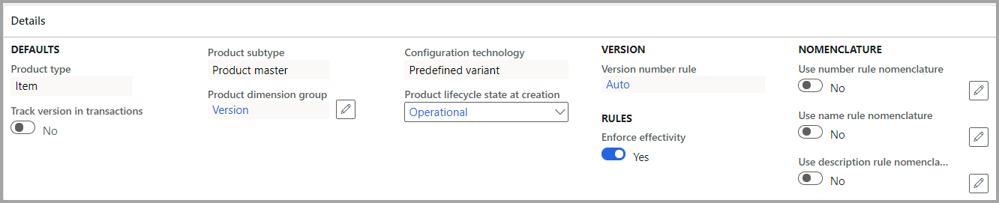
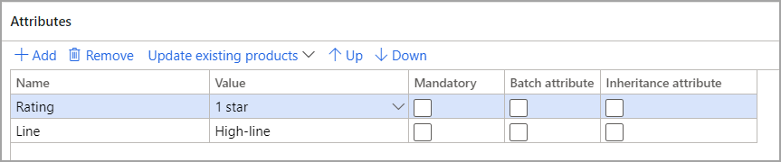

لإعداد منتج هندسي، يجب تعيين فئة هندسية. وتشير الفئة إلى القيم والسياسات الافتراضية. تقوم كل فئة بتأسيس السلوك الافتراضي للمنتجات الموجودة في هذه الفئة. عند تعيين منتج إلى فئة، لا يمكن تغييره. ويكون الحل الوحيد لإزالة منتج من فئة هو حذفه ثم إعادة إنشائه في فئة أخرى.

عند إعداد أحد المنتجات في إحدى الفئات، لا يمكنك تغيير الإعدادات الآتية:

- الشركة الهندسية

- نوع المنتج

- النوع الفرعي للمنتج

- مجموعة أبعاد المنتجات

- تقنية التكوين

- قاعدة رقم الإصدار

لإعداد فئة جديدة، انتقل إلى **إدارة التغيير الهندسي > الإعداد > تفاصيل فئة المنتج الهندسي**. عند تحديد **جديد**، يمكنك الاستمرار في إعداد الفئة باستخدام التفاصيل التي يتم عرضها في الأقسام الآتية.

## الرأس

سيحتوي هذا القسم على **اسم** للفئة و **المؤسسة الهندسية** من هذا الإعداد.

> [!div class="mx-imgBorder"]
> 

## التفاصيل

أدخل المعلومات الآتية في علامة التبويب السريعة **التفاصيل**.

> [!div class="mx-imgBorder"]
> 

|التجميع | الحقل | الخيارات | التعليقات |
|---------|-------|---------|---------|
|الإعدادات الافتراضية | نوع المنتج | الصنف، الخدمة |
| | **تعقب الإصدار في الحركات** | نعم، لا | إذا تم إعداد منتج في هذه الفئة، فسيكون تلقائياً النوع الفرعي لأصل المنتج; يتم ختم كل الحركات بالإصدار |
| | **النوع الفرعي للمنتج** | المنتج، أصل المنتج | إذا كان أصل المنتج، فسيتم تمكين مجموعة أبعاد المنتجات |
| | **مجموعة أبعاد المنتجات** | كافة المجموعات | إذا كان إصدار المسار **نعم**، فسيتم عرض تلك المجموعات فقط مع الإصدار |
| | **تقنية التكوين** | المتغير المعرف مسبقاً | هذه التقنية هي التقنية الوحيدة المعتمدة من قِبل إدارة التغييرات الهندسية |
| | **حالة دورة حياة المنتج عند الإنشاء** | بدءاً من تلك التي تم إعدادها | حالة دورة الحياة عند إنشاء الصنف لأول مرة |
|**الإصدار** | قاعدة رقم الإصدار | يدوي، تلقائي، القائمة | على النحو المعروض سابقاً في هذه الوحدة النمطية |
|**القواعد** | تطبيق السريان | نعم، لا | حدد ما إذا كان من الممكن أن تكون تواريخ الإصدارات متصلة أم لا وما إذا كان من الممكن حدوث تداخلات. **نعم** تعني أن تواريخ **البدء** يجب أن توجد على كل إصدار. **لا** تعني عدم وجود قيود للتاريخ ويمكن استخدام أي إصدار نشط. |
|**كود nomenclature** | استخدام كود nomenclature لقاعدة الرقم | نعم، لا | يقوم هذا الإعداد بتمكين قواعد تعريف للاسم باستخدام أسماء سمات التسلسلات الرقمية |
| | استخدام كود nomenclature لقاعدة الاسم | نعم، لا |
| | استخدام كود nomenclatures لقاعدة الوصف | نعم، لا |

## علامة التبويب السريعة "السمات"

في علامة التبويب السريعة **السمات**، يمكن إضافة السمات الهندسية التي تمت مناقشتها سابقاً إلى الفئة، والتي سيتم تطبيقها فيما بعد عند إضافة منتج جديد وإصداره إلى الكيانات القانونية. 

> [!NOTE] 
> وهذا الإعداد غير مطلوب لاستخدام إدارة التغييرات الهندسية. كما يمكن إضافة السمات بشكل تقليدي. ومع ذلك، يعرّف هذا الأسلوب السمات الهندسية ويجعلها جزءاً من تعريف المنتج.

> [!div class="mx-imgBorder"]
> 

تعرض لقطة الشاشة السابقة السمات الموجودة على الشاشة **السمات الهندسية**. وبعد أن تقوم بإضافة قيمة السمة، يمكنك تحديد أي ميزة، كما هو موضح. إضافة إلى ذلك، من خلال تحديد **تحديث المنتجات الموجودة**، يمكنك تحديث السمات في المنتجات الهندسية الموجودة في هذه الفئة.

شاهد الفيديو الآتي لرؤية عرض توضيحي لخطوات الإعداد.

> [!VIDEO https://www.microsoft.com/videoplayer/embed/RWCZ2h]
