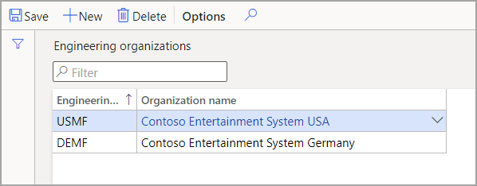

لاستخدام ميزات إدارة التغيير الهندسي، فإن مهمتك الأولى هي إنشاء مؤسسة هندسية. تمثل المؤسسة الهندسية الكيان القانوني الذي يمتلك البيانات الهندسية والمسؤول عن المنتجات الهندسية. ستتم الإشارة إلى المؤسسة عند إعداد منتجات هندسية جديدة.

لإعداد المؤسسة الهندسية، اتبع الخطوات التالية:

1. انتقل إلى  **إدارة التغيير الهندسي > الإعداد > المؤسسات الهندسية**.

1. حدد  **جديد** لإضافة صف إلى الشبكة، ثم قم بتعيين القيم التالية لها:

    - **المؤسسة الهندسية** - ‏USMF

    - **اسم المؤسسة** - Contoso Entertainment System USA

    > [!div class="mx-imgBorder"]
    > 
