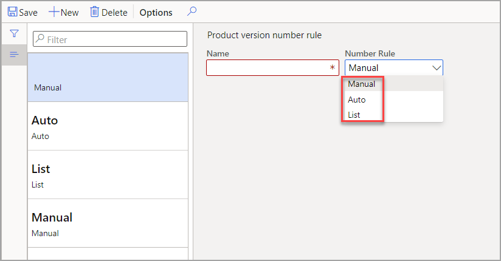

بهدف استخدام إصدارات المنتجات للتحكم في عملية المنتج، يمكنك استخدام *رقم الإصدار* لتتبع جميع التغييرات والتعديلات. لتطبيق رقم الإصدار هذا، يتم استخدام مصطلح الترقيم.

توجد ثلاثة خيارات لإعداد قواعد رقم الإصدار هي:

- **تلقائي** - إنشاء رقم إصدار بناءً على التنسيق الذي توفره (على سبيل المثال، سيكون رقم الإصدار **V24** للإصدار الرابع والعشرين).

- **قائمة** - قائمة الأحرف الثابتة: ألفا أو رقمية أو أي مجموعة. القائمة بترتيب ثابت يستخدم كل إصدار لاحق من القائمة.

- **يدوي** - يتم الإدخال عند الحاجة. نص النموذج الحر عند كل تحديث.

> [!div class="mx-imgBorder"]
> 
