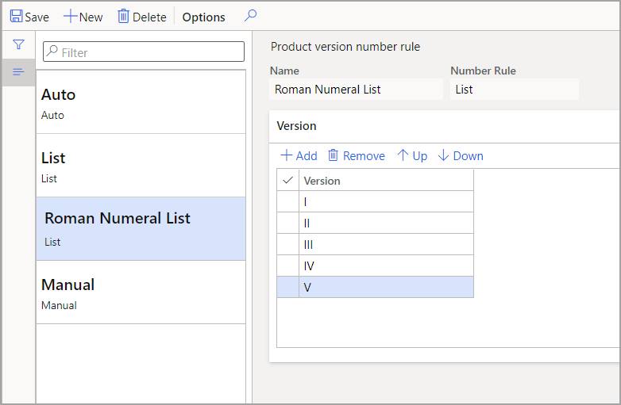

أثناء استخدامك لإدارة التغيير الهندسي وإنشاء إصدارات مختلفة من المنتجات، سيتم إرفاق *رقم إصدار المنتج* بالمنتج ذاته. لذلك، تحتاج إلى قاعدة لتطبيق مثل هذه الأرقام.

لإنشاء القواعد، اتبع الخطوات التالية:

1. انتقل إلى **إدارة التغيير الهندسي > إعداد > قواعد رقم إصدار المنتج**.

1. حدد **جديد‏‎**.

1. بالنسبة إلى **الاسم**، أدخل **قائمة الأرقام الرومانية**.

1. بالنسبة إلى **قاعدة الأرقام**، حدد **قائمة**.

1. قُم بتوسيع علامة التبويب السريعة **الإصدار**.

1. حدد **إضافة**.

1. أدخل **V ،IV ،II ،I** كتسلسل القائمة الخاص بك.

1. أغلق الصفحة.

> [!div class="mx-imgBorder"]
> 
