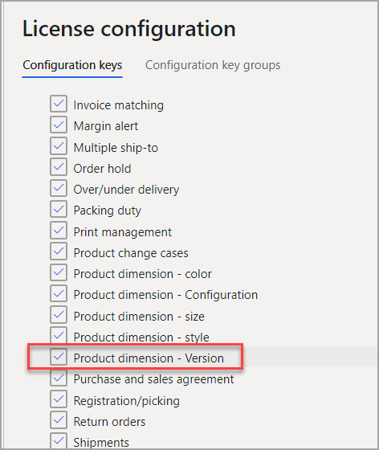

يحتاج العديد من الشركات إلى تعقب إصدار المنتج في جميع الحركات التي تتضمن هذا المنتج. على سبيل المثال، قد ترغب في تعقب الإصدار الموجود في أمر مبيعات. وبدون هذا التتبع، سيقوم أمر المبيعات دائماً بتسجيل أحدث إصدار يتم بيعه.

إذا كنت ترغب في تتبع الإصدار في إدارة التغييرات الهندسية، فيمكنك إضافته **كبُعد منتج**. ونتيجة لذلك، سيتم إعداد المنتج **كأصل المنتج**. بالإضافة إلى ذلك، يمكنك إضافة الإصدار مع **التكوين** و **الحجم** و **اللون** و **النمط** كأبعاد منتج محتملة.

لإنشاء بُعد منتج الإصدار، اتبع الخطوات الآتية:

1. قم بتمكين **إصدار بُعد المنتج** في مساحة عمل **إدارة الميزات**.

1. للانتقال إلى الأمام، يجب وضع الشركة في وضع **صيانة**. لمزيد من المعلومات، راجع [وضع الصيانة](/dynamics365/fin-ops-core/dev-itpro/sysadmin/maintenance-mode/?azure-portal=true).

1. انتقل إلى **إدارة النظام > الإعداد > تكوين الترخيص**، انتقل إلى مجموعة **التجارة**، ثم حدد **بُعد المنتج - الإصدار** وقم بتنشيطه.

    > [!div class="mx-imgBorder"]
    > 

عند تمكين البُعد واستخدامه على المنتجات، سيتم استخدامه بعدئذٍ في قوائم مكونات الصنف والمسارات. إذا لم تكن تستخدم بُعد الإصدار في أحد المنتجات، فلن تتم إضافة الإصدار إلى قوائم مكونات الصنف والمسارات، ولن تحدث أي اختلافات في الإصدارات المتتالية.
