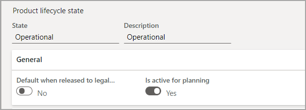
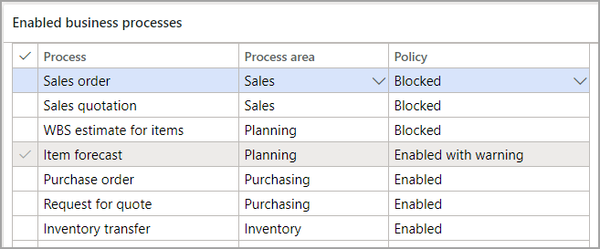

سيكون لجميع المنتجات دورة حياة، بداية من تاريخ بدئها وإلي استخدامها النشط وحتى نهايتها. عند إعداد هذه الحالات، ستحدد الحركات وأوامر المبيعات وأوامر الشراء وأوامر الإنتاج وما إلى ذلك، التي تم تمكينها وحظرها.

ترتبط المنتجات الهندسية وتغييرات دورة الحياة بالإصدار الهندسي للمنتج. ضع في اعتبارك سيناريو تستخدم فيه بُعد منتج مع إصدار. في هذه الحالة، يمكنك استخدام حالة دورة الحياة للإشارة إلى الحركات المسموح بها لكل إصدار.

## إعداد حالات دورة حياة المنتج

لاستخدام حالات دورة الحياة، انتقل إلى **إدارة التغيير الهندسي > إعداد > حالة دورة حياة المنتج**. حدد **جديد** لإنشاء دورة حياة جديدة أو **تحرير** لتعديل الإعدادات في إحدى الحالات الحالية.

### الرأس 

في الرأس، ستُنشئ اسماً ووصفاً لحالة دورة حياة المنتج.

### علامة التبويب السريعة عام

تحتوي علامة التبويب السريعة **عام** على خيارين:

- **القيمة الافتراضية عند الإصدار إلى الكيان القانوني** - بالنسبة للمنتجات العادية، يمكنك تحديد **نعم** إذا كنت تريد تطبيق حالة دورة الحياة على المنتجات عند إصدارها للكيانات القانونية. يمكنك تحديد **لا** إذا تم تطبيق دورة الحياة يدوياً لاحقاً.

    لن يتم تطبيق هذا الخيار على المنتجات الهندسية لأنه يتم إنشاء دورة الحياة عند تعيينها لفئة تغيير هندسي.

- **نشط للتخطيط** - يعني تحديد **نعم** لهذا الخيار أنه سيشمل المنتجات الموجودة في حالة دورة الحياة هذه في العمليات الحسابية للتخطيط الرئيسي ومستويات قائمة مكونات الصنف. إذا قمت بتحديد **لا**، فسيتم استبعاد المنتجات في هذه الحالة من الحسابات.

> [!div class="mx-imgBorder"]
> 

### علامة التبويب السريعة لعمليات الأعمال الممكّنة

في علامة التبويب السريعة **عمليات الأعمال الممكّنة**، يعتبر عمود **العملية** قائمة ثابتة تضم عمليات الأعمال الممكنة. يحتوي عمود **منطقة العملية** على قيمة افتراضية يمكن تغييرها، على الرغم من أن التغيير لن يكون له أي تأثير. 

يحتوي عمود **السياسة** على ثلاثة خيارات يمكنك التحديد من بينها:

- **الممكّنة** - يتم السماح بعملية الأعمال.

- **المحظورة** - غير مسموح بعملية الأعمال، وفي حاله المحاولة، سيقوم النظام بحظرها وعرض الخطأ. على سبيل المثال، لا يسمح بأمر شراء بصنف قديم.
 
- **تم التمكين مع تحذير** - سيعرض النظام تنبيهاً لحالة معينة. يعتبر أمر إنتاج الذي يستخدم منتجاً لا يزال قيد التصميم واحدً من الأمثلة.

> [!div class="mx-imgBorder"]
> 

