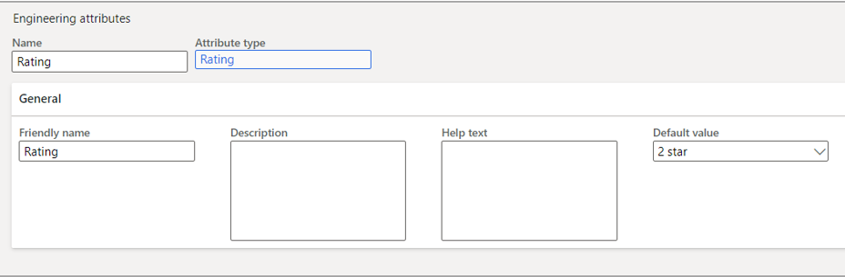

يتم إعداد أنواع السمات الهندسية في إدارة التغيير الهندسي بشكل مشابه لجميع أنواع سمات المنتجات الموضحة في [إنشاء وتكوين التدرجات الهرمية للفئات والسمات](/learn/modules/create-products-product-masters-dyn365-supply-chain-mgmt/7-category-hier-attr/?azure-portal=true). 

بدلاً من إعداد سمات إدارة معلومات المنتجات، تحتاج إلى إعداد سمات إدارة التغيير الهندسي في الوحدة النمطية **إدارة التغيير الهندسي** بحيث يمكن تطبيقها على المنتجات الهندسية.

لإنشاء سمة هندسية، اتبع الخطوات التالية:

1. انتقل إلى **إدارة التغيير الهندسي > إعداد > السمات > السمات الهندسية**.

1. حدد **جديد** في جزء الإجراءات لإنشاء سمة جديدة.

    - حدد **اسماً** مثل **التصنيف**.

    - حدد **نوع السمة** من القائمة: **التصنيف**.

    - أدخل **اسماً مألوفاً** إن أمكن، والذي سيتم تعيينه افتراضياً لما أدخلته في حقل **الاسم**.

    - أدخل **وصفاً** و **نص تعليمات** حسب الحاجة.

    - إذا تم إعداد **القيمة الافتراضية** في **نوع السمة**، فيمكنك تحديد واحدة. لا يلزم أن تكون هي نفس القيمة الافتراضية لسمة المنتج.

    > [!div class="mx-imgBorder"]
    > 
