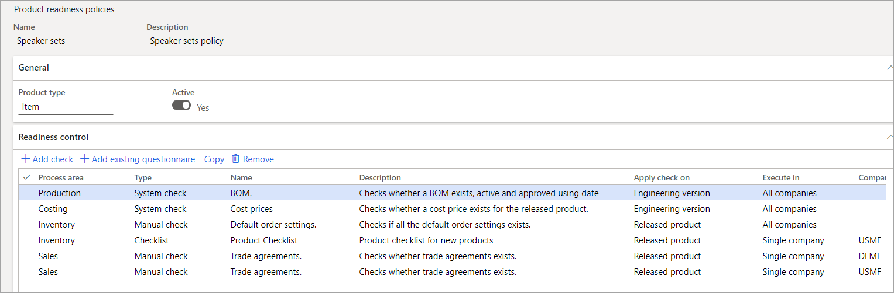
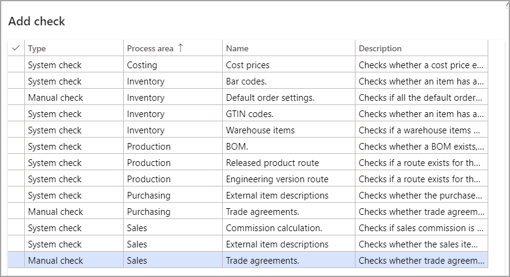
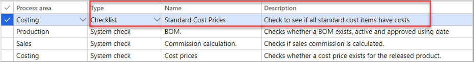
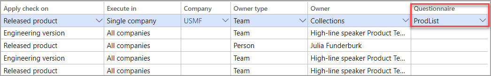

توفر سياسات جاهزية المنتج فحصاً للتأكد من تحديد جميع البيانات الرئيسية المطلوبة لمنتج قبل استخدامه في الحركات. يمكن إصدار منتج أو استخدامه في الحركات في حالة التحقق من صحة فحص الجاهزية فقط. لا يُشترط فحص الجاهزية لإضافتها إلى فئة أو منتج.

يصف الجدول التالي الأنواع الثلاثة من فحوصات الجاهزية المضمنة في كل سياسة.

|النوع | فحص |
|-----|-------|
|فحص النظام | سيتحقق النظام من وجود تسجيل صالح، وفقاً لإعداد السياسة. |
|فحص يدوي | سيتحقق المستخدم من صحة السجل، ويمكن للمستخدم تحديد ما إذا كان قد تم استيفاء شرط الجاهزية. |
|قائمة الاختيار | سيتطلب هذا الفحص أن يجيب المستخدم على سلسلة من الأسئلة من قائمة التحقق، وسيحدد النظام بعد ذلك ما إذا كانت المعايير قد استوفيت أم لا. |

لإنشاء الفحوصات، استخدم علامة التبويب السريعة **التحكم في الجاهزية**، حيث يمكنك إضافة الفحوصات من خلال إدراج **منطقة العملية** و **نوع** الفحص. توجد الصفحة في **إدارة التغيير الهندسي > إعداد > سياسات جاهزية المنتج**.

> [!div class="mx-imgBorder"]
> 

يأتي النظام مزوداً بـ 13 نظاماً أو فحصاً يدوياً، والتي يمكنك الاختيار من بينها عن طريق تحديد **إضافة فحص**.

> [!div class="mx-imgBorder"]
> 

لإضافة قائمة تحقق، حدد **إضافة استبيان موجود**، والذي سينشئ بند متضمناً **قائمة الاختيار** كنوع. يمكنك بعد ذلك الاستمرار في تغيير **منطقة العملية** وإضافة الاستبيان.

> [!div class="mx-imgBorder"]
> 

> [!div class="mx-imgBorder"]
> 
