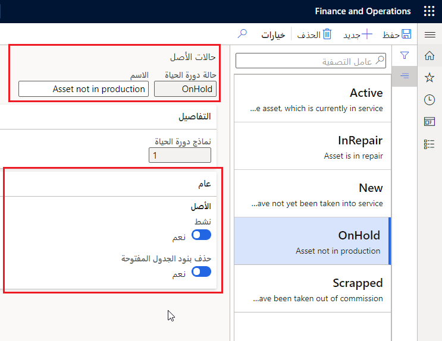
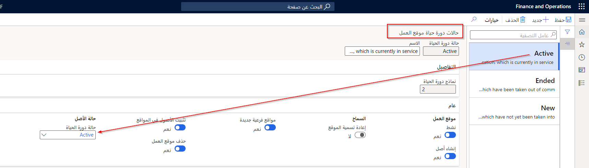

كما هو الحال مع **مواقع العمل** و **طلبات الصيانة**، يكون للأصول حالات دورة حياة تحدد حالة الأصل. تتضمن بعض أمثلة **‏‫حالات دورة حياة الأصول‬** كلاً من **جديد**، و **نشط**، و **منتهٍ**. يمكنك عرض الحالة الحالية للأصل في أي وقت على صفحة **كل الأصول**. 

**إدارة الأصول > إعداد > الأصول > حالات دورة الحياة**
 

يصف هذا الإجراء كيفية إعداد حالات دورة حياة الأصول.

1.  حدد **إدارة الأصول > الإعداد > الأصول > حالات دورة الحياة**.
2.  حدد **جديد** لإنشاء حالة دورة حياة أصل جديدة.
3.  في حقل **حالة دورة الحياة**، أدخل معرّف حالة دورة الحياة. ‏‫وكمثال، يمكن أن يكون هذا المعرف **نشط**، و **جديد**، و **قيد الانتظار**، و **منتهٍ**، وما إلى ذلك. بالنسبة لهذا المثال، أدخل المعرّف **قيد الإصلاح"**.
4.  في حقل **الاسم**، أدخل اسماً وصفياً. نظراً لأن هذا الإدخال يقوم بإنشاء عنوان فرعي لعرضه، ضع اسماً في هذا الحقل يصف حالة دورة الحياة، على سبيل المثال، **الأصل قيد الإصلاح**. 
    يُظهر الحقل **‏‫نماذج دورة الحياة** عدد نماذج دورة حياة الأصل التي تقترن بها حالة دورة الحياة. 
5.  قم بتعيين الخيار **نشط** إلى **نعم** لتنشيط حالة دورة الحياة. في حالة التنشيط، يمكن إنشاء أوامر عمل للأصل في حالة دورة الحياة.
6.  قم بتعيين خيار **حذف بنود الجدول المفتوحة** ‎إلى **‎نعم** ‎للسماح بحذف بنود الجدول المفتوحة المقترنة بحالة دورة حياة الأصل. تكمن ميزة هذا الإعداد في أن القدرة على الاحتفاظ بجداول نظيفة وحذف الجداول لم تعد قابلة للتطبيق.
7.  يجب عليك **‏‫حفظ** حالة الأصل الجديدة.

> [!NOTE]
> كما قد تتذكر، عند إعداد حالات دورة حياة موقع العمل، يمكنك تكوين النظام لتحديث حالات دورة حياة الأصل تلقائياً عند تغيير حالة دورة حياة موقع العمل.  

**إدارة الأصول > إعداد > مواقع العمل > حالات دورة الحياة**

