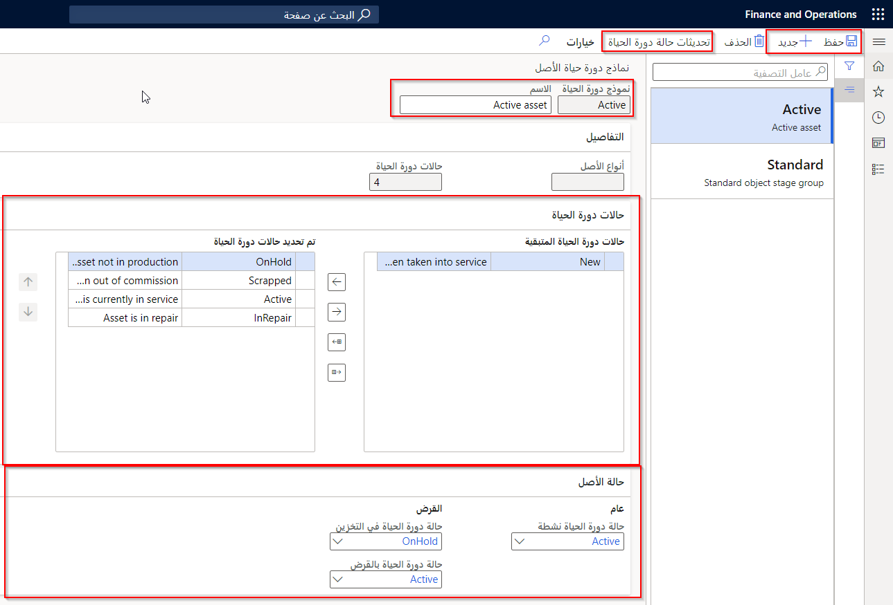
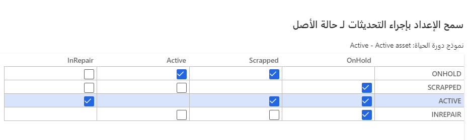

عند إنشاء حالات دورة الحياة المطلوبة للأصول لديك، يمكنك بعد ذلك وضعها في مجموعات تسمى النماذج. 

**إدارة الأصول > الإعداد > الأصول > نماذج دورة الحياة**
 

تساعدك هذه الطريقة في إنشاء سير عمل لدورة الحياة يمكن استخدامه لأنواع مختلفة من الأصول. نوصي بإنشاء نموذج دورة حياة أصل قياسي واحد على الأقل.

1.  انتقل إلى **إدارة الأصول > الإعداد > الأصول > نماذج دورة الحياة**.
2.  حدد **جديد** لإنشاء نموذج دورة حياة أصل جديد. 
3.  في الحقل **نموذج دورة الحياة**، أدخل معرف نموذج دورة الحياة، مثل **نشط**.
4.  في حقل **الاسم**، أدخل اسماً وصفياً لنموذج دورة حياة الأصل، مثل **نشط - الأصل**.
5.  **احفظ** النموذج الجديد.
6.  ضمن علامة التبويب السريعة **تفاصيل**، يمكن ملء الحقلين **‏‫أنواع الأصول‬** و **حالات دورة الحياة** تلقائياً وعرض عدد أنواع الأصول و‎حالات دورة حياة الأصول التي تستخدم نموذج دورة الحياة الحالي. نظراً لأن هذا النموذج جديد، فلن تحتوي أنواع الأصول على أي أنواع أصول مرتبطة بهذا النموذج. ستتم تعبئة حالات دورة الحياة عند تحديث علامة التبويب السريعة حالات دورة الحياة في هذه الصفحة.
    ضمن علامة التبويب السريعة **حالات دورة الحياة**، تظهر حالات دورة الحياة النشطة في قسم حالات دورة الحياة المتبقية ناحية اليسار. تتوفر هذه الحالات ليتم تضمينها في مجموعة نماذج دورة حياة الأصول الجديدة.
7.  لنقل حالة دورة حياة معيّنة إلى قسم **حالات دورة الحياة المحددة**، اختر الحالة المراد نقلها في قسم **حالات دورة الحياة المتبقية**، ثم حدد زر سهم إلى اليمين.   
8.  لاختيار جميع حالات دورة الحياة لتضمينها في النموذج، حدد زر سهم نقل الكل إلى اليمين لنقل التحديد بالكامل من قسم **حالات دورة الحياة المتبقية** إلى قسم **حالات دورة الحياة المحددة**.
9.  لإزالة حالة دورة حياة محددة من النموذج، اختر حالة دورة الحياة المراد إزالتها من القسم **حالات دورة الحياة المحددة**، ثم حدد زر السهم الأيسر لنقلها مرة أخرى إلى القسم **حالات دورة الحياة المتبقية**.
10. لإزالة التحديد بالكامل من النموذج، حدد زر سهم نقل الكل إلى اليسار. وبعد ذلك يتم إرجاع جميع حالات دورة الحياة في قسم **حالات دورة الحياة المحددة** إلى قسم **حالات دورة الحياة المتبقية**.
11. يحدد ترتيب حالات دورة الحياة في علامة التبويب **حالات دورة الحياة المحددة** سير العمل. لنقل الحالات إلى ترتيب سير العمل المطلوب، حدد الحالة واستخدم الأسهم الموجودة على يمين قسم **حالات دورة الحياة المحددة** لتحريك الحالة لأعلى أو لأسفل في أمر سير العمل.
12. استخدم علامة التبويب السريعة **حالة الأصل** لتعيين **حالة دورة الحياة** التي يقع فيها الأصل عندما يكون بالحالة **نشط** أو عندما يكون بالحالة "قرض"، والحالة التي ينبغي تعيينها **لحالة دورة الحياة في تخزين** **وحالة دورة الحياة في قرض**. 
13. **احفظ** نموذج دورة الحياة الجديد.

## تحديثات حالة دورة الحياة
عند إنشاء نموذج دورة الحياة، يتعين عليك تحديد كيفية سير الحالات في النظام. يتم تحديد هذا التعريف من خلال سير إجراءات العمل بالشركة وتصميمها.

1.  أثناء فتح صفحة **نماذج دورة حياة مواقع الأصول**، حدد **تحديثات حالة دورة الحياة** في جزء الإجراءات. 
2.  بجوار كل حالة دورة حياة، حدد الحالة التي يمكن تغيير الحالة إليها. على سبيل المثال: 
    - يمكن تغيير **نشط** إلى **معلق** أو **قيد الإصلاح**. 
    - يمكن تغيير **معلق** إلى **نشط** فقط. 
    - يمكن تغيير **قيد الإصلاح** إلى **نشط** أو **معلق** أو **مخرد**.
    - يمكن تغيير **مخرد** إلى **نشط** فقط.

    

3.  حدد **موافق** لحفظ التحديثات.

