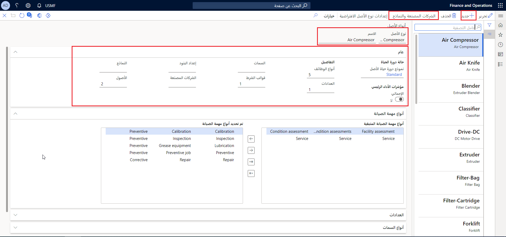

تُستخدم أنواع الأصول لتحديد الأصول المستخدمة في المؤسسة وتصنيفها. تُستخدم أنواع الأصول لإدارة أنواع المهام، بما في ذلك مهام الصيانة وعدادات الأصول المقترنة بها وتقييمات الشروط ومواصفات الأصول ونماذج المشاريع.

تتضمن أنواع الأصول الماكينات، والتي تتضمن جميع الأصول المقترنة مثل سير الناقلة ذي المحرك والبكرات وجميع الأجزاء الأخرى ذات الصلة مثل الصواميل والمسامير والأسلاك. 

أمثلة على أنواع الأصول:

- الماكينات 
- المركبات
- محركات الشاحنة
- المازجات
- النابطات

تُستخدم أنواع الأصول لتعقب الأخطاء والتكاليف حسب نوع الأصل. بالإضافة إلى ذلك، يمكن استخدام أنواع الأصول من أجل:

أنواع مهام الصيانة

- حالات دورة حياة الأصول
- العدادات
- سمات الأصول
- نماذج تقييم الشروط
- نماذج الأصول التي يمكن تحديدها لأحد الأصول 

يمكن أن يكون لنوع الأصل أشكال متعددة. على سبيل المثال، بالنسبة لنوع أصل **الشاحنات**، نظراً لوجود عدة أنواع مختلفة من الشاحنات، يمكنك إنشاء أشكال مختلفة بناءً على جهة مصنعة وطراز محددين. بعد ذلك، بالنسبة لكل نوع أصل تم إعداده، يمكنك إضافة قطع الغيار وخطط الصيانة المطلوبة لطراز الشاحنة المحدد. يمكنك إنشاء الأشكال المختلفة لأنواع الأصول في صفحة **الإعدادات الافتراضية لأنواع الأصول**.

قبل التفكير في الأشكال المختلفة، عليك أولاً تنفيذ الخطوات التالية:

1.  قم بإعداد أنواع الأصول المطلوبة. 
2.  أنشئ نماذج الأصول المرتبطة بأنواع الأصول هذه. 

بعد إنشاء أنواع الأصول الأساسية، يمكنك العمل على إنشاء أشكال نوع الأصول المطلوبة لمعداتك، مثل نوع محرك معين لشاحنة واحدة ونوع محرك آخر لنوع مختلف من الشاحنات.

> [!NOTE]
> لا يمكن تغيير أنواع الأصول بعد إنشائها.

## إنشاء نوع أصل
اتبع الخطوات التالية لإنشاء نوع الأصل:

1.  انتقل إلى **إدارة الأصول > الإعداد > أنواع الأصول > أنواع الأصول**.
2.  حدد **جديد** لإنشاء نوع أصل جديد.
3.  في الحقل **نوع الأصل**، أدخِل معرف نوع الأصل مثل **وحدة تبريد**.
4.  في الحقل **الاسم**، أدخِل اسماً لنوع الأصل مثل **وحدة تبريد**.
5.  في القسم **حالة دورة الحياة**، حدد نموذج دورة حياة أصل. تذكر أن هذه هي حالات الحياة التي تم تجميعها في نماذج سير العمل. حدد **قياسي**.
6.  في القسم **مؤشرات الأداء الأساسية (KPI)**، قم بتعيين شريط التبديل **الإجمالي** على **نعم** في حالة ضرورة حساب قيم مؤشر الأداء الرئيسي (KPI) لأنواع الأصول هذه.
7.  حدد **حفظ**.
8.  في علامة التبويب السريعة **أنواع مهام الصيانة**، حدد أنواع مهام الصيانة المرتبطة بنوع الأصل. 
    - في القسم **أنواع مهام الصيانة المتبقية**، حدد نوع المهمة وحدد زر السهم الأيمن لنقل اختيارك إلى قسم **أنواع مهام الصيانة المحددة**.
    - إذا كنت تريد جميع أنواع مهام الصيانة المتاحة، فحدد زر **نقل الكل** لنقل جميع الأصناف المُدرجة في قسم **أنواع مهام الصيانة المتبقية** إلى قسم **نوع مهمة الصيانة المحددة**. 
    - لإزالة نوع مهمة صيانة من قسم أنواع المهام المحددة، حدده في حقل **أنواع مهام الصيانة المحددة** ثم استخدم زر السهم الأيمن لنقله مرة أخرى إلى قسم **أنواع مهام الصيانة المتبقية**.

    > [!NOTE]
    > لتحديد أنواع المهام في علامة التبويب السريعة **أنواع مهام الصيانة**، يجب أن تكون قد أنشأت أنواع مهام الصيانة في **إدارة الأصول > الإعداد > المهام > أنواع مهام الصيانة**.

9.  تسمح لك العدادات بتعيين تعقب الأصول للاستخدام، مثل الساعات قيد الاستخدام والمسافة والمسافة بالأميال المستخدمة، وما إلى ذلك. يساعدك هذا الأسلوب في تعيين عدادات لإعلامك بموعد إجراء الصيانة الوقائية التالية. على سبيل المثال، قد يجب استبدل سيرٍ بعد كل 200 ساعة من الاستخدام في خط الإنتاج. تسمح لك العدادات بإنشاء هذا التذكير. كجزء من تكوين **أنواع الأصول**، تكون علامة التبويب السريعة **العدادات** حقلاً اختيارياً ويمكن إضافته لاحقاً. اترك هذا الحقل فارغاً لهذا الإجراء.
10. في علامة التبويب السريعة **أنواع السمات** (وهو أيضاً قسم اختياري)، يمكنك تعيين أنواع السمات لتحديد نوع الأصل بشكل أكبر.
    > [!NOTE]
    > عند إضافة نوع سمة جديد إلى نوع أصل موجود، سيتم تحديث السمة الجديدة تلقائياً في جميع الأصول المرتبطة بهذا النوع.
11. في علامة التبويب السريعة **تقييمات الشروط**، تعمل تقييمات الشروط على تحديد شروط الصيانة الوقائية التي يمكن قياسها على فترات منتظمة لتحديد التغييرات التي تحدث في تلك الأصول. على سبيل المثال، يتم قياس مستوي الاهتزاز في الآلة على فترات زمنية منتظمة. في حالة العثور على قياسات اهتزاز متزايدة، يمكن إجراء الصيانة الوقائية بناءً على هذا التقييم. لاختيار نماذج الشروط، حدد نماذج الشروط من قسم **نماذج الشروط المتبقية** وانقلها باستخدام الأسهم الموجودة في المنتصف إلى قسم **نماذج الشروط المحددة**. 
12. ستعرض لك علامة التبويب السريعة **الجهات المصنعة والطرازات** الجهات المصنعة والطرازات المرتبطة بالأصل. 

**إدارة الأصول > الإعداد > أنواع الأصول > أنواع الأصول**
 

يجب مراعاة المعلمات التالية عند العمل مع أنواع المهام:

- يتم تحديث تحديدات **العدادات** التي يتم إجراؤها على نوع الأصل تلقائياً في نوع الأصل في صفحة **العدادات** (**إدارة الأصول > الإعداد > أنواع الأصول > العدادات**).
- تعرض الحقول الموجودة في قسم **التفاصيل** في علامة التبويب السريعة **عام** عدد أنواع مهام الصيانة والعدادات والسمات المرتبطة بنوع الأصل المحدد الحالي.
- عندما تقوم بإنشاء أمر عمل يدوياً، يمكنك فقط استخدام أنواع مهام الصيانة التي تم تحديدها في علامة التبويب السريعة **أنواع مهام الصيانة**. تشتمل أوامر العمل اليدوية عادةً على طلب صيانة تصحيحي. 
- يمكن أن تستخدم **أوامر العمل** التي يتم إنشاؤها تلقائياً *جميع* **أنواع مهام الصيانة** المُنشأة في صفحة **أنواع مهام الصيانة**. 
- يمكن أن تستخدم أوامر العمل التي يتم إنشاؤها يدوياً **أنواع مهام الصيانة** التي تم تحديدها فقط في علامة التبويب السريعة **أنواع مهام الصيانة** في صفحة **أنواع الأصول**.

يوضح الفيديو التالي كيفية إنشاء نوع أصل.
 
> [!VIDEO https://www.microsoft.com/videoplayer/embed/RE4oONV]

