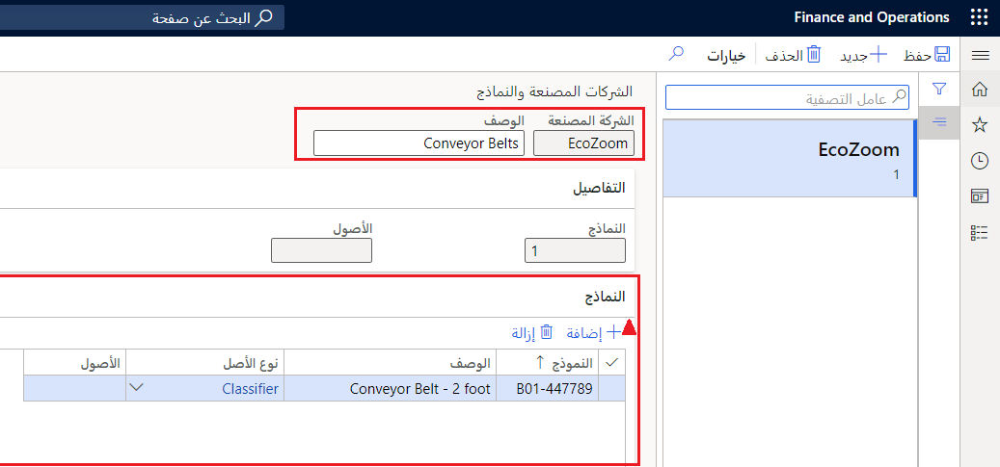

لتعقب أصولك، احصل على أجزاء احتياطية لهذه الأصول، وقم بإنشاء ضمانات، ومن المهم معرفة نوع الأصل المحدد وطرازه. يوضح هذا الموضوع كيفية إعداد الشركات المصنعة والطرازات الخاصة بالأصول التي يمكن ربطها بأحد الأصول. 

لإعداد العلاقات بين المنتج والطراز، اتبع الخطوات الآتية:

1.  انتقل إلى **إدارة الأصول > الإعداد > الأصول > الشركات المصنعة والطرازات**.
2.  حدد **جديد‎**.
3.  في حقل **الشركة المصنعة**، أدخل اسم الشركة المصنعة للأصول مثل **Contoso**.
4.  في حقل **الوصف**، أدخل وصفاً لمنتج الشركة المصنعة مثل **السيور الناقلة**.
    في علامة التبويب السريعة **تفاصيل**، يتم ملء الحقلين **الطرازات** و **الأصول** تلقائياً عند إكمال هذه العملية في علامة التبويب السريعة **الطرازات**. 
5.  في علامة التبويب السريعة **الطرازات**، حدد **إضافة** لإنشاء طراز أصل مرتبط بالشركة المصنعة للأصول. 
6.  في حقل **الطراز**، أدخل اسم أو معرِّف الطراز مثل **B 01-447789**.
7.  في حقل **الوصف**، أدخل وصفاً للطراز مثل **السير الناقل - 2 قدم**.
8.  في القائمة المنسدلة **نوع الأصل**، حدد نوع الأصل الذي يجب ربط طراز الشركة المصنعة به.
    يُملأ حقل **الأصول** تلقائياً ويعرض عدد الأصناف باستخدام طراز الشركة المصنعة.

تعرض الصورة الآتية مثالاً لصفحة **الشركات المصنعة والطرازات**.

 

