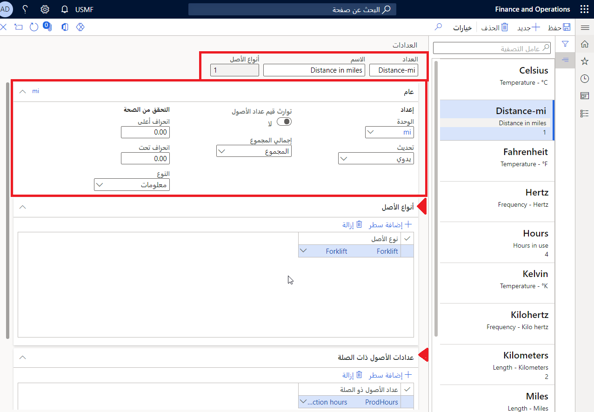

تسمح لك العدادات بتعيين تعقب الأصول للاستخدام، مثل الساعات قيد الاستخدام والمسافة والمسافة بالأميال المستخدمة، وما إلى ذلك. هذه الميزة مفيدة لأنه يمكنك بعد ذلك تعيين عدادات لإعلامك بموعد إجراء الصيانة الوقائية التالية. على سبيل المثال، قد يجب استبدل سيرٍ بعد كل 200 ساعة من الاستخدام في خط الإنتاج. كجزء من تكوين **أنواع الأصول**، تكون علامة التبويب السريعة **العدادات** حقلاً اختيارياً ويمكن إضافته لاحقاً.  

أمثلة العدادات:

- الساعات قيد الاستخدام
- كمية الإنتاج
- درجة الحرارة (الدرجة المئوية والفهرنهايت)
- المسافة بالأميال والكيلومترات وما إلى ذلك
- القياسات

يمكن تحديث العدادات يدوياً أو تلقائياً

## إنشاء عدادات
لإنشاء عدادات، اتبع الخطوات الآتية:

1.  انتقل إلى **إدارة الأصول > الإعداد > أنواع الأصول > العدادات**.
2.  حدد **جديد** لإنشاء نوع عدادات جديد.
3.  أدخل اسم **العداد**، مثل **مسافة-ميل**.
4.  أدخل **اسم** العداد باستخدام معلومات وصفية، مثل **المسافة بالأميال**. 
5.  حقل **أنواع الأصول** يعد حقلاً مؤتمتاً يوضح عدد أنواع الأصول المرتبطة بهذا العداد. 
6.  في علامة التبويب السريعة **عام**، حدد **وحدة** من القائمة المنسدلة. حدد **ميل**.
7.  من القائمة المنسدلة **تحديث**، حدد طريقة التحديث التي سيتم استخدامها للعداد. الخيارات هي: 
    - **يدوي** – يتم تسجيل قيم العداد يدوياً.
    - **ساعات الإنتاج** – يُجري العداد عمليات التعقب والتحديثات تلقائياً استناداً إلى عدد ساعات الإنتاج.
    - **كمية الإنتاج** – يُجري العداد عمليات التعقب والتحديثات تلقائياً استناداً إلى الكمية التي تم إنتاجها. 
8.  يمكن تغيير زر التبديل **اكتساب قيم عدادات الأصول** إلى **نعم** إذا كان من الضروري تضمين الأصول التابعة الموجودة في بنية الأصل في تسجيلات العدادات التي تم اجراؤها في الأصل الأساسي.
9.  في حقل **التجميع الإجمالي**، حدد طريقة التجميع المطلوب استخدامها للعداد. **المجموع** القيمة الإجمالية للعداد والتي تتكون من القيم التي تم تجميعها لإنشاء المجموع. 

    **المتوسط** المقدار أو المعيار أو المعدل الذي يعد عادياً. ويمكن استخدامه إذا تم ضبط عداد لمراقبة أحد الحدود، فيما يتعلق بدرجة الحرارة أو الاهتزازات أو التآكل والبلى في أحد الأصول مثلاً.
10. في حقل **الانحراف الزائد**، حدد مقدار، بالنسبة المئوية، المعدل المتوسط للانحراف عن المعيار المقبول للتحقق الذي يسمح للقيمة به. يستند التحقق إلى زيادة خطية في تسجيلات العدادات الموجودة.
11. في حقل **الانحراف المنخفض**، أدخل مقدار، بالنسبة المئوية، الانحراف عن المعيار المقبول للتحقق الذي يسمح للقيمة به. يستند التحقق إلى انخفاض خطي في تسجيلات العدادات الموجودة.
12. حدد **نوع** الإخطار من القائمة المنسدلة. يحدد **النوع** نوع الرسالة التي سيتم عرضها عند اكتشاف انحرافات خارج النطاقات المحددة. تتضمن الخيارات المتاحة الآتي:
    - ‏‏‏‏‏‏‏‏‏‏‏‏‏‏‏‏‏‏‏المعلومات
    - التحذير
    - الخطأ
13. في علامة التبويب السريعة **أنواع الأصول**، يمكنك تحديد **أنواع الأصول** باستخدام هذا العداد.
14. في علامة التبويب السريعة **عدادات الأصول ذات الصلة**، يمكنك تحديث العدادات المرتبطة بهذا العداد تلقائياً. على سبيل المثال، يمكنك تعقب الساعات المستخدمة في رافعة شوكية والساعات المرتبطة بالمحرك والساعات منذ آخر مرة تم فيها تغيير الزيت. 

