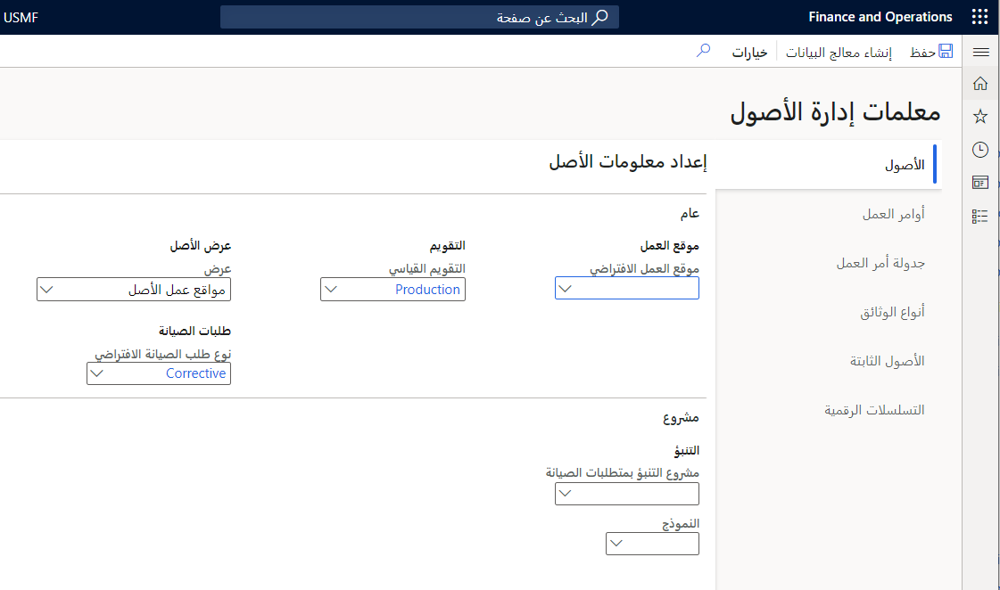
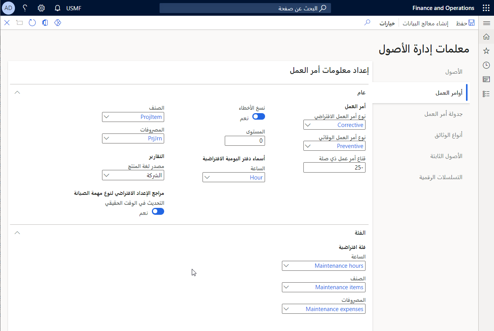
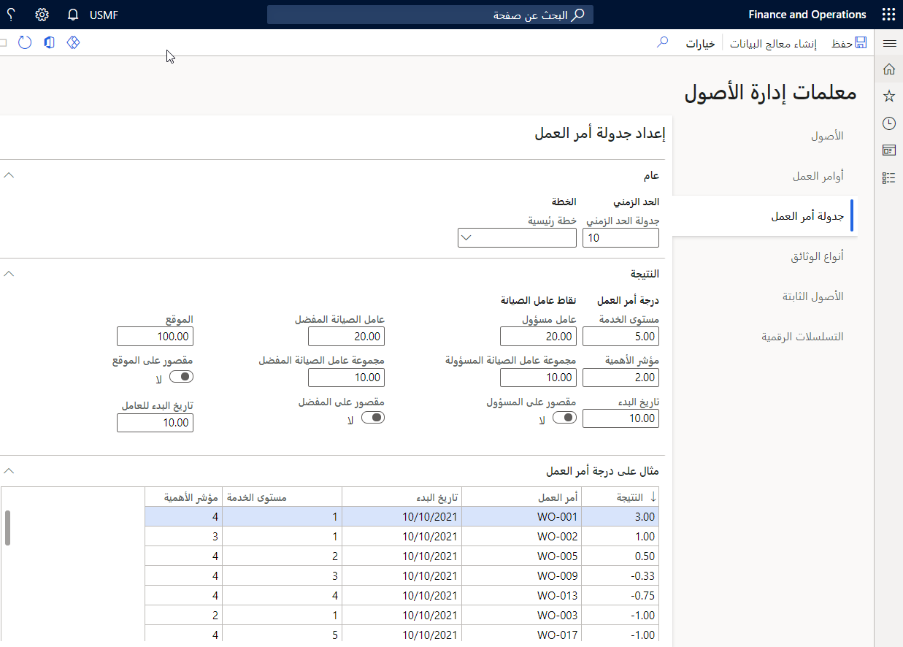
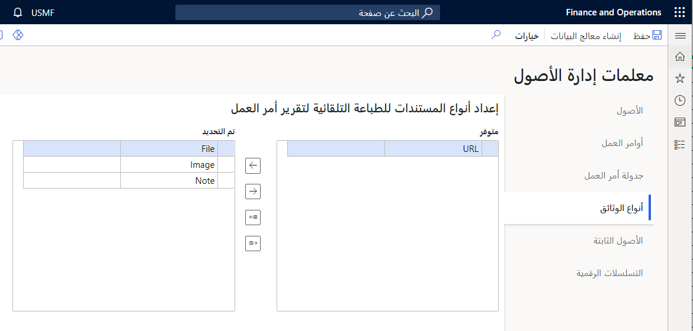
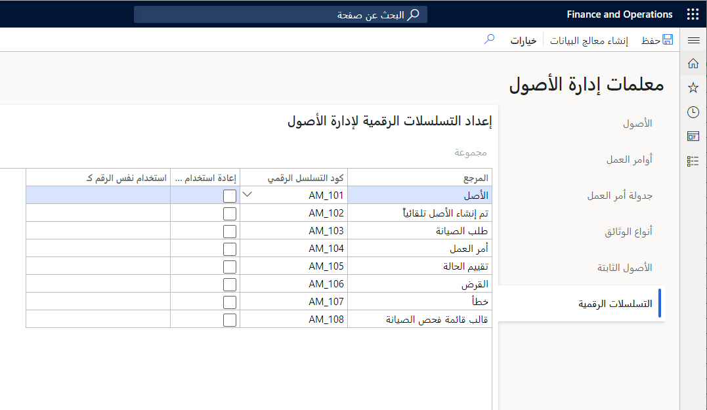

في إدارة الأصول، يجب إنشاء معلمات عامة تتعلق بالأصول وأوامر العمل وجدولة أوامر العمل وأنواع المستندات والتسلسلات الرقمية. تشرح هذه الوحدة كيفية إعدادها. 

انتقل إلى **إدارة الأصول> الإعداد > معلمات إدارة الأصول**.

> [!NOTE]
> يستخدم زر **معالج إنشاء البيانات** لإنشاء بيانات الإعداد تلقائيَا لأغراض الاختبار أو العرض التوضيحي الموجودة في شركة في Dynamics 365 Supply Chain Management. 

## علامة التبويب السريعة "الأصول"
لإنشاء مشاريع في علامة التبويب السريعة **الأصول**، اتبع الخطوات الآتية:

1.  في القائمة المنسدلة **موقع العمل الافتراضي**، حدد الموقع الافتراضي. هذا الموقع موقع العمل القياسي الذي يتم تحديده تلقائياً عند إنشاء أصول جديدة.
2.  في حقل **التقويم القياسي**، حدد التقويم الذي سيتم استخدامه لحساب مؤشرات الأداء الرئيسية للأصول عند عدم وجود مَورد محدد في أحد الأصول.
3.  في الحقل **عرض** حدد العرض الذي تريد رؤيته عند فتح صفحة **عرض الأصول** page (**إدارة الأصول > الأصول > عرض الأصول**).   
4.  في القائمة المنسدلة **نوع طلب الصيانة الافتراضي** حدد نوع طلب الصيانة الذي تريد تحديده عند إنشاء طلب جديد.
5.  افتح علامة التبويب السريعة **المشروع** إذا كنت تريد إنشاء مشاريع تتعلق بالأصول. 
    - حدد **المشروع الرئيسي** من القائمة المنسدلة.
    > [!NOTE]
    > تنسيق قناع أمر العمل المرتبط هو عدد من علامات الأرقام (#) لتمثيل الحد الأقصى لعدد أوامر العمل التي تتوقع إنشائها على أحد الأصول. كمثال على ذلك، تسمح لك علامتا الرقم (##) بإنشاء 99 مشروعاً فرعياً كحدٍ أقصى. 
7.  يتم تخزين التنبؤات الموجودة في أنواع المهام في المشروع الذي تم تحديده في حقل **مشروع التنبؤ بالصيانة**. بالنسبة إلى كل نوع مهمة، يتم إنشاء نشاط جديد تلقائياً في مشروع التنبؤ. ويتم حفظ التنبؤات الموجودة في نوع المهمة في مشروع التنبؤ.
8.  في حقل **النموذج**، حدد نموذج التنبؤ الذي يتم استخدامه في نوع مهمة الصيانة وتنبؤات أوامر العمل.

تعرض الصورة الآتية مثالاً لقسم **إعداد معلومات الأصل**. 

انتقل إلى **إدارة الأصول > الإعداد > معلمات إدارة الأصول > الأصول**

## علامة التبويب السريعة "أوامر العمل"
لإنشاء مشاريع في علامة التبويب السريعة **أوامر العمل**، اتبع الخطوات الآتية:

1.  في القائمة المنسدلة **نوع أمر العمل الافتراضي**، حدد نوع أمر العمل الذي سيصبح الإعداد القياسي عند إنشاء أمر عمل جديد.
2.  استخدم **نوع أمر العمل الوقائي** لتحديد نوع أمر العمل المستخدم عند إنشاء أوامر العمل من خطط الصيانة. إذا تُرك هذا الحقل فارغاً، فسيتم استخدام حقل **نوع أمر العمل الافتراضي**.
3.  في حقل **قناع أوامر العمل ذات الصلة**، حدد العدد الأقصى لأوامر العمل التي يمكن ربطها بأمر العمل. على سبيل المثال، يمكنك إدخال علامتي الرقمين (# #)، والتي تتيح لك إمكانية الحصول على 99 أمر عمل مرتبط كحدٍ أقصى. 
    - إذا قمت بتحديد القناع # #، فسيتم ترقيم أوامر العمل ذات الصلة -01 ،-02 ،-03، وهكذا. 
    - وفي حالة عدم تحديد أي قناع في هذا الحقل، سيحصل أمر العمل المرتبط على معرف أمر العمل المتسلسل التالي.
4.  حدد **نعم** في شريط التبديل **نسخ الأخطاء** إذا كنت ترغب في نسخ الأخطاء المسجلة في أوامر العمل تلقائياً إلى طلبات الصيانة ذات الصلة.
5.  في حقل **المستوى**، أدخل مستوى موقع العمل الذي سيظهر تلقائياً في أمر العمل إذا كانت جميع مهام أمر العمل المرتبطة تشير إلى موقع العمل نفسه. 
    - إذا لم تكن مهام أوامر العمل تابعة لموقع العمل نفسه في المستوى المحدد، فسيتم ترك حقل **موقع العمل** فارغاً في أمر العمل. 
    - إذا قمت بإدراج رقم 1 في هذا الحقل، فسوف يمثل أعلى مستوى في بنية موقع العمل. 
    - إذا قمت بإدراج الرقم 0 في هذا الحقل، فلن يتم تحديد مستوى موقع العمل، ما يعني أن كافة مهام أمر العمل الموجودة في أمر العمل يجب أن تكون مرتبطة بنفس موقع العمل لموقع العمل الذي ستتم إضافته إلى أمر العمل.
6.  في قسم **أسماء دفاتر اليومية الافتراضية**، حدد دفاتر اليومية (**الساعة** و **الصنف** و **المصروفات)** التي يتم استخدامها عند ترحيل الاستهلاك في أمر العمل.
7.  في قسم **التقارير**، يمكنك تحديد اللغة التي تريد استخدامها لأسماء المنتجات في تقارير إدارة الأصول. يمكن أن تستند اللغة إلى حساب الشركة أو اللغة التي تم إعدادها للمستخدم الذي قام بتسجيل الدخول في الوقت الحالي.
8.  في قسم **مراجع الإعدادات الافتراضية لنوع مهمة الصيانة**، حدد **نعم** في شريط التبديل **تحديث الوقت الحقيقي** إذا كنت تريد تحديث التغييرات تلقائياً إلى الإعدادات الافتراضية لنوع المهمة وخطط الصيانة ودورات الصيانة.
    - في حال ترك تعيين التبديل إلى **لا**، فلن يتم تحديث التغييرات الافتراضية لنوع المهمة وخطط الصيانة وخطط الصيانة تلقائياً في إدارة الأصول.
    - حدد **لا** في زر التبديل إذا كان لديك كميات كبيرة من البيانات التي تتم مزامنتها (مثلاً عندما يكون لديك العديد من الأصول أو مواقع العمل التي تم إعدادها في خطط الصيانة أو دورات الصيانة).
    - إذا حددت **لا** للتحديثات في الوقت الفعلي وقمت بإجراء تغييرات على الإعدادات الافتراضية لنوع المهمة أو خطط الصيانة أو دورات الصيانة، فقد لا يظهر تحذير إذا كانت التغييرات تؤثر في الكيانات الآتية:
        - مواقع العمل التي تم إعدادها في خطط أو دورات الصيانة
        - الكائنات التي تم إعدادها في خطط أو دورات الصيانة
        - إعداد خطط الصيانة
        - إعداد دورات الصيانة
9.  في علامة التبويب السريعة **الفئة**، حدد الفئات الافتراضية المرتبطة بالاستهلاك في أوامر العمل (**الساعات** و **الأصناف** و **المصروفات**).

توضح الصورة الآتية مثالاً لعلامة التبويب السريعة **أوامر العمل**.

**إدارة الأصول > الإعداد > معلمات إدارة الأصول > أوامر العمل**

## علامة التبويب السريعة "جدولة أمر العمل"
لإنشاء مشاريع في علامة التبويب السريعة **جدولة أمر العمل**، اتبع الخطوات الآتية:

1.  في قسم **عام**، يقوم حقل **الحد الزمني للجدولة** بتحديد الفترة بالأيام، محسوبة من تاريخ البدء المتوقع لأمر العمل الذي يتم خلاله التخطيط لمهام أوامر العمل.
2.  تتعلق **الخطة الرئيسية** بالموارد الموجودة في وحدة إدارة المؤسسة. 
    - إذا تم تحديد خطة رئيسية، فسترى حجوزات القدرة الإنتاجية المرتبطة بأوامر العمل (**حجوزات القدرة الإنتاجية (إدارة المؤسسة)> الموارد> الموارد** > تحديد المَورد> علامة تبويب **المورد** > زر **حجوزات القدرة الإنتاجية**). 
    - إذا لم يتم تحديد خطة رئيسية، فسترى القدرة الإنتاجية المرتبطة بأوامر العمل في **القدرة الإنتاجية** (إدارة المؤسسة> الموارد> **الموارد** تحديد المورد > علامة التبويب **المورد** زر **القدرة الإنتاجية**).

    > [!NOTE]
    > يعد الاختيار فيما يتعلق باستخدام خطة رئيسية أم لا في وحدة إدارة الأصول والنموذج ذي الصلة المستخدم للحصول على نظرة عامة على حجوزات القدرة أو القدرة الإنتاجية، هو الإعداد القياسي. بناءً على ما تحدده في حقل **الخطة الرئيسية**، ستتمكن من الوصول إلى معلومات القدرة الإنتاجية في إما **حجوزات القدرة الإنتاجية** أو **القدرة الإنتاجية** في وحدة إدارة المؤسسة. لا يمكن إنشاء إعداد يتم فيه عرض حجوزات القدرة الإنتاجية في كلا طريقتي العرض.

الحقول الموضحة في القائمة الآتية عبارة عن درجات تقييم محسوبة تُستخدم لحساب أولوية أمر العمل في أثناء جدولة أمر العمل.

- **الأولوية** - درجة التقييم التي يتم حسابها باستخدام درجة التقييم في حقلي **الأهمية** و **تاريخ البدء**. 
    - الرقم الموجود في هذا الحقل مقسوم على الرقم الموجود في حقل **الأولوية** في أمر العمل. 
    - مثال: إذا تم إدراج القيمة **5.00** في هذا الحقل، وكان لأمر العمل أولوية 20، فتكون درجة تقييم الأولوية 0.25.
- **الأهمية** - درجة تقييم التي يتم حسابها باستخدام درجة التقييم في الحقلين **الأولوية** و **تاريخ البدء**. 
    - يتم ضرب الرقم الموجود في هذا الحقل في الرقم الموجود في حقل **الأهمية** في أمر العمل. 
    - مثال: إذا تم إدراج القيمة 10.00 في هذا الحقل، وكانت الأهمية لأمر العمل 5، فإن درجة تقييم الأهمية هي 50.
- **تاريخ البدء** - درجة التقييم التي يتم حسابها باستخدام درجة التقييم في الحقلين **الأولوية** و **الأهمية**. 
    - هذا الحقل يعبر عن الدرجة اليومية كقيمة سالبة، والتي تتم مقارنتها بالحقل **البداية المتوقعة** في أمر العمل. 
    - مثال: إذا تم إدراج القيمة **1 10.00** في هذا الحقل، وكان تاريخ البدء المتوقع لأمر العمل هو ثلاثة أيام من الآن، فإن نتيجة التقييم هي -30.00. 

    إضافة النتائج 0.25 من مثال حقل **الأولوية** و50 من مثال حقل **الأهمية** و-30 من مثال **تاريخ البدء** يعطيك إجمالي 20.25. ويتم بعد ذلك مقارنة هذا الرقم بكافة درجات تقييم أوامر العمل الأخرى أثناء جدولة أمر العمل حيث تكون الأسبقية لأعلى نقاط التقييم.
- **عامل مسؤول** - درجة تقييم يتم حسابها باستخدام قيم درجات تقييم **مجموعة عمال الصيانة المسؤولين** و **عامل الصيانة المفضل** و **مجموعة عمال الصيانة المفضلين** و **الموقع** و **تاريخ البدء**. 

    إذا تم إدراج القيمة 20.00 في هذا الحقل، فإن العامل المسؤول الذي تم تحديده في أمر العمل يتلقى 20 نقطة في العملية الحسابية الإجمالية للعامل في أثناء جدولة أمر العمل.
- **مجموعة عمال الصيانة المسؤولين** - درجة تقييم يتم حسابها باستخدام قيم درجات تقييم **العامل المسؤول** و **عامل الصيانة المفضل** و **مجموعة عمال الصيانة المفضلين** و **الموقع** و **تاريخ البدء**.  

    إذا تم إدراج القيمة **1 10.00** في هذا الحقل، وتم اختيار عامل مسؤول في أمر عمل، فسيحصل هذا العامل على 10 نقاط في العملية الحسابية الإجمالية للعامل في أثناء جدولة أمر العمل.
- **تحديد المسؤول** - يحدد زر التبديل **نعم / لا** عدد العمال المتاحين لجدولة أمر العمل. 
    - حدد **لا** إذا كنت تريد حساب درجة لجميع العمال، بما في ذلك أولئك الذين لم يتم إعدادهم كعامل مسؤول أو كجزء من عامل مسؤول.
    - حدد **نعم** إذا كنت تريد احتساب درجة فقط للعمال الذين تم إعدادهم كعامل مسؤول في أمر العمل و/ أو تم إدراجهم في مجموعة عمال مسؤولين تم تحديدها في أمر العمل.
- **عامل الصيانة المفضل** - درجة تقييم يتم حسابها باستخدام قيم درجات تقييم **العامل المسؤول** و **مجموعة عمال الصيانة المسؤولين** و **مجموعة عمال الصيانة المفضلين** و **الموقع** و **تاريخ البدء**. 
    - يتم حساب درجات التقييم الأربعة وإضافتها معاً لتوفير درجة تُستخدم لتحديد العامل الذي يجب تعيينه لأمر العمل أثناء جدولة أمر العمل. 
    - إذا تم إدراج القيمة **20.00** في هذا الحقل، فسيحصل العامل الذي تم اختياره كعامل مفضل في أمر عمل على 20 نقطة في العملية الحسابية الإجمالية للعامل في أثناء جدولة أمر العمل.
- **مجموعة عمال الصيانة المفضلين** - درجة تقييم يتم حسابها باستخدام قيم درجات تقييم **العامل المسؤول** و **عامل الصيانة المفضل** و **مجموعة عمال الصيانة المفضلين** و **الموقع** و **تاريخ البدء**. 

    إذا تم إدراج القيمة 10.00 في هذا الحقل، وتم تعيين عامل لمجموعة عمال مفضلين تم تحديدها في أمر عمل، فسيحصل هذا العامل على 10 نقاط في العملية الحسابية الإجمالية للعامل في أثناء جدولة أمر العمل.
- **تحديد المفضل** - يحدد زر التبديل **نعم / لا** عدد العمال المتاحين لجدولة أمر العمل. 
    - حدد **لا** إذا كنت تريد حساب درجة لجميع العمال، سواء تم إعدادهم كعمال مفضلين أو كجزء من مجموعة عمال مفضلين أم لا. 
    - حدد **نعم** إذا كنت تريد فقط حساب درجة للعمال الذين تم إعدادهم كعمال مفضلين و/ أو مدرجين في مجموعة عمال مفضلين.
- **الموقع** – درجة تقييم يتم حسابها باستخدام قيم درجات تقييم **العامل المسؤول** و **عامل الصيانة المفضل** و **مجموعة عمال الصيانة المفضلين** و **تاريخ البدء**. 
    - إذا تم إدخال القيمة **1100.00** في هذا الحقل، فسيحصل العامل على 100 نقطة في العملية الحسابية إذا كان موجوداً في نفس المصنع أو المنشأة باعتبار أنه الأصل الذي تمت جدولة المهمة فيه.
    - إذا كانت شركتك تستخدم مواقع عمل، فسيحصل العمال على الدرجات الآتية:
        - درجة كاملة إذا كانوا موجودين في موقع العمل المرتبط بالأصل. 
        - نصف (0.50) درجة إذا كان موقع العمل الخاص بالأصل يحتوي على أصل رئيسي. 
        - ثلث (0.333) درجة إذا كان لهذا الموقع أصل رئيسي أيضاً.
        - ربع (0.25) درجة إذا كان لهذا الموقع أصل رئيسي، وما إلى ذلك.
    - إذا كانت شركتك تستخدم موقع الأصل، فسيتم استخدام الموقع والمنطقة والمكان لحساب نقاط الموقع. سيحصل العمال على الدرجات الآتية:
        - درجة كاملة إذا كانوا موجودين في الموقع والمنطقة والمكان المرتبطة بالأصل. 
        - ثلثا (0.667) درجة إذا كان موقع العامل يتطابق فقط مع الموقع والمنطقة.
        - ثلث (0.333) درجة إذا كان موقع العامل يتطابق مع الموقع فقط.
- **تحديد الموقع** - زر التبديل **نعم / لا** هذا يحدد عدد العمال المتاحين لجدولة أمر العمل. 
    - حدد **لا** إذا كنت تريد حساب درجة لجميع العمال في جميع مواقع العمل. 
    - حدد **نعم** إذا كنت تريد فقط حساب درجة للعاملين المرتبطين بموقع عمل أمر العمل.
    > [!NOTE]
    > تساعد أزرار التبديل الثلاثة **تحديد...** في زيادة سرعة جدولة أمر العمل عن طريق الحد من عدد الدرجات التي يتم احتسابها للعمال.
- **تاريخ بدء العمال** - درجة تقييم يتم حسابها باستخدام قيم درجات تقييم **العامل المسؤول** و **عامل الصيانة المفضل** و **مجموعة عمال الصيانة المفضلين** و **الموقع** و **تاريخ البدء**. 
    - يحتوي هذا الحقل على قيمة يومية سالبة وتتم مقارنته بالحقل **البداية المتوقعة** في أمر العمل. 
    - إذا تم إدراج القيمة **10.00** في هذا الحقل، وكان تاريخ البدء المتوقع لأمر العمل غداً، فإن نتيجة التقييم هي -10.00.
    - شريطة عدم تحديد أي عامل مسؤول أو مجموعة عمال مسؤولين في أمر عمل مجدول، يمكنك إضافة وطرح قيم درجات التقييم في الأمثلة الموجودة في الحقول **عامل الصيانة المفضل** و **مجموعة عمال الصيانة المفضلين** و **الموقع** و **تاريخ البدء** من الأمثلة السابقة، والتي ستضيف إلى إجمالي 140. 
        - هذه درجة عالية للعامل الذي تم اختياره بالفعل كعامل مفضل، ويقع في مجموعة عمال مفضلين مناسبة، ويقع في نفس المنشأة التي تعد الأصل الذي يجب جدولة المهمة من أجله. على الأرجح، سيتم اختيار العامل لإكمال المهمة في أثناء جدولة أمر العمل.
        - إذا تم إدراج القيمة ‎**0.00** في أحد الحقول الثمانية، فلن يتم استخدام درجة التقييم هذه في أثناء جدولة أمر العمل.

توضح الصورة الآتية مثالاً لعلامة التبويب السريعة **جدولة أمر العمل**.

**إدارة الأصول > الإعداد > معلمات إدارة الأصول > جدولة أمر العمل**

 

## علامة التبويب السريعة "أنواع المستندات"
لإنشاء مشاريع في علامة التبويب السريعة **أنواع المستندات**، يجب تحديد أنواع المستندات التي يجب أن تكون متاحة لطباعة المرفقات المرتبطة بتقرير أمر العمل. 

1.  في قسم **متاح**، حدد نوع المستند الذي تريده وحدد زر السهم الأيمن لنقله إلى قسم **المحدد**. 
2.  إذا كنت تريد إزالة نوع مستند محدد، فحدد نوع المستند في قسم **المحدد** ثم حدد زر السهم الأيمن.
3.  لنقل كل المستندات مرة واحدة من قسم إلى آخر، استخدم نقل جميع الأسهم (سهمان في الأسفل).

توضح الصورة الآتية مثالاً على علامة التبويب السريعة **أنواع المستندات**.

**إدارة الأصول > الإعداد > معلمات إدارة الأصول > أنواع المستندات**

 
## علامة التبويب السريعة "التسلسلات الرقمية"
في علامة التبويب السريعة **التسلسلات الرقمية**، يمكنك إنشاء التسلسل الرقمي للأصول في النظام. هناك نوعان من التسلسلات: أحدهما للأصول التي تم إنشاؤها يدوياً والآخر للأصول التي تم إنشاؤها من خلال الأصول قيد الانتظار. يتم إنشاء هذه التسلسلات في وحدة إدارة المؤسسة، قسم **التسلسلات الرقمية**.

