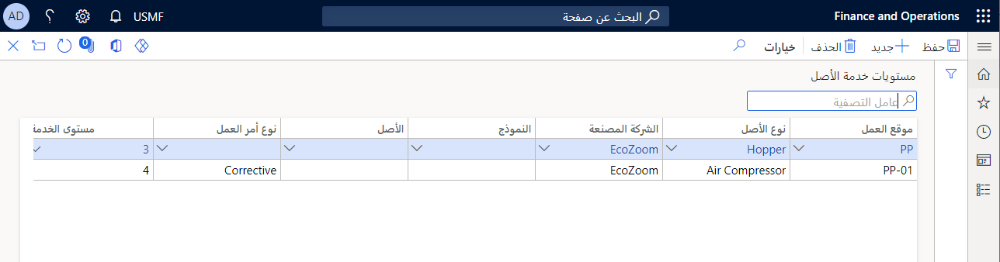

يتم استخدام مستويات خدمة الأصل، المرتبطة بالأصول، في طلبات الصيانة وأوامر العمل لتحديد أولوية أوامر العمل أثناء جدولة أمر العمل. 

يتم تحديد مستويات خدمة الأصل عن طريق إقران العناصر التالية:

- موقع العمل
- نوع الأصل
- الشركة المصنعة
- النموذج
- الأصل
- نوع أمر العمل
- مستوى الخدمة (الإعداد في **إدارة الأصول > إعداد > مستويات خدمة الأصل**)
    - 1 = هام
    - 2 = عاجل
    - 3 = مرتفع
    - 4 = متوسط
    - 5 = منخفض

لمزيد من المعلومات حول إعداد حساب نقاط التصنيف لجدولة أمر العمل، راجع وحدة **إدارة معلمات الأصول** في هذه الوحدة النمطية.

> [!NOTE]
> يجب إعداد سجل افتراضي واحد على الأقل لمستوى خدمة الأصل. يتم استخدام هذا السجل الافتراضي في حالة عدم العثور على أية مطابقة أخرى أثناء جدولة أمر العمل.

## إعداد مستويات خدمة الأصول

1. لإعداد مستويات خدمة الأصل، انتقل إلى **إدارة الأصول > إعداد > مستويات خدمة الأصل** وحدد **جديد**.

1. استخدم الحقول المتنوعة لإنشاء مستوى خدمة الأصل كما تم تلخيصه مسبقا.
    - سيكون لمستوى خدمة الأصل الافتراضي كافة الحقول فارغة فيما عدا مستوى الخدمة. 
    - نظراً لأن سير الناقلة المقطوعة عبارة عن مشكله، فإنه يتم تصنيفها كمستوى خدمة عالي. حدد **سير ناقلة** في الحقل **نوع الأصل**، ثم حدد **3** في الحقل **مستوى الخدمة**.
    > [!NOTE]
    > عند استخدام مستوى خدمة أصل لطلبات الصيانة وأوامر العمل، تبحث إدارة الأصول عن وجود تطابق محتمل. 

1. تقوم إدارة الأصول دائماً بفحص المجموعة الأكثر تحديداً. بدءاً من الحقل **نوع أمر العمل**، إذا لم يتم العثور على أي تطابق، سيقوم بالتحقق من التطابق الخاص بحقل **الأصل** ثم يستمر في البحث خلال كل حقل مستوى خدمة من اليمين إلى اليسار. 

1. في حالة عدم العثور على أي تطابق، يتم استخدام السجل الافتراضي الذي لا يحتوي على تحديدات في هذه الحقول.

تعرض الصورة التالية مثالاً لصفحة **مستويات خدمة الأصل**.

**إدارة الأصول > إعداد > مستويات خدمة الأصل**.

> [!NOTE]
> يمكن تغيير مستويات خدمات الأصول إذا لزم الأمر. ومع ذلك، إذا قمت بتغيير سجل مستوى خدمة الأصل في الصفحة **مستويات خدمة الأصل** وكان المستوى الأصلي قيد الاستخدام بالفعل، فلن يتم تحديث مستوى الخدمة الجديد في طلبات الصيانة الموجودة وأوامر العمل.

يوضح الفيديو التالي كيفية إنشاء مستويات خدمة الأصل في إدارة الأصول.

 > [!VIDEO https://www.microsoft.com/videoplayer/embed/RE4oErt]

