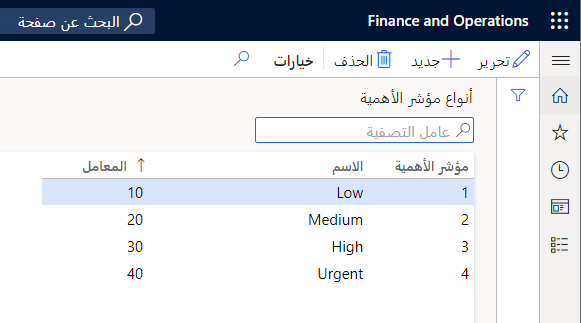
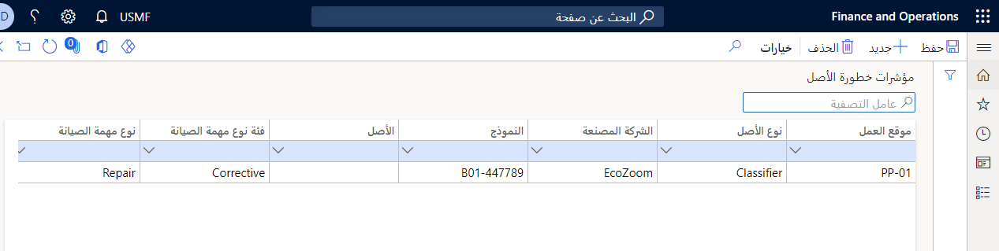

تحدد أهمية الأصول أهمية الأصل خارج نطاق الإنتاج للوقت المطلوب للصيانة. تحدد أهمية الأصول ما إذا كان سيضر بالإنتاج والمؤسسة إذا كان الأصل الحرج خارج الإنتاج للصيانة. بمعنى آخر، يقوم بحساب مدى تأثير مهمة الصيانة الخاصة بأحد الأصول على جدول الإنتاج والإنتاجية في شركتك. لمزيد من المعلومات حول الإعداد المرتبط بحساب نقاط التصنيف لجدولة أمر العمل، راجع وحدة **إدارة معلمات الأصول** في هذه الوحدة النمطية.

يعد إعداد درجات الأهمية عملية من خطوتين:

1.  يستخدم في إنشاء أنواع الأهمية المستخدمة في إعداد الأصول. 
2.  قم بإعداد درجات أهمية الأصل.

## إعداد أنواع الأهمية
لإعداد أنواع الأهمية‬، اتبع هذه الخطوات:

1.  انتقل إلى **إدارة الأصول > إعداد > الأصول > أنواع الأهمية**.
2.  حدد **جديد‏‎**.
3.  في الحقل **الأهمية**، أدخل رقماً يشير إلى الأهمية.
4.  في الحقل **الاسم**، أدخِل اسماً لنوع الأهمية.
5.  في حقل **العامل**، أدخل رقم عامل. 
    - يتم استخدام هذا الرقم أثناء حساب جدولة أمر العمل لتحديد سجل الأهمية الذي ينبغي استخدامه. (يتم دائماً استخدام السجل صاحب أعلى عامل.) 
    - يصبح هذا الرقم مناسباً إذا تم إنشاء بنود الأهمية بنفس قيمة الأهمية.
    
الصورة التالية تعرض مثالاً لصفحة **أنواع الأهمية**.

**إدارة الأصول > إعداد > الأصول > أنواع الأهمية**.

 

## إعداد درجات أهمية الأصل
لإعداد درجات أهمية الأصول‬، اتبع هذه الخطوات:

1.  انتقل إلى **إدارة الأصول > إعداد > درجات أهمية الأصول**.
2.  حدد **جديد‏‎**.
3.  حدد المعلومات ذات الصلة، حسب الحاجة، في كل حقل لإنشاء أهمية أصل:
    - موقع العمل
    - نوع الأصل
    - الشركة المصنعة
    - النموذج
    - الأصل
    - فئة نوع مهمة الصيانة
    - نوع مهمة الصيانة
    - متغير نوع مهمة الصيانة
    - التجارة
    - الأهمية
    
    على سبيل المثال، عند تقسيم سير ناقلة إلى بند الإنتاج الوحيد، يجب إعداد أهمية الأصل باستخدام نوع مهمة صيانة تصحيحية وأهمية عالية.

عند تحديد أهمية الأصل، ستبحث إدارة الأصول عن كافة سجلات الأهمية لفحص وجود تطابق محتمل. 

وهي تقوم دائماً بفحص المجموعة الأكثر تحديداً.
 
- البدء في الحقل **تجارة**، في حالة عدم العثور على أي تطابق، فإنه يقوم بالتحقق من الحقل **متغير نوع مهمة الصيانة** ويستمر في الانتقال خلال كل حقل من اليمين إلى اليسار. 
- في حالة عدم العثور على أي تطابق، يتم استخدام السجل "الافتراضي" الذي لا يحتوي على تحديدات.

تعرض الصورة التالية مثالاً لصفحة **درجات أهمية الأصل**.

**إدارة الأصول > إعداد > درجات أهمية الأصول**.
 
 

وهناك بعض الاعتبارات الخاصة بإعداد أهمية الأصول:

- إذا قمت بتغيير أهمية الأصل بعد استخدامه بالفعل في أمر العمل، فلن يتم تحديث الأهمية الجديدة في أمر العمل وفقا لذلك.
- وتتم إعادة حساب الأهمية في أمر العمل في كل مرة يتم فيها إضافة بند أمر عمل أو حذفه من أمر العمل.
- إذا كان أمر العمل يحتوي على العديد من وظائف أمر العمل، فان أعلى أهمية، وفقا لحقل العامل في الصفحة أنواع الأهمية، يتم استخدامها دائماً في أمر العمل.
- يمكن أن تتغير أهمية الأصول في فترة وتكون متأثرة عادة بشراء معدات جديدة وعمليات التجديد وغير ذلك. يجب مراعاة إعادة تقييم أهمية الأصل في فترات منتظمة لضمان مطابقة تعريفات الأهمية الخاصة بك لإعداد الإنتاج الحالي.
