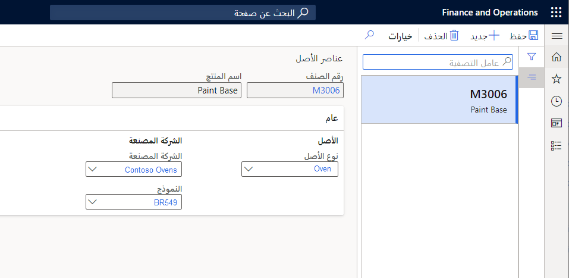
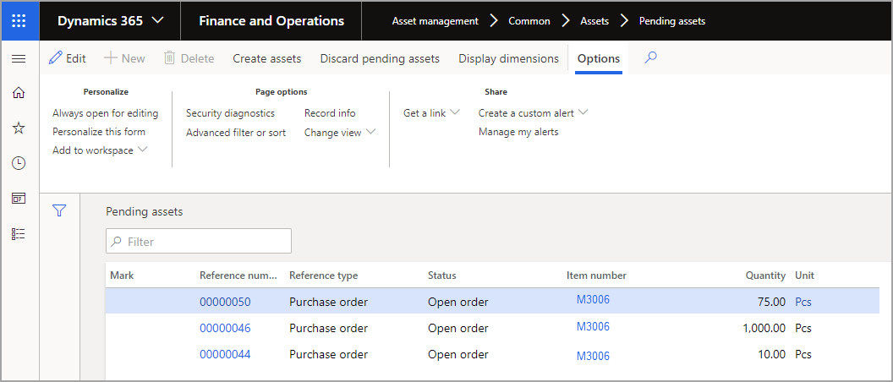
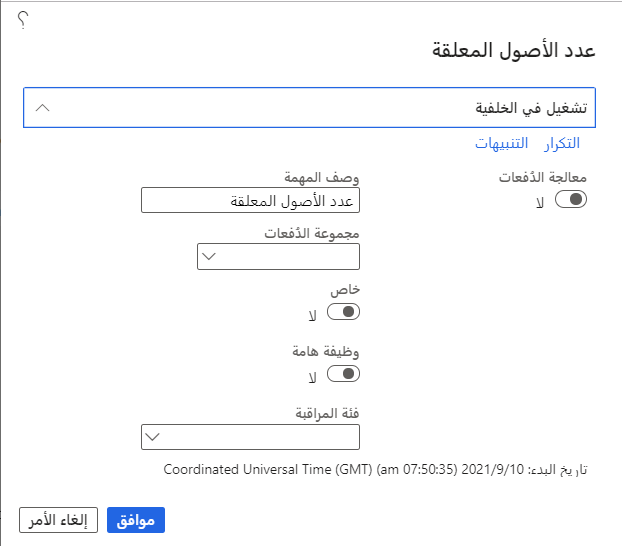

تتيح لك أصناف الأصول إمكانية عرض قائمة بكافة بنود أمر الشراء التي تم إنشاؤها في هذه الأصناف. والغرض من هذه الوظيفة هو السماح لك بإنشاء أصل في إدارة الأصول على أساس أمر شراء.

المهمة الأولي هي إعداد الأصناف التي سيتم استخدامها لإنشاء أصول من أمر شراء. بعد إنشاء بند أمر شراء، يمكن بعد ذلك إنشاء الأصول في الأصول المعلقة. ومن الممكن تحديد مرحلة أمر الشراء التي يجب فيها إنشاء الأصل.

## إنشاء أصناف أصل وتحديدها
لإنشاء بنود الأصل وتحديدها، اتبع الخطوات التالية:

1.  حدد **إعداد الأصول > الإعداد > الأصول > البنود**.
2.  حدد **جديد** لإنشاء بند أصل جديد.
3.  حدد البند في الحقل **رقم الصنف**. 
4.  في علامة التبويب السريعة **عام**، حدد أصلاً من حقل **نوع الأصل**.
5.  حدد **الشركة المصنعة** للأصول و **النموذج** للصنف.
6.  **احفظ** العنصر.

    
 
## إنشاء أصول من أصول قيد الانتظار
لبدء إنشاء أصول من الأصول المعلقة، حدد **إدارة الأصول > شائع > الأصول > الأصول المعلقة**.

 
ستشاهد قائمة محدثة بأوامر الشراء استنادا إلى الأصناف التي تم تحديدها في **عناصر الأصل**.

يمكنك تصفية حالة أوامر الشراء لتحديد حالة دورة الحياة التي يجب إنشاء الأصل بها. على سبيل المثال، قد ترغب فقط في إنشاء أصول عند ترحيل إيصال استلام منتجات في أمر شراء.

1.  حدد الارتباط **رقم المرجع** في بند أمر الشراء لعرض معلومات مفصلة حول الصنف.
2.  إذا كنت ترغب في تحرير الأبعاد التي يتم عرضها على علامة التبويب السريعة **أبعاد المخزون**، حدد الزر **أبعاد العرض** وقم بإجراء التحديدات.
3.  إذا كنت ترغب في إنشاء أصل استناداً إلى بند أمر شراء، فقم بالرجوع إلى صفحة قائمة **الأصول المعلقة** وحدد خانة الاختيار في العمود **علامة** لهذا البند ثم حدد **إنشاء الأصول** من شريط القوائم. سيتم عرض رسالة تخبرك بمعرف الأصل.
4.  حدد الأصل في قائمة **كافة الأصول** وحدد **تحرير** لإضافة مزيد من المعلومات إلى الأصل.
5.  في **الأصول المعلقة**، إذا كنت ترغب في حذف بند إذا كنت لا تريد إنشاء أصل، حدد خانة الاختيار في العمود **علامة** لهذا البند ثم حدد **تجاهل الأصول المعلقة** من شريط القوائم. سيتم عرض رسالة تخبرك بمعرف الأصل. لا تقم بحذف أمر الشراء أو أمر التوريد، ولكن فقط السجل الذي قد قمت بإنشاء أصل له في إدارة الأصول.
    
> [!NOTE]
> يتم تحويل كافة أبعاد المنتجات (الحجم واللون والتكوين وما إلى ذلك) تلقائياً إلى سمات الأصول. ويتم تخزين أبعاد التعقب (رقم تسلسلي) مباشرةً إلى الأصل عند إنشاء الأصل.

## البحث عن الأصول قيد الانتظار
يمكنك تشغيل عملية **جرد أصول معلقة** لفحص الأصول المعلقة. يمكن استخدام هذه الوظيفة لاستلام إخطار في كل مرة يكون الأصل المعلق جاهزاً ليتم إنشاؤه كأصل.

1.  انتقل إلى **إدارة الأصول > دوري > الأصول > جرد الأصول المعلقة**.
     
2.  حدد **موافق** لتشغيل الوظيفة وتحديث القائمة في الأصول المعلقة.
3. يمكنك إعداد هذه الوظيفة لتشغيلها كمهمة مجموعة، على سبيل المثال، مرة كل يوم. حدد **تكرار** لفتح مربع حوار **تحديد التكرار**.
4. في مربع الحوار **تحديد التكرار**، يمكنك تعيين المعلمات الخاصة بعدد المرات التي تريدها لتشغيل **جرد الأصول المعلقة**.

> [!CAUTION]
> إذا تغيرت البيانات في أمر شراء بعد إنشاء الأصل استناداً إلى صنف محدد، فلن يتم تطبيق هذه التغييرات على الأصل.

