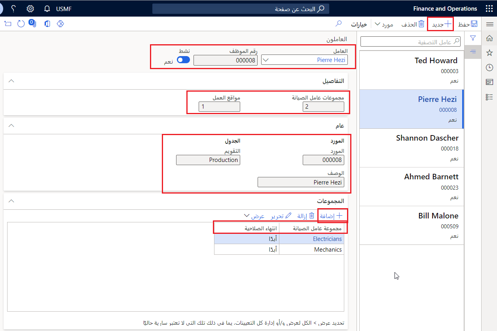
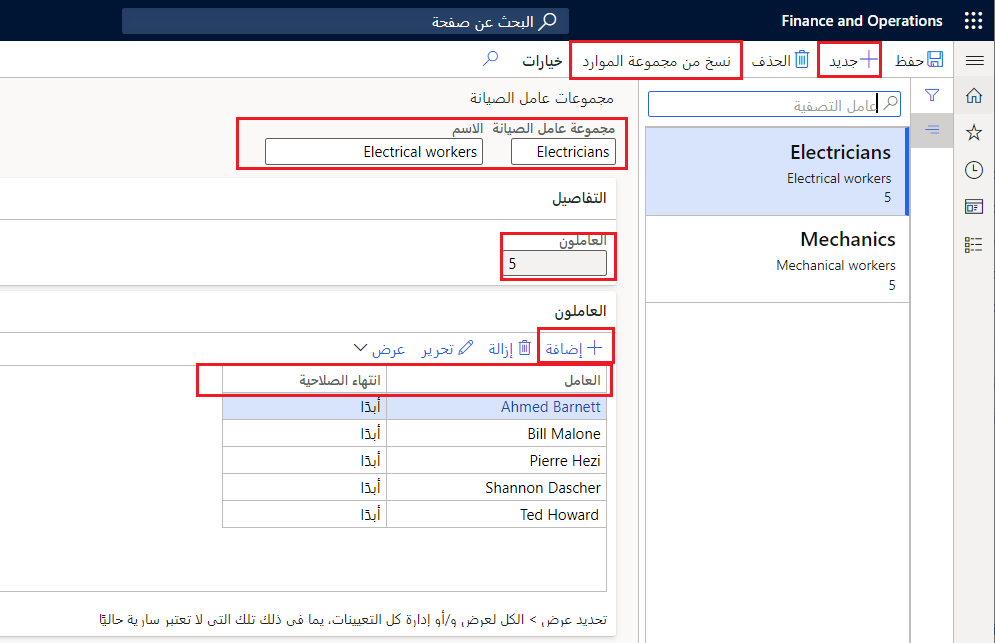

يتم مبدئيا إنشاء العاملين في الوحدة النمطية للموارد البشرية في Dynamics 365 Finance. يساعد هذا التوفير على تسهيل عملية التحديد عند العمل لإقران العمال بمجموعات العمل وتعيين مجالات الخبرة.

وبعد إقران العمال والخبرة المعينة، تتيح إدارة الأصول إمكانية ربط عمال الصيانة بمواقع العمل. لمزيد من المعلومات حول مواقع العمل، راجع الوحدة النمطية لإنشاء مواقع العمل. يمكن إقران مواقع العمل بسهولة إذا كنت بحاجة إلى جدولة وظيفة صيانة في موقع العمل 02، على سبيل المثال، وكنت ترغب في تخصيص عمال الصيانة من نفس الموقع لتنفيذ الوظيفة.

يمكنك أيضا إنشاء مجموعات عمال صيانة وربط عمال الصيانة معهم. وتعتبر هذه الطريقة مفيدة عندما تريد جدولة مجموعة من عمال الصيانة في أمر العمل. استخدم ببساطة عمال الصيانة ومجموعات عمال الصيانة لإعداد عمال الصيانة المفضلين وعمال الصيانة المسؤولين.

## إنشاء معلومات العاملين
لإنشاء معلومات العاملين، اتبع الخطوات التالية:

1.  انتقل إلى **إدارة الأصول > إعداد > العاملون > عاملون**
2.  حدد **جديد‏‎**.
3.  في الحقل **العامل**، حدد العامل من القائمة المنسدلة.
4.  قم بتعيين زر التبديل **نشط** إلى **نعم**، إذا كنت ترغب في جدولة هذا العامل في أوامر العمل.
5.  تعرض علامة التبويب السريعة **التفاصيل** عدد مجموعات العاملين ومواقع العمل المرتبطة بعامل الصيانة هذا.
6.  في علامة التبويب السريعة **عام**، يتم ملء المعلومات التالية تلقائياً. 
    - الحقلان **"المورد** و **الوصف** - إذا تم تحديد مورد بالفعل لهذا العامل. 
    - حقل **التقويم** – إذا قمت بتخصيص تقويم لهذا العامل عندما تقوم بإعداده كمورد ( **إدارة المؤسسة > الموارد > الموارد**).
7.  في علامة التبويب السريعة **المجموعات**، حدد **إضافة**.
8.  في الحقل **مجموعة عامل الصيانة**، حدد مجموعة عامل صيانة من القائمة المنسدلة. يمكنك إضافة المزيد من البنود إذا كنت ترغب في أن يكون العامل تابعا لأكثر من مجموعة واحدة.
9.  ويتم تعيين الحقل **تاريخ الانتهاء** تلقائياً إلى **بلا**. حدد رمز التقويم لإدخال تاريخ انتهاء محدد.
10. في علامة التبويب السريعة **مواقع العمل**، حدد **إضافة بند**.
11. في الحقل **موقع العمل**، حدد موقع عمل من القائمة المنسدلة.
12. في الحقل **الأساسي**، حدد خانة الاختيار إذا كنت ترغب في تحديد هذا الموقع كموقع أساسي لعامل الصيانة. حدد أيضاً الموقع الذي يعد موقع عمل أساسياً للعامل.
    > [!NOTE]
    > عند تعيين مواقع العمل إلى أحد العمال، تظهر كافة الأصول النشطة المرتبطة بمواقع العمل تلك في العديد من عناصر القائمة **(الأصول النشطة** و **مواقع العمل النشطة**). كما تظهر الأصول في عمليات البحث الخاصة بالأصول التي تظهر عند إنشاء أصل جديد أو طلب صيانة أو أمر عمل.

الصورة التالية هي مثال لصفحة **العاملون**.

**إدارة الأصول > إعداد > العاملون > عاملون**

 

شاهد الفيديو التالي حول كيفية إعداد العاملين في إدارة الأصول.

 > [!VIDEO https://www.microsoft.com/videoplayer/embed/RE4oRpx]
 

## إنشاء مجموعات العاملين
لإنشاء مجموعات العاملين، اتبع الخطوات التالية:

1.  انتقل إلى **إدارة الأصول > إعداد > العاملون > مجموعات عمال الصيانة**.
2.  حدد **جديد**.
3.  في الحقل **مجموعة عاملي الصيانة**، حدد معرف مجموعة.
4.  أدخل اسماً في حقل **الاسم**.
تعرض علامة التبويب السريعة **التفاصيل** عدد عمال الصيانة الذين تم تعيينهم لهذه المجموعة.
5.  في علامة التبويب السريعة **العمال**، حدد **إضافة**.
6.  في الحقل **العامل**، حدد عامل صيانة من القائمة المنسدلة. 
7.  ويتم تعيين الحقل **تاريخ الانتهاء** تلقائياً إلى بلا. حدد رمز التقويم لإدخال تاريخ انتهاء محدد.
8.  حدد **نسخ من مجموعة الموارد** إذا كنت ترغب في تعيين مجموعة موارد لمجموعة عمال الصيانة المحددة. 
    - في الحقل **المجموعة**، حدد مجموعة الموارد التي سيتم نسخ إعدادات التقويم منها. 
    - في الحقل **مجموعة العمال**، حدد مجموعة العمال لنسخ إعدادات التقويم إليها في مجموعة الموارد. 
    
    تكون هذه الخطوة مفيدة إذا كنت ترغب في أن يقوم عمال الصيانة باستخدام التقويم المرتبط بأحد الموارد (مركز العمل) أثناء جدولة أمر العمل.

تعرض الصورة الآتية مثالاً لصفحة **مجموعات عمال الصيانة**.

**إدارة الأصول > إعداد > العاملون > مجموعات عمال الصيانة**.

 

