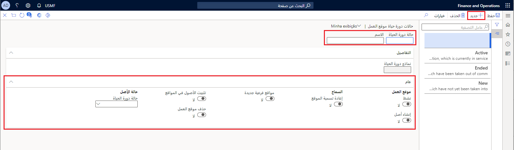
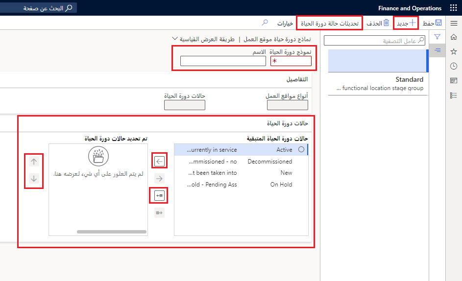
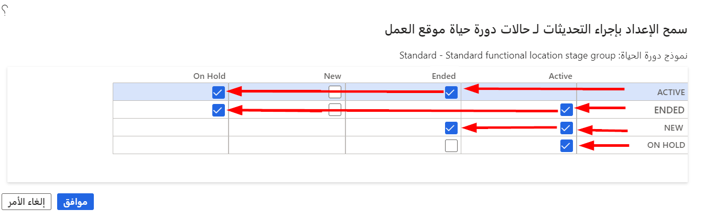

تشتمل جميع مواقع العمل على حالات دورة حياة تحدد حالة موقع العمل. ‏ومن الأمثلة ‬‏‫المستخدمة في ‬‏‫‏‫حالات دورة الحياة **نشط** و **معلق** و **جديد** و **‬‏‫منتهي**. يمكنك عرض الحالة الحالية لموقع العمل في أي وقت على صفحة **كل مواقع العمل**. توضح هذه الوحدة كيفية إعداد حالات دورة حياة موقع العمل.

تُبيّن الصورة التالية كيفية الوصول إلى صفحة **حالات دورة حياة موقع العمل‬**:

## إعداد حالات دورة حياة مواقع العمل

لإعداد حالات دورة حياة مواقع العمل، اتبع هذا الإجراء:

1.  انتقل إلى **إدارة الأصول > الإعداد > مواقع العمل > حالات دورة الحياة**.
2.  حدد **جديد** في جزء الإجراءات لإنشاء حالة دورة حياة موقع عمل جديدة.
3.  في حقل **حالة دورة الحياة**، أدخل حالة دورة الحياة الجديدة، مثل **نشط**.
4.  في حقل **الاسم**، يمكنك إدخال **حالة دورة الحياة**، مثل **نشط**. كما يمكنك أيضاً إدخال وصف في هذا الحقل، إذا أردت ذلك، على سبيل المثال: **موقع عمل نشط**.
5.  عند إنشاء حالة دورة حياة جديدة، لن يتم ملء حقل **نماذج دورة الحياة**. عند إضافة حالة دورة الحياة هذه إلى نموذج دورة الحياة، يتم ملء هذا الحقل تلقائياً لإظهار عدد نماذج دورة الحياة المضمنة في هذه الحالة.
6.  في علامة التبويب السريعة **عام**، حدد **نعم** على زر التبديل **نشط** إذا أردت أن يكون موقع العمل نشطاً.
7.  حدد **نعم** على زر التبديل **إنشاء أصل** إذا كنت تريد إنشاء أصل بنفس اسم موقع العمل تلقائياً وتثبيته على موقع العمل أثناء حالة دورة الحياة هذه.

    > [!NOTE]
    > يرتبط زر التبديل **إنشاء أصل** بحقل **نوع الأصل** في علامة التبويب السريعة **عام** في صفحة **‏‫أنواع مواقع العمل‬** (**إدارة الأصول > إعداد > مواقع العمل > أنواع مواقع العمل**). 

8.  حدد **نعم** على زر التبديل **إعادة تسمية الموقع** إذا أردت أن تتمكّن من تغيير اسم موقع العمل في هذه الحالة. 
9.  حدد **نعم** على زر التبديل **مواقع فرعية جديدة** إذا أردت إضافة مواقع فرعية جديدة إلى موقع العمل في هذه الحالة. 
10. حدد **نعم** على زر التبديل **تثبيت أصول في المواقع** إذا أردت أن تتمكّن من ‬‏‫تثبيت الأصول في موقع العمل في هذه الحالة. 
11. حدد **نعم** على زر التبديل **حذف موقع العمل** إذا أردت أن تتمكّن من حذف موقع العمل في هذه الحالة. 
12. حدد **حالة الأصل** في حقل **حالة دورة الحياة** إذا كنت تريد تحديث حالة دورة حياة الأصل أو تغييرها تلقائياً لجميع الأصول المثبتة في موقع العمل في هذه الحالة. على سبيل المثال، إذا قمت بإغلاق موقع العمل وتعيين حالة دورة حياة موقع العمل إلى **منتهي**، فقد تريد تغيير حالة دورة الحياة تلقائياً لجميع الأصول التي تم تثبيتها في هذا الموقع إلى **غير مستخدَم**.

    > [!NOTE]
    > عند إنشاء حالات دورة الحياة في البداية، قد لا تتوفر لديك أي معلومات حتى تقوم بالتحديد من القائمة المنسدلة **حالة الأصل > حالة دورة الحياة** حتى تُكمل التكوين الكامل لأصولك، بما في ذلك حالات دورة حياة الأصول.

    **إدارة الأصول > إعداد > مواقع العمل > حالات دورة الحياة**

    

يُبيّن العرض التوضيحي التالي كيفية إنشاء حالة دورة حياة موقع العمل‬.

 > [!VIDEO https://www.microsoft.com/videoplayer/embed/RE4o4Os]

## إعداد نماذج دورة حياة مواقع العمل
عند إنشاء حالات دورة الحياة المطلوبة لمواقع العمل لديك، يمكنك تقسيمها إلى مجموعات. وتتم هذه العملية لإنشاء سير مهام نموذج دورة الحياة الذي يمكن استخدامه لأنواع مختلفة من مواقع العمل. لذا يتعيّن عليك إنشاء نموذج دورة حياة موقع عمل قياسي واحد على الأقل.

لإعداد نموذج دورة حياة موقع العمل، اتبع هذا الإجراء:

1. انتقل إلى **إدارة الأصول > الإعداد > مواقع العمل > نماذج دورة الحياة**.
2. حدد **جديد**،
3. وأدخل اسماً لنموذج دورة الحياة لديك، مثل **قياسي**.
4. في حقل **الاسم**، أدخل اسماً وصفياً لنموذج دورة الحياة، مثل **قياسي**.
5. ضمن علامة التبويب السريعة **تفاصيل**، يمكن ملء الحقلين **‏‫أنواع مواقع العمل‬** و **حالات دورة الحياة** تلقائياً وعرض عدد أنواع مواقع العمل و‎حالات دورة الحياة التي تستخدم نموذج دورة الحياة الحالي. 
6. ضمن علامة التبويب السريعة **حالات دورة الحياة**، تظهر حالات دورة الحياة النشطة في قسم **حالات دورة الحياة المتبقية** ناحية اليسار. وهذه هي الحالات المتاحة لتضمينها في مجموعة النموذج الحالي.
7. لنقل حالة دورة حياة معيّنة إلى قسم **حالات دورة الحياة المحددة**، حدد الحالة المراد نقلها في حقل **حالات دورة الحياة المتبقية**، ثم حدد زر سهم إلى اليمين. 
8. لتحديد جميع حالات دورة الحياة لتضمينها في النموذج، حدد زر سهم نقل الكل إلى اليمين لنقل التحديد بالكامل من قسم **حالات دورة الحياة المتبقية** إلى قسم **حالات دورة الحياة المحددة**.
9. لإزالة حالة دورة حياة محددة من النموذج، اختر حالة دورة الحياة المراد إزالتها من القسم **حالات دورة الحياة المحددة**، ثم حدد زر السهم الأيسر لنقلها مرة أخرى إلى القسم **حالات دورة الحياة المتبقية**.
10. لإزالة التحديد بالكامل من النموذج، حدد زر سهم نقل الكل إلى اليسار. وبعد ذلك يتمّ إرجاع جميع حالات دورة الحياة في قسم **حالات دورة الحياة المحددة** إلى قسم **حالات دورة الحياة المتبقية**.
11. حدد **حفظ**.

    **إدارة الأصول > الإعداد > مواقع العمل > نماذج دورة الحياة**
 
    

## تحديثات حالة دورة الحياة
عند إنشاء نموذج دورة حياة موقع العمل، يجب تحديد كيفية سير الحالات في النظام. يتم تحديد هذا التعيين من خلال سير إجراءات العمل بالشركة وتصميمها.

1.  أثناء فتح صفحة **نماذج دورة حياة مواقع العمل**، حدد **تحديثات حالة دورة الحياة** في جزء الإجراءات. 
2.  بجوار كل حالة دورة حياة، حدد الحالة التي يمكن تغيير الحالة إليها. 

    
 
    على سبيل المثال: 
    -   يمكن تغيير **نشط** إلى **معلق** أو **منتهي**. 
    -   يمكن تغيير **معلق** إلى **نشط** أو **منتهي**. 
    -   يمكن تغيير **جديد** إلى **نشط** أو **معلق**. 
    -   يمكن تغيير **منتهي** إلى **نشط**.
3.  حدد **موافق** لحفظ التحديثات.