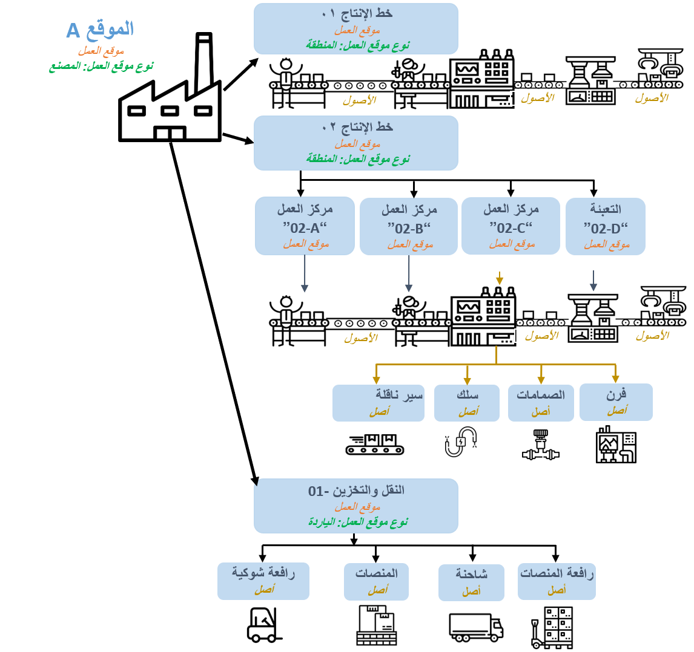
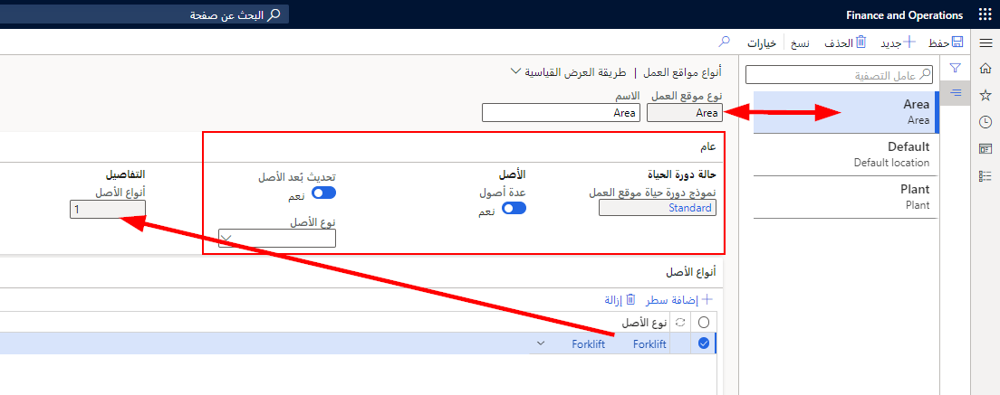

تصف هذه الوحدة كيفية إنشاء أنواع مواقع عمل في إدارة الأصول. 

تُستخدم أنواع مواقع العمل لتحديد متطلبات مواقع العمل، الأصول وكيفية تثبيت الأصول في موقع العمل. يمكن أن تشتمل أمثلة أنواع مواقع العمل على مبنى المكاتب والمصنع والمستودع والساحة. يمكنك الربط بين أنواع الأصول وسمات موقع العمل ومتطلبات سمات الأصول وخطط الصيانة في نوع موقع العمل.

 

استمراراً للمثال، تمت إضافة أنواع مواقع عمل الآن إلى مواقع العمل. تم تمييزها باللون الأخضر في الرسم التخطيطي السابق. تصف أنواع مواقع العمل نوع الموقع. على سبيل المثال، قد تختار إحدى المؤسسات عدم تخزين الرافعات الشوكية والشاحنات الخاصة بها في مناطق الإنتاج، والتي تم تصنيفها في هذا المثال على أنها المنطقة، ولكن قد تختار Yard كنوع موقع عمل لتخزين هذه الأصول. 

أولاً، عند إنشاء أنواع مواقع العمل الخاصة بك، يجب عليك إنشاء موقع عمل بسيط وافتراضي. يُستخدم هذا الموقع لإنشاء أصول جديدة، والتي تمت مناقشتها بمزيد من التفصيل في الوحدة النمطية [العمل مع الأصول في إدارة الأصول لـ Dynamics 365 Supply Chain Management](/learn/modules/work-assets-management/?azure-portal=true).

## إنشاء نوع موقع عمل افتراضي
لإنشاء نوع موقع عمل افتراضي، اتبع الخطوات التالية:

1.  انتقل إلى **إدارة الأصول > الإعداد > مواقع العمل > أنواع مواقع العمل**.
2.  حدد **جديد** لإنشاء نوع موقع عمل جديد.
3.  أدخل **افتراضي** في الحقل **نوع موقع العمل**.
4.  أدخل **اسم** نوع موقع العمل، مثل **الموقع الافتراضي**. 
5.  للسماح بتثبيت الأصول على هذا النوع من موقع العمل، حدد **نعم** في شريط التبديل **أصول متعددة**. يعمل هذا التحديد على إنشاء موقع عمل افتراضي. 
6.  **حفظ** نوع موقع العمل الافتراضي الجديد.

    

## إنشاء أنواع مواقع العمل
لإنشاء نوع موقع عمل، اتبع الخطوات التالية:

1.  حدد **إدارة الأصول > الإعداد > مواقع العمل > أنواع مواقع العمل**.
2.  حدد **جديد** لإنشاء نوع موقع عمل.
3.  قم بإدراج معرف نوع موقع العمل في حقل **نوع موقع العمل**، مثل **المنطقة**.
4.  أدخل اسم نوع موقع العمل في حقل **الاسم**، مثل **المنطقة**.
5.  حدد نموذج دورة الحياة في القائمة المنسدلة **نموذج دورة حياة موقع العمل**. حدد **قياسي**.
6.  حدد **نعم** على زر التبديل **أصول متعددة** إذا كنت ترغب في السماح بتثبيت أصول متعددة على موقع عمل باستخدام نوع موقع العمل هذا. 
    > [!NOTE]
    > في حالة تحديد **لا**، يمكنك فقط تثبيت أصل واحد على موقع عمل باستخدام نوع موقع العمل هذا.
7.  حدد **نعم** على زر التبديل **تحديث بعد الأصل** للسماح للأصول المثبتة على موقع العمل هذا باستخدام الأبعاد المالية المرتبطة بموقع العمل تلقائياً. 
    عندما تقوم بتغيير الأبعاد المالية في صفحة "إنشاء مواقع العمل"، ويتم تعيين زر التبديل إلى "نعم" في حقل "تحديث بُعد الأصل" في نوع موقع العمل، فإنه يتم تحديث الأبعاد المالية تلقائياً على كافة الأصول المثبتة على موقع العمل هذا.
8.  يتم استخدام الحقل **نوع الأصل** عندما تريد إنشاء نوع أصل واحد فقط تلقائياً ليتم تثبيته على موقع العمل بنفس المعرف والاسم مثل موقع العمل الذي تقوم بإنشائه. على سبيل المثال، يمكنك إنشاء نوع موقع عمل، مثل "المنطقة"، الذي يخزن الرافعات الشوكية فقط. يمكنك تحديد نوع الأصل لتقول "في نوع موقع العمل هذا، اسمح فقط بأنواع الأصول التي تمثل رافعات شوكية".
    > [!NOTE]
    > إذا قمت بتحديد أحد الخيارات في هذا الحقل، يجب تعيين زر التبديل **أصول متعددة** إلى **لا**.
9.  في علامة التبويب السريعة **أنواع الأصول**، يمكنك تحديد أنواع الأصول التي يمكن تثبيتها على نوع موقع العمل. إذا لم تتم إضافة أنواع الأصول، فقد يتم تثبيت جميع أنواع الأصول. لتحديد أنواع أصول معينة مطلوب تثبيتها في موقع العمل هذا، حدد **إضافة بند**، ثم حدد أنواع الأصول المدرجة في القائمة المنسدلة. 
    > [!NOTE]
    > إذا لم يتم تكوين أنواع الأصول في **الإعداد > أنواع الأصول**، فقد لا تكون لديك تحديدات للاختيار منها حتى الآن.
10. في علامة التبويب السريعة **خطط الصيانة**، يمكن تحديد خطط الصيانة المطلوب إعدادها تلقائياً في نوع موقع العمل الحالي الذي تم تحديده. لإضافة خطة صيانة إلى نوع موقع العمل، حدد "إضافة بند" ثم حدد خطط الصيانة من القائمة المنسدلة. 
    > [!NOTE]
    > إذا لم يتم تكوين خطط الصيانة في **الإعداد > خطط الصيانة**، فقد لا تكون لديك تحديدات للاختيار من بينها حتى الآن. إذا أضفت خطط صيانة في هذا الحقل، يمكن استخدام تلك الخطط المضافة فقط في موقع عمل باستخدام نوع موقع العمل هذا.
11. في علامة التبويب السريعة **متطلبات سمة الأصل**، يمكنك إعداد سمات الأصول التي يجب إنشاؤها تلقائياً في مواقع عمل جديدة باستخدام نوع موقع العمل هذا. المتطلبات تقيد الأصول، والسمات افتراضية. تحتوي متطلبات السمة على شرط مطلوب قبل إمكانية إضافة الأصل في نوع أصل موقع العمل، على سبيل المثال، النوع = خلاط. حدد **إضافة بند**، ثم حدد نوع السمة من القائمة المنسدلة. إذا لم يتم إنشاء سمات الأصول بعد في **الإعداد > أنواع السمات**، فقد لا تكون لديك تحديدات للاختيار من بينها.
12. في علامة التبويب السريعة **الأنواع المسموح بها**، يمكنك تحديد أنواع مواقع العمل، مثل ساحة ومصنع وما إلى ذلك، الصالحة للاستخدام لأنواع مواقع العمل الفرعية المرتبطة بنوع موقع عمل أصلي، والذي يستخدم نوع موقع العمل المحدد.  لمشاهدة الخيارات التي يمكنك تحديدها، يجب أن تكون قد أكملت إعداد نوع موقع العمل.
13. في علامة التبويب السريعة **السمات**، حدد سمات موقع العمل التي يجب إعدادها تلقائياً في مواقع العمل باستخدام نوع موقع العمل هذا. السمات هي سمات افتراضية سيتم استخدامها في موقع العمل، مثل النوع واللون وما إلى ذلك. حدد **إضافة بند**، وحدد السمة.
14. **احفظ** التحديثات التي تم إجراؤها على أنواع مواقع العمل لديك. 
    > [!NOTE]
    > عند إضافة أنواع الأصول وخطط الصيانة ومتطلبات سمات الأصول والأنواع المسموح بها والسمات وحفظها، يتم عرض تفاصيل كل منها في علامة التبويب السريعة **عام**.

    **إدارة الأصول > الإعداد > مواقع العمل > أنواع مواقع العمل**

    

يعبر الفيديو التالي عن عرض توضيحي حول كيفية إنشاء أنواع مواقع العمل.

 > [!VIDEO https://www.microsoft.com/videoplayer/embed/RE4orjT]