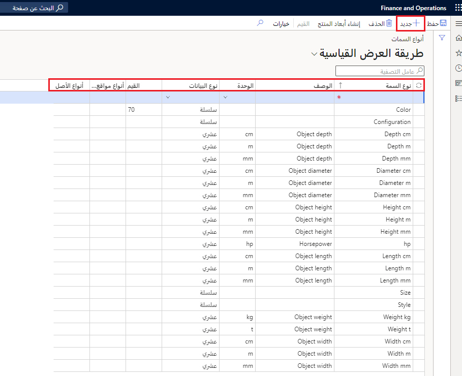

تستخدم السمات لوصف الصفات المميزة والخصائص للأصل الفعلي. يمكن إنشاء السمات للعناصر التالية في إدارة الأصول:

- أنواع مواقع العمل
- إنشاء مواقع العمل
- أنواع الأصول
- الأصول

يمكن أن تختلف السمات حسب المكون. على سبيل المثال، يمكنك إعداد سمات لموقع عمل يحدد التكوين والحجم الفعلي لموقع العمل أو للأصول، مثل شاحنة، يمكنك إعداد السمات لأقصى قدرة حمل في الوزن.

## إنشاء أنواع السمات
يمكنك إنشاء أنواع السمات الخاصة بك. بالإضافة إلى ذلك، يمكنك نقل أبعاد المنتج إلى صفحة **أنواع السمات** باتباع الخطوات التالية: 

1.  انتقل إلى **إدارة الأصول > الإعداد > أنواع السمات**.
2.  حدد **جديد** لإنشاء نوع سمة جديد.
3.  في الحقل **نوع السمة**، أدخل اسماً لنوع السمة، مثل **اللون**.
4.  في حقل **الوصف**، أدخل وصفاً لنوع السمة، مثل **لون الكائن**.
5.  في حقل **الوحدة**،، حدد وحدة السمة ذات الصلة من القائمة المنسدلة. في هذا المثال، الوحدة ذات الصلة غير متوفرة، لذا اترك هذا الحقل فارغاً. 
6.  في حقل **نوع البيانات**، حدد نوع بيانات للوحدة، مثل **سلسلة**. يتم استخدام "السلسلة" عندما يكون الحقل إدخال حر الشكل.
7.  إذا قمت بتحديد **سلسلة** كنوع بيانات، اتبع الخطوات التالية لإنشاء قيم لنوع السمة:
    - قم بتمييز نوع السمة بالعنوان **اللون** ثم حدد **القيم** في جزء الإجراءات في الجزء العلوي.
    - في صفحة **قيم السمات**، حدد **جديد** من جزء الإجراءات.
    - في حقل **القيمة**، أدخل قيمة ذات صلة مثل **اللون الأحمر**.
    - في حقل **الوصف**، أدخل وصفاً، مثل **اللون الأحمر** أو الوصف الملائم.
    - كرر الخطوات حتى تتم إضافة جميع قيم السمات.
    - حدد **حفظ**.
    - ارجع إلى صفحة **أنواع السمات**.
8.  **احفظ** السجل.

    **إدارة الأصول > الإعداد > أنواع السمات**

     
 
تتضمن العناصر المهمة في صفحة **أنواع السمات**:

- عمود **القيم** - يعرض عدد قيم السمات التي تتم إضافتها إذا كان نوع البيانات هو "سلسلة". 
- حقل **أنواع مواقع العمل** - مؤتمت ويعرض عدد مواقع العمل التي تستخدم نوع السمة. إذا كانت هذه المعلومات جزءاً من إعداد أولي، فقد لا ترى أي شيء مملوءاً في هذا العمود حتى يكتمل تكوين مواقع العمل والأصول.
- حقل **أنواع الأصول** - مؤتمت ويعرض عدد أنواع الأصول التي تستخدم نوع السمة. إذا كانت هذه المعلومات جزءاً من إعداد أولي، فقد لا ترى أي شيء مملوءاً في هذا العمود حتى يكتمل تكوين مواقع العمل والأصول.